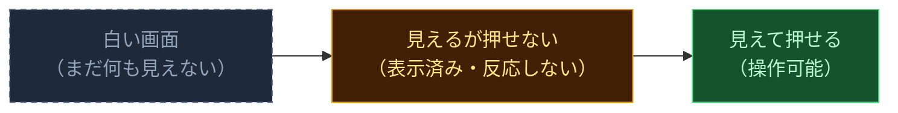
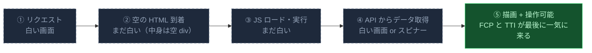
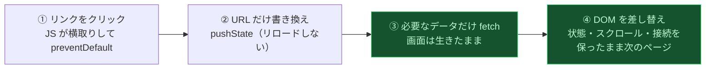
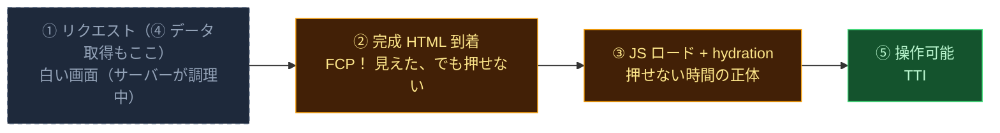
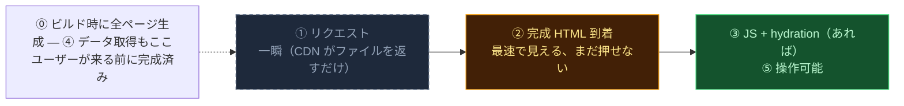
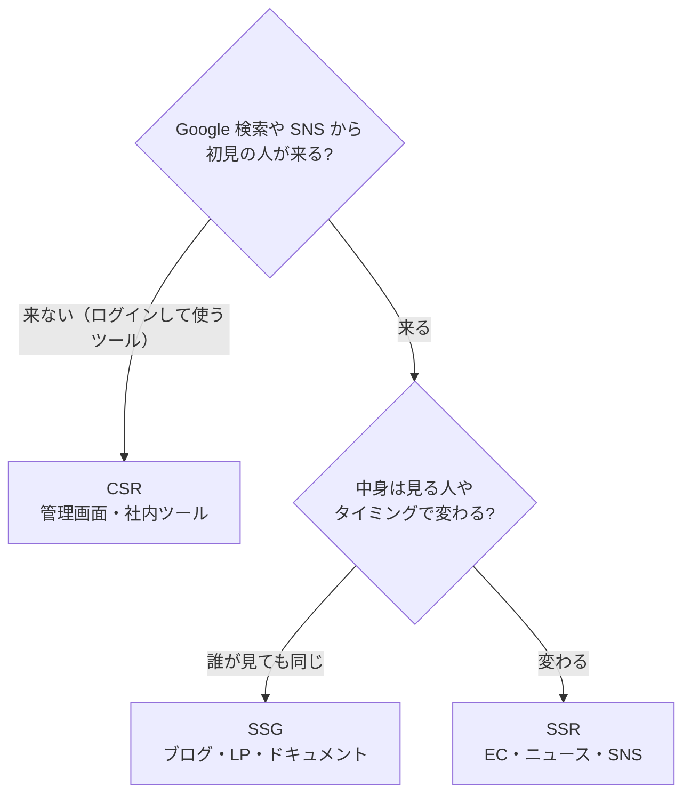

[[csr|CSR]]・[[ssr|SSR]]・[[ssg|SSG]]・[[spa|SPA]] を**時間軸のフェーズ**で捉え直した初学者向けの全体図。各戦略の違いは、結局「**どのフェーズで HTML を作り、ユーザーがいつ・何を見るか**」の違いでしかない。より厳密な定義・比較・歴史は [[rendering-strategies]] へ。

## まず地図 — 4 つの言葉は 2 つの軸に分かれる

CSR / SPA / SSR / SSG と 4 つ並ぶと同格に見えるが、実は**答えている質問が違う**。

| 質問 | 答えの選択肢 |
|---|---|
| **初回アクセス** — 最初の HTML をいつ・どこで作る? | [[csr\|CSR]]（ブラウザがその場で作る）/ [[ssr\|SSR]]（リクエストのたびサーバーで作る）/ [[ssg\|SSG]]（デプロイ前に作り置き） |
| **2 ページ目以降** — ページ移動をどう動かす? | [[spa\|SPA]]（リロードせず差し替え）/ MPA（毎回リロード） |

2 つの軸は組み合わせ自由。Next.js は「SSR/SSG + SPA」、Rails は「SSR + MPA」、Vite + React の素の構成は「CSR + SPA」。CSR と SPA は「**画面づくりをブラウザに任せる**」という同じ思想の**初回編と遷移編**なので、昔からセットで登場する。ただし軸としては独立していて、「初回だけサーバーに任せて、遷移はブラウザ」（SSR + SPA）という組み替えができる — これが現代フレームワークの肝。

## 共通のものさし — 6 つのフェーズ

どの戦略も、ユーザーがページを開いてから操作できるまでに通る道は同じ。違うのは**各フェーズの長さと、そこで何が見えているか**。

| フェーズ | 何が起きるか | 対応する指標 |
|---|---|---|
| ⓪ ビルド | デプロイ前にコードや HTML を準備する | — |
| ① リクエスト | ブラウザがサーバーに「ページください」 | **TTFB**（最初の 1 バイトまで） |
| ② HTML 到着 | 返ってきた HTML をブラウザが表示する | **FCP**（最初に何か見えるまで） |
| ③ JS ロード・実行 | JS をダウンロードして動かす | — |
| ④ データ取得 | API から中身のデータをもらう | — |
| ⑤ 操作可能 | クリックや入力に反応するようになる | **TTI**（操作できるまで） |

ユーザーの見え方は 3 段階しかない。以降の図では、この 3 段階をノードの色で塗り分ける。

## CSR — 「見える」が全部後ろに寄る

- **特色**: サーバーは空の HTML を返すだけなので ① は一瞬。そのかわり「見える」ために必要な仕事（②〜④）が**全部ユーザーの端末の上で、直列に**起きる。だから白い画面の時間が長い
- **フェーズ③④が主役**: CSR の体感速度は JS バンドルの大きさと端末の性能で決まる。サーバーを強くしても速くならない
- 管理画面など「ログインして長く使うツール」なら、この初回の遅さは一度きりの代金として許容できる

## SPA — CSR の続き: 「2 ページ目以降」の図

CSR の続きの話。CSR が「初回の画面をブラウザで描く」なら、SPA は「**2 ページ目以降もブラウザで描き続ける**」— 同じ思想の遷移編で、だから CSR とセットで使われてきた。ただし担当する時間帯が違うので、初回だけ SSR/SSG に差し替えることもできる（冒頭の「まず地図」の 2 軸目）。

- **特色**: フルリロードの「白い画面に戻る瞬間」が無い。メモリ上の状態や WebSocket 接続が**遷移をまたいで生き続ける**のが本質的な価値
- MPA（従来型）だと同じ操作は「① クリック → 初回アクセスの図を全部やり直し」になり、状態はすべて消える

ここまでが古典 SPA（CSR + SPA）の全体像 — **初回は重いが、入ってしまえば快適**。この「初回の重さ」を解決するのが、次の SSR と SSG。

## SSR — すぐ見えるが、少しの間押せない

- **特色**: サーバーがデータ取得もレンダリングも済ませてから返すので、① が少し長い（TTFB はサーバーの仕事量次第）。そのかわり ② の瞬間に**完成した見た目**が出る
- **フェーズ②〜③のギャップが主役**: 見えているのにボタンが反応しない時間（hydration 待ち）が SSR 特有の弱点。この「押せない時間」をどう縮めるかが RSC や Islands といった最新技術のテーマ
- ブラウザ側が ③→⑤ と飛ぶのは、④（データ取得）を ① の中でサーバーが済ませているから。**フェーズは消えるのではなく、前倒しで場所が移る**

## SSG — ユーザーが来る前に、もう出来ている

- **特色**: 重い仕事（レンダリング）が**フェーズ⓪に全部前倒し**されている。リクエスト時にやることが「ファイルを渡す」しかないので、①② が全戦略で最速
- **フェーズ⓪が主役**: そのかわり「⓪ の時点で決まっていること」しか出せない。ユーザーごとに違う内容は作れないし、内容を変えるにはビルドをやり直す
- ブログやドキュメントが SSG なのは「全員同じ・たまにしか変わらない」がこの制約にぴったりだから

## 横並び — 同じ瞬間に、何が見えているか

| フェーズ | CSR | SSR | SSG |
|---|---|---|---|
| ① リクエスト直後 | 白い画面（一瞬で返る） | 白い画面（サーバー調理中） | 白い画面（一瞬で返る） |
| ② HTML 到着 | まだ白い（中身が空） | **完成画面（押せない）** | **完成画面（押せない）** |
| ③ JS 実行後 | まだデータ待ち | **押せる** | **押せる** |
| ④ データ取得後 | **やっと見えて押せる** | —（サーバーで済み） | —（ビルドで済み） |

同じ「①→⑤」を通るのに、**「見える」「押せる」が現れるタイミングだけがずれている**ことが分かれば、この 3 つは理解できたと言っていい。

## 結局どれを選ぶ? — 2 つの質問で決まる

| 作るもの | 質問への答え | 選択 |
|---|---|---|
| 社内の勤怠管理ツール | 検索から人は来ない | CSR |
| 会社ブログ・製品 LP | 検索から来る・誰が見ても同じ | SSG |
| ドキュメントサイト | 検索から来る・誰が見ても同じ | SSG |
| EC の商品ページ | 検索から来る・価格や在庫が変わる | SSR |
| SNS のタイムライン | 人ごとに中身が違う | SSR |

実際のフレームワーク（Next.js 等）は**ページごとに戦略を混ぜられる**ので、「サイト全体でどれか 1 つ」と思わなくていい。トップは SSG、商品ページは SSR、マイページは CSR、が普通にできる。

## 覚え方 — レンダリング費用を「誰が・いつ」払うか

HTML を作る計算は必ずどこかで誰かが払う。戦略の違いは**支払いの場所とタイミング**の違い。

| 戦略 | 払う人 | 払うタイミング | 食堂に例えると |
|---|---|---|---|
| [[ssg\|SSG]] | ビルドサーバー | デプロイ前に 1 回だけ | **作り置きのお弁当** — 渡すのは一瞬。全員同じ中身 |
| [[ssr\|SSR]] | 運営のサーバー | リクエストのたび | **注文を受けてから作る定食** — 好みに合わせられるが、待ち時間は厨房次第 |
| [[csr\|CSR]] | ユーザーの端末 | 訪問のたび | **食材とレシピを渡して自分で調理** — 店は楽。速さは客のコンロ次第 |
| [[spa\|SPA]] | —（別軸） | 遷移のたび（差分だけ） | **入店後の追加注文** — 店を出入りし直さず、席（状態）を保ったまま |

## 押さえどころ（カード化候補）

- 4 つの言葉の地図 → CSR/SSR/SSG は「初回の HTML をいつ作るか」、SPA/MPA は「2 ページ目以降をどう動かすか」。CSR と SPA は「ブラウザで描く」思想の初回編と遷移編で、セットが自然だが組み替えもできる
- 6 フェーズの共通ものさし → ⓪ビルド ①リクエスト(TTFB) ②HTML到着(FCP) ③JS実行 ④データ取得 ⑤操作可能(TTI)。戦略の違いは各フェーズの長さと見え方だけ
- 見え方の 3 段階 → 白い画面 → 見えるが押せない → 見えて押せる。この遷移タイミングが戦略ごとにずれる
- CSR のフェーズの特徴 → 見えるための仕事が全部ユーザーの端末上で直列に起きるので、白い画面の時間が長く FCP と TTI が最後に一気に来る
- SSR のフェーズの特徴 → ② で完成画面が出るが hydration まで押せない。「見えるのに反応しない」時間が SSR 特有の弱点
- SSG のフェーズの特徴 → 重い仕事がフェーズ⓪（ビルド）に前倒しされていて、リクエスト時はファイルを渡すだけ。⓪ で決まったものしか出せない
- どれを選ぶかの 2 つの質問 → 「検索や SNS から初見の人が来る?」来ないなら CSR で十分。「中身は人やタイミングで変わる?」変わらないなら SSG、変わるなら SSR
- 費用のメンタルモデル → HTML を作る計算は必ず誰かが払う。SSG = ビルドで 1 回、SSR = サーバーが毎回、CSR = ユーザーの端末が毎回
- 食堂の例え → SSG = 作り置き弁当、SSR = 注文後調理の定食、CSR = 食材渡して自分で調理、SPA = 入店後の追加注文

## 関連

- [[rendering-strategies]] — 厳密な定義・比較表・歴史・発展形（ISR / RSC / Islands）はこちら（親ノート）
- [[csr]] / [[ssr]] / [[ssg]] — 各戦略の詳細
- [[spa]] — 「2 ページ目以降」というもう 1 つの軸
