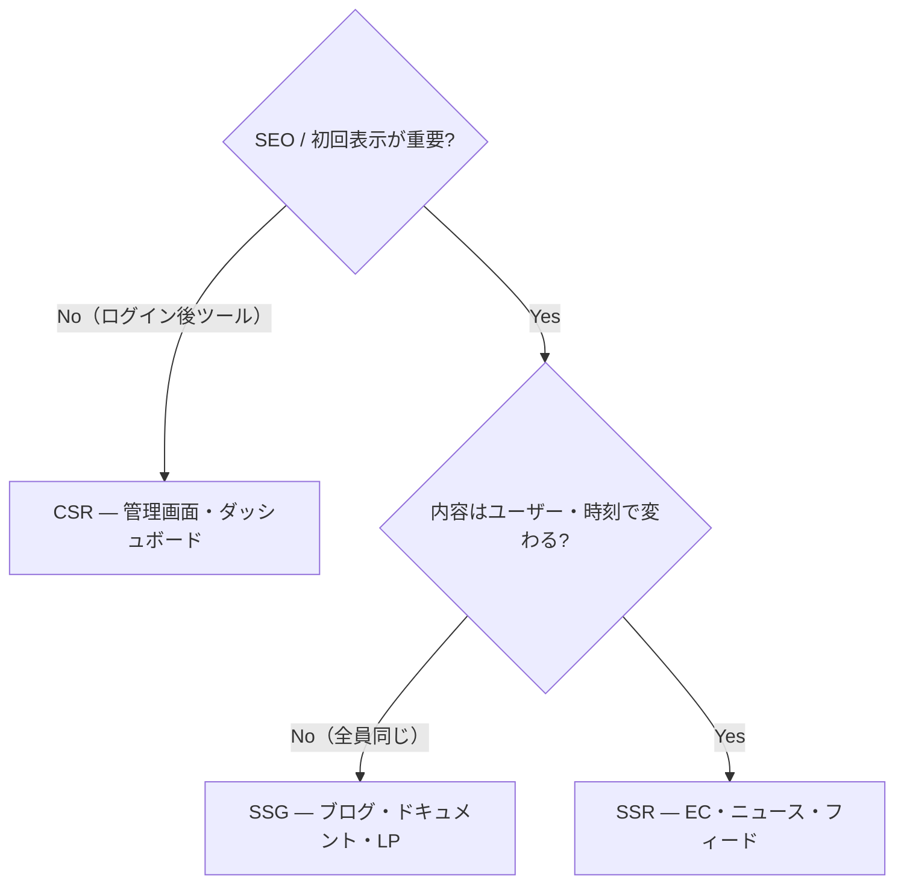

Web アプリの「**HTML をいつ・どこで生成するか**」という設計判断。[[csr|CSR]]（クライアント実行時）・[[ssr|SSR]]（リクエスト時、サーバー）・[[ssg|SSG]]（ビルド時）の 3 戦略が基本形で、モダンフレームワークの諸機能はこの 3 点間のトレードオフ調整として理解できる。

## まず軸を分ける — このテーマの最重要ポイント

「CSR / SPA / SSR / SSG」と並べると 4 つが同列に見えるが、**[[spa|SPA]] だけ軸が違う**。

| 軸 | 問い | 選択肢 |
|---|---|---|
| レンダリング戦略 | 初回の HTML をいつ・どこで作るか | CSR / SSR / SSG |
| アプリケーション構造 | 2 ページ目以降の遷移をどう扱うか | SPA / MPA |

2 軸は直交していて組み合わせは自由（Next.js = SSR/SSG + SPA 遷移、[[rails|Rails]] = SSR + MPA、Create React App = CSR + SPA）。「SPA = CSR」という同一視は、2010 年代前半の古典構成が固定観念化したもの。

## 3 戦略の比較

| | [[csr|CSR]] | [[ssr|SSR]] | [[ssg|SSG]] |
|---|---|---|---|
| HTML 生成 | クライアント実行時 | リクエスト時（サーバー） | ビルド時 |
| TTFB | 速い（空 HTML を返すだけ） | サーバー処理時間に依存 | 最速（CDN のファイル配信） |
| FCP（表示） | 遅い（JS 実行 + fetch 待ち） | 速い | 最速 |
| TTI（操作可能） | FCP と同時（だが遅い） | hydration 待ちのギャップあり | hydration 待ち（JS があれば） |
| SEO / OGP | 弱い | 完全対応 | 完全対応 |
| パーソナライズ | ○（クライアントで自由） | ◎（リクエスト時情報を使える） | ×（全員同じ HTML） |
| 更新の反映 | 即時（API 次第） | 即時 | リビルドが必要 |
| インフラ | 静的ホスティングのみ | レンダリングサーバー必須 | 静的ホスティングのみ |
| 代表 | Create React App, Vite | Next.js, Rails | Hugo, Astro, Gatsby |

指標の意味: **TTFB** = 最初の 1 バイトが届くまで、**FCP** = 最初のコンテンツ描画まで、**TTI** = 操作可能になるまで。

## 選び方

判断軸は 2 つ: **SEO・初回表示は重要か**、**内容はリクエストごとに変わるか**（パーソナライズ・鮮度）。

実際のアプリはページごとに性質が違うため、**ページ単位で戦略を混ぜる**のが現代フレームワークの前提（Next.js はルートごとに static / dynamic を選ぶ）。

## 歴史 — 振り子ではなく粒度の細分化

| 時代 | 主流 | 駆動力 |
|---|---|---|
| 〜2000s | SSR + MPA — CGI, PHP, [[rails|Rails]] | Web は文書だった |
| 2005〜 | Ajax の衝撃（[[web2.0]]） | Gmail / Google Maps |
| 2010s 前半 | CSR + SPA 全盛 — Backbone, Angular, React | アプリ的 UX、API 分離 |
| 2016〜 | SSR 回帰（isomorphic）— Next.js | CSR の初回表示・SEO の限界 |
| 2016〜 | SSG / Jamstack — Gatsby, Hugo, Netlify | CDN 配信の速さと運用の軽さ |
| 2020s | ハイブリッド細分化 — ISR, Streaming SSR, RSC, Islands | ページ内・ページ単位でトレードオフを最適化 |

「サーバー → クライアント → サーバー」と振り子が往復しているのではなく、**選択の粒度がサイト単位 → ページ単位 → コンポーネント単位へ細かくなっている**と読むのが正確。

## 発展形の位置付け

| 手法 | 基本戦略 | 何を足すか |
|---|---|---|
| ISR | SSG | リクエスト契機の再生成でリビルドのタイムラグを解消 |
| Streaming SSR | SSR | HTML をチャンク送信して FCP を前倒し |
| RSC (React Server Components) | SSR/SSG | サーバー専用コンポーネントで JS 送信量と hydration を削減 |
| Islands Architecture | SSG/SSR | 静的ページの中の interactive な島だけ hydrate |
| Edge SSR | SSR | [[edge-computing|エッジ]]でレンダリングして TTFB を削減 |

## 押さえどころ（カード化候補）

- CSR/SSR/SSG と SPA の軸の違い → 前者は「初回 HTML をいつ・どこで作るか」、SPA/MPA は「以降の遷移をどう扱うか」。直交する 2 軸で組み合わせは自由
- 3 戦略の HTML 生成タイミング → CSR: クライアント実行時 / SSR: リクエスト時 / SSG: ビルド時
- 選び方の 2 つの判断軸 → 「SEO・初回表示が重要か」×「内容がリクエストごとに変わるか」。No/— → CSR 可、Yes/No → SSG、Yes/Yes → SSR
- なぜページ単位で混ぜるのか → 同じアプリ内でもページごとに性質が違うから。現代 FW はルート単位で static/dynamic を選ばせる
- レンダリング史の正しい読み方 → サーバー↔クライアントの振り子ではなく、選択の粒度がサイト → ページ → コンポーネント単位へ細分化している
- ISR / RSC / Islands の位置付け → いずれも基本 3 戦略の弱点補正。ISR = SSG の鮮度、RSC = SSR の JS 量、Islands = hydration の範囲

## Links

- [Rendering on the Web — web.dev](https://web.dev/articles/rendering-on-the-web)
- [Rendering Patterns — patterns.dev](https://www.patterns.dev/vanilla/rendering-patterns/)

## 関連

- [[csr]] / [[ssr]] / [[ssg]] — 各戦略の詳細
- [[spa]] — 直交するもう 1 つの軸（遷移の構造）
- [[web2.0]] — CSR/SPA 時代の起点となった Ajax の時代背景
- [[anycast-cdn]] — SSG / Edge 配信の基盤
- [[edge-computing]] — Edge SSR の実行環境
