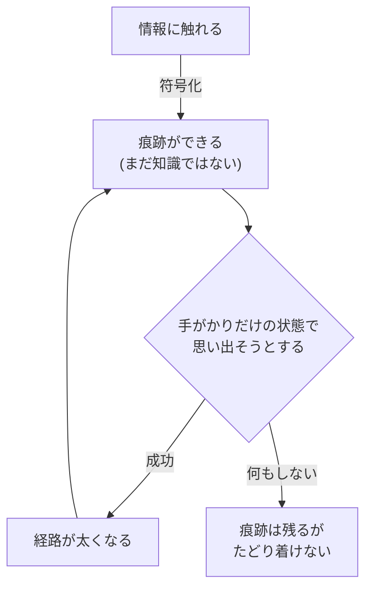
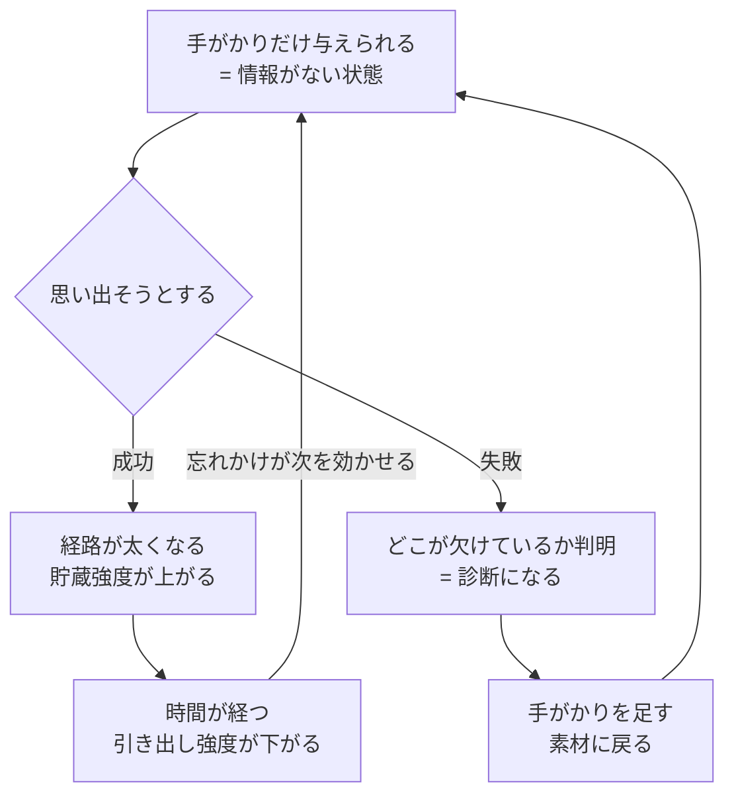
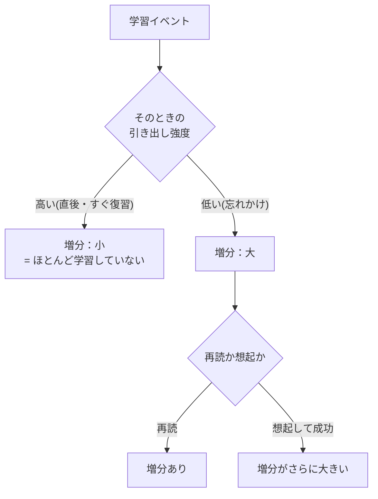
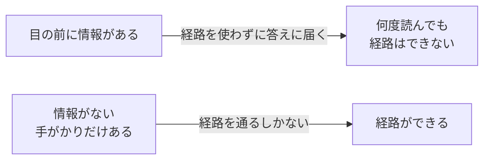
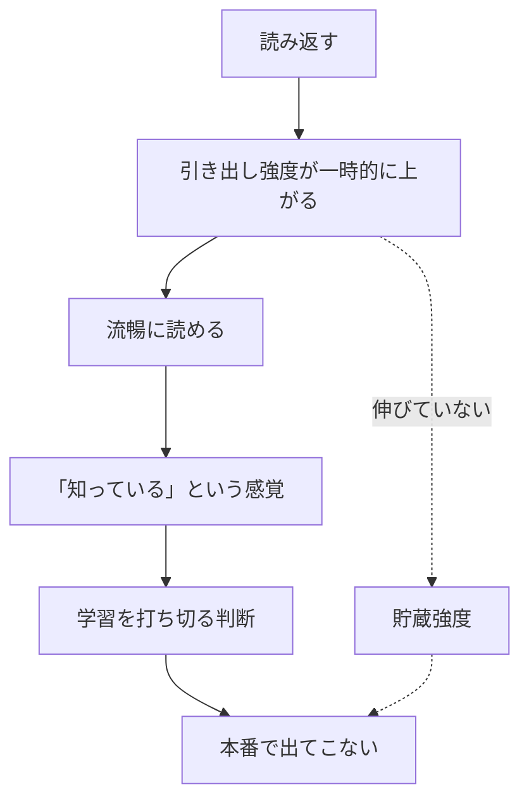
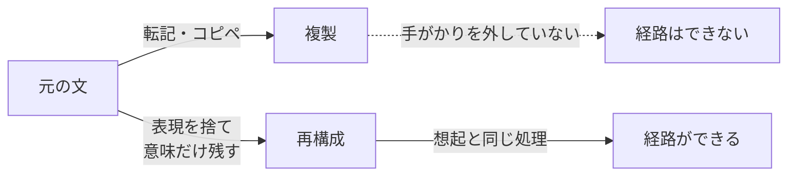
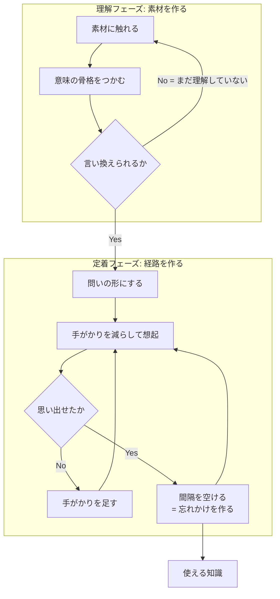

知識の獲得とは、引き出せる経路を作る作業である。経路は引いたときにしか太くならないので、情報に触れた回数はほとんど寄与しない。想起練習・分散学習・「自分の言葉にする」の効き目は、すべてこの一点から導ける。学習法の議論が混乱するのは、筆記具や教材という手段の層と、この機序の層を混ぜて話すため。

## 素朴なモデルが間違っている

多くの人が暗黙に持つのは**容器モデル** — 脳を器と見て、注いだ量に比例して知識が増えると考える。読んだ回数・眺めた時間が投入量になる。

容器モデルは検証可能な予測を立てるので、そこを突けば倒せる。予測は「投入量に比例して知識が増える」。

反例が2方向から来る。

- **入れたのに出ない** — 同じ教科書を何度読んでも試験で出てこない。投入量は積み上がっているのに、取り出せる量が増えていない
- **出ないのに残っている** — 何年も使わず完全に思い出せなくなった内容でも、覚え直しは初回よりはるかに速い。取り出せる量はゼロなのに、何かが残っている

2つは逆向きの反例になっている。容器モデルは**入れることと出せることを同一視している**ため、片方が成り立って片方が成り立たない状況を原理的に表現できない。だから局所的な修正では救えず、モデルごと置き換える必要がある。

置き換えた先が**経路モデル**で、情報に触れた時点ではまだ知識になっていない。触れて生まれるのは素材だけで、知識になるのは、そこへ至る経路ができたとき。

## なぜ1軸では足りないのか

ここでいう**軸**とは、記憶の状態を記述するために立てる変数のこと。**何本立てるか**がモデルの設計判断にあたる。

素朴な捉え方は、暗黙に1本しか立てていない。「よく覚えている ↔ あまり覚えていない」という単一の目盛りがあり、学習でその目盛りが上がり、時間が経つと下がる、という像になる。前節の容器モデルで言う「注いだ量」も、この1本の別名にすぎない。器の比喩をやめても、変数が1本のままなら構造は変わらない。

変数を1本で済ませると、その1本が**2つの役目を兼務する**ことになる。

- **今その項目を出せるか** — テストで答えられるかどうか
- **どれだけ深く入っているか** — 後々どれだけ残るか

普段この2つは連動して見えるので、兼務していることに気づかない。この節で見るのは、**兼務が破綻する場面**にあたる。

| 現象 | 1軸モデルの予測 | 実際 |
|---|---|---|
| 再学習の節約 | 忘れた = 強度ゼロ → 初回と同じ時間がかかる | **明らかに速い** |
| 分散効果 | 詰めたほうが強度が積み上がる | **間隔を空けたほうが強い** |
| テスト効果 | 情報量の多い再読が勝つ | **思い出すほうが強い** |
| 直後の成績と長期保持 | 一致するはず | **逆転すらする** |

4つとも、上の2つの役目がズレて観測されている。

**なぜ2本目の軸が「必要」と言えるのか。** 節約の観測を形式的に書くと、次の2つが同時に成り立っている。

1. 想起できない → アクセスの度合いはゼロ
2. 再学習が速い → 何かが残っている量はゼロではない

1軸モデルでは「アクセスの度合い」と「残っている量」が同じ変数なので、この2つは `x = 0 かつ x > 0` になり矛盾する。矛盾を解く方法は、**2つを別の変数に分離する**以外にない。ここでの2軸は、観測を無矛盾に記述するための最小構成という位置づけになる。便利な比喩として導入されたものではない。

残り3つの現象も同じ形に還元できる。分散効果なら「触れた回数は同じなのに保持が違う」、テスト効果なら「触れた情報量が少ないほうが保持で勝つ」、直後と長期の乖離なら「同じ項目が今は出て後で出ない」。いずれも1変数では両立しない観測の組で、**同じ理由で同じ分離を要求する**。4つが独立に2軸を支持している点が、この分離の強さになっている。

Bjork の言い方では **performance(今の出来) ≠ learning(習得)**。この2つが、次節で名前のつく2本の軸にあたる。

## 2つの強度 — 何が減り、何が減らないのか

| | 意味 | 時間経過 | 干渉・競合 |
|---|---|---|---|
| **貯蔵強度** (storage strength) | どれだけ深く入ったか = learning | **減らない** | **減らない** |
| **引き出し強度** (retrieval strength) | 今どれだけアクセスできるか = performance | **減る** | **減る** |

### 「減る」を割る

引き出し強度が下がる機序は少なくとも3つあり、性質が違う。

| 機序 | 中身 |
|---|---|
| **時間減衰** | 単なる経過。使わない期間の関数 |
| **文脈変動** | 学習時に効いていた文脈手がかり(場所・気分・直前の作業)が、現在の文脈から乖離していく。理論名に "an Old Theory of Stimulus Fluctuation" が入っているのはこれ |
| **競合による排除** | 同じ手がかりに紐づく他項目が強化されると、相対的に押し下げられる(検索誘導性忘却) |

3つ目が効いてくる。**引き出し強度は絶対量というより、同じ手がかりを共有する項目の中での相対的な順位**に近い。したがって「減る」の多くは押しのけとして起きる。似た用語をまとめて覚えると混ざるのは、順位の奪い合いが起きているため。

### 「減らない」を割る

貯蔵強度は**単調非減少**とされる。学習と想起で増え、不使用でも競合でも減らない。

根拠は**再学習の節約**(Ebbinghaus の節約法) — 完全に思い出せなくなった素材でも、覚え直しは初回より速い。引き出し強度がゼロでも何かが残っている、という観測がこれにあたる。つまり「忘れた」は消えたのではなく、たどり着けなくなった状態を指す。

**なぜ「ゆっくり減る」ではなく「まったく減らない」と置くのか。** 節約の観測が要求しているのは「ゼロではない」ことだけで、「減らない」までは要求していない。にもかかわらず減衰ゼロと置くのには、モデル側の理由がある。

貯蔵強度にも減衰を許すと、減る量が2つになる。すると観測される忘却を、どちらの減衰にどれだけ帰属させるかが決められない。同じ忘却曲線を「引き出し強度が速く減った」でも「貯蔵強度が少し減った」でも説明できてしまい、2つの軸を分離した意味が消える(識別不能)。

貯蔵側の減衰をゼロに固定すると、忘却はすべて引き出し側で説明され、軸が分離したまま保たれる。つまり **「減らない」は観測から導かれた事実ではなく、モデルを識別可能にするための正規化**に近い。

この理解は実用上も効く。「減らない」が反証しにくいのは理論の怠慢ではなく、そもそも反証されるために置かれた命題ではないため。逆に言えば、ここを実在の主張として振り回すのは誤用になる。

ただし単調非減少には注釈がつく。

- **収穫逓減がある** — 上限に近いほど増分が小さい
- **正規化であって観測ではない** — 上記の通り。理論の弱点として自覚しておく
- **スコープは通常の不使用による忘却** — 損傷・加齢は扱っていない

### 4象限

2軸が独立なので4象限が存在する。実務で問題になるのは逆対角の2つ。

| | 引き出し強度：高 | 引き出し強度：低 |
|---|---|---|
| **貯蔵強度：高** | 使える知識 | **持っているのに出てこない**(喉まで出かかる状態) |
| **貯蔵強度：低** | **知っている気がするだけ**(読んだ直後) | 未学習 |

左下が学習の失敗の大半を占める。読み返した直後の「分かった感」がここで、**貯蔵強度は伸びていないのにアクセスだけが一時的に良くなっている**。

## 中核 — 想起が記憶を書き換える

直感では「思い出す＝記憶を読みに行く」。実際には、思い出す動作そのものが記憶を書き換え、貯蔵強度を上げる。想起は read ではなく **modify** にあたる。

**なぜ「読み出しではない」と言い切れるのか。** 想起が単なる読み出しなら、テストは状態を変えない測定であるはずで、そこから予測が出る — 同じ時間を与えたとき、触れる情報量が多い再読のほうが保持で勝つはず。

実際の結果は時間依存で反転する。直後の測定では再読群が勝ち、数日置いた測定ではテスト群が逆転する(Roediger & Karpicke, 2006)。**同じ2群の順位が、測定時期だけで入れ替わる**。

ここが決定的で、もしテストが測定にすぎないなら、テスト群の保持は再読群を上回りようがない。逆転が起きた時点で、テストは測定と同時に状態を変えている。しかも直後に負けて後で勝つという順序は、変化した対象が「減りにくさ」の側であることまで示している。

筋トレの比喩で言い直すと、持ち上げる動作が重り自体を大きくしている状態にあたる。中身を増やす作業が引く行為の外側にあるわけではない。引く行為そのものが、唯一の経路になっている。

## 2軸の相互作用 — 3つの規則

2軸は独立に動くが、無関係ではない。互いに**違う役割で**影響する。

矢印が逆向きで役割が違うことが、この理論の生む予測すべての源になっている。規則として明示すると:

1. 学習イベント(再読・想起)は両方を増やす。ただし**想起のほうが増分が大きい**
2. **貯蔵強度の増分は、そのときの引き出し強度に反比例する** — 引き出し強度が低いほど大きく入る
3. **引き出し強度の減衰速度は、貯蔵強度が高いほど遅い** — よく入ったものは忘れにくい

規則2の含意が強い。**引き出し強度が高いときは、貯蔵強度がいくつであろうと、ほとんど学習が起きていない**。読んですらすら分かる状態での勉強は、定義上ほぼ無価値ということになる。

この3規則から、直感に反する命題が演繹される。

| 命題 | 出どころ |
|---|---|
| 忘れかけているほど、思い出したときの学習効果が大きい | 規則2 |
| 今の出来が良いほど、学習は進んでいない | 規則2の対偶 |
| 同じ「1回の復習」でも、タイミングで価値が桁違いになる | 規則2 |
| よく学んだものほど、間隔を長く取れる | 規則3(拡張間隔法の根拠) |
| 完全に忘れさせてはいけない | 想起が失敗すると増分が得られない |

## 「情報がない」ことが効き目の源

情報が目前にある状態の学習では、経路を使わずに答えへたどり着ける。だから経路は作られず、100回読んでも同じ。逆に手がかりが少ないほど遠回りの経路を通ることになり、効果が大きい — Bjork の **desirable difficulties**(望ましい困難)。

**なぜ手がかりが少ないほど効くのか。** 規則2は、増分をそのときの引き出し強度の減少関数として決める。ここで手がかりの働きを考えると、手がかりはその場のアクセスを補助する — つまり**実効的な引き出し強度を押し上げている**。

したがって手がかりを減らす操作は、実効的な引き出し強度を下げる操作と同じことになり、規則2を経由して増分を大きくする。desirable difficulties は**規則2の系**として出てくる。独立した原理を立てる必要がない。

この導出には実用上の含みがある。効いているのは、**難易度が引き出し強度を下げる手段になっている**という一点。難易度それ自体が効くわけではない。だから引き出し強度を下げない種類の難しさ — 字を小さくする、制限時間を無意味に詰める、関係のない負荷をかける — は、いくら苦しくても増分を生まない。「苦しいほど効く」ではなく「アクセスを下げた分だけ効く」が正確なところになる。

ただし条件が1つ。**たどり着ける範囲であること**。届かない難易度では何も起きないので、最適は「ギリギリ思い出せる」ところ。失敗が続くならヒントを足して難易度を下げる。

## 忘却が次の想起を効かせる

上のループには忘却が組み込まれている。**引き出し強度が下がるからこそ次の想起が効く**。忘れる前に復習すると経路を通る必要がないので、ほぼ何も起きない。

分散学習(spacing)が効くのは、忘れかけを作れるため。**なぜそう言えるか**を規則から辿ると、次の形になる。

復習の間隔を変数にとって、1回の復習が生む貯蔵強度の増分を考える。

- **間隔を詰める** → 引き出し強度は高いまま → 規則2より増分はゼロに近づく
- **間隔を空ける** → 引き出し強度が下がる → 規則2より増分が大きくなる

ここまでなら「無限に空けるほど得」に見える。ところが規則1は、増分が得られるのは**想起が成立した場合**だという前提を含んでいる。間隔を空けすぎると想起は失敗し、増分はまた失われる。

したがって増分は間隔に対して単調にならず、**途中で最大をとる**。最適は端点ではなく内点に来る。その内点が「引き出し強度が下がりきる直前」にあたる。

分散が**規則2と3から出る最適化問題の解**である、というのはこの意味になる。技法として覚える必要はなく、規則から毎回導き直せる。

神経基盤の側から見ると、[[episodic-memory|海馬]]の **CA3 のパターン補完**(部分的な手がかりから全体を復元)が想起そのものであり、睡眠中のリプレイによる固定化が、間隔を空ける意味を裏打ちする。

## 手応えと効果は逆相関する

実践上もっとも危険な性質。

| 方法 | 最中の手応え | 実際の効果 |
|---|---|---|
| 読み返す・眺める | **◎ 気持ちいい** | ✗ |
| 隠して思い出す | **✗ しんどい・不安** | ◎ |

**流暢性の錯覚**(fluency illusion)。重要なのは、これが**規則2から演繹される**という点。注意力の問題として扱うと対処を誤る。

手応えとは何の関数かを考える。すらすら出てくる、引っかからずに読める、という感覚は、アクセスの良さそのもの — つまり引き出し強度の増加関数になっている。一方、その時点で起きる学習量は、規則2により引き出し強度の**減少**関数。

同じ変数について、一方が増加関数で他方が減少関数になる。したがって**手応えと学習量は必然的に逆相関する** — そうならない状況が存在しない。

帰結として、この錯覚は「気をつければ避けられる」種類のものではなくなる。注意深く自己評価するほど引き出し強度を正確に読み取ってしまい、正確に読み取るほど学習量とは逆の指標を見ることになる。**自己評価の精度を上げても解決しない**。だから学習法は原則で選ぶしかない。「読み返すな、テストしろ」に根拠があるのはこのため。

## 直感が狂う原因 — 日常語が2軸を混ぜている

錯覚が起きるより手前に、語彙の問題がある。「覚える / 忘れる」が**1語で2つの軸をまたいでいる**。

| 日常語 | 2軸で言うと |
|---|---|
| 覚えた | 貯蔵強度が上がった |
| 覚えている | 引き出し強度が高い |
| 忘れた | 引き出し強度が下がった(貯蔵強度は無傷) |
| 忘れないように復習する | **引き出し強度の延命**。貯蔵強度はほぼ増えていない |

最後の行が罠になる。「忘れないための復習」は今のアクセスを保っているだけで、**習得はほとんど進んでいない**。勉強している感覚の正体がこれ。

同じ理由で「あれ覚えてる?」という問いは引き出し強度しか測っていない。テストが学習になるのは、測る行為が同時に規則2を発動させるからで、**測定と学習が同一の操作である**点がこの領域の得な性質になっている。

## 「自分の言葉にする」が効く理由

**なぜ言い換えが想起の一種だと言えるのか。** 想起の構造は「手がかりから対象を復元する」こと。言い換えでは、元の表現が使えない状態で意味を復元している。復元の対象が表現から意味に変わっただけで、**手がかりから復元するという構造は同じ**。したがって規則2がそのまま適用される。

転記が効かない理由も同じ規則から出る。転記の最中は元の文が目前にあるので、実効的な引き出し強度が最大に近い。規則2より増分はほぼゼロ。**差を決めるのは、規則2のどこに位置しているか**。勤勉さの問題ではない。

この見方をとると、言い換えの「質」が何を意味するかも決まる。効き目を決めるのは**元の表現をどれだけ手放せているか**で、表現のうまさは関係しない。原文の語順や語彙が残っているほど手がかりが残っており、増分は小さくなる。

副次効果として、**言い換えられないこと自体が診断になる**。詰まったらまだ理解していない、というシグナルなので、理解に戻る合図として使える。

言い換えを機械化する型:

| 型 | やり方 | 例(複利) |
|---|---|---|
| 禁止語 | 元の定義のキーワードを3つ禁じて説明する | 「利息」「元本」を禁じる → 増えた分が、次に増えるための土台になる |
| 問いに変換 | 質問文の形にする | 「複利とは?」→「単利と複利で、10年後に差がつくのはなぜ?」 |
| 対比 | 「X は Y と違って〜」の形にする | 単利は元本にしか効かない。複利は増えた分にも効く |
| 帰結に変換 | 「何が起きるか」を書く | 期間が長いほど効く。途中で引き出すと効果が消える |

定義の言い換えは難しいが、帰結の記述は書ける。そして試験・実務で問われるのはたいてい帰結のほう。

## 実装 — 2フェーズとゲート

含意は3つ。

1. **理解と定着は別の作業**。混ぜると、理解していないものを暗記しようとして詰む
2. **ゲートは「言い換えられるか」**。通れないうちは定着フェーズに進んではいけない
3. **定着フェーズはループ**であって直線ではない。1回で終わる工程が存在しない

**なぜゲートが要るのか。** これも規則から出る。ゲートを外して、理解していない項目をそのまま定着フェーズへ流したとする。理解していないので想起は失敗し続ける。規則1は増分が得られるのは想起が成立した場合だとしているから、失敗し続ける項目の増分はゼロのまま。**回した時間に対して増分が構造的にゼロになる領域**が存在することになる。

ゲートはこの領域を排除するために置かれている。**ゼロ増分の区間に入らないための境界**として必然的に要るもので、作業を丁寧にするための儀式ではない。

同じ理由で、ゲートは緩めてもいけないし、厳しくしすぎてもいけない。厳しすぎれば理解フェーズに滞留して定着が始まらず、緩すぎればゼロ増分の区間を回すことになる。判定基準を「言い換えられるか」に置くのは、それが**想起が成立する見込みの、最も安いプロキシ**だから。

この vault の各ノートにある `## 押さえどころ` セクションが「トピック → 1-2文の本質」形式なのは、**そのまま問いの形に変換できる**ようにするため。理解フェーズの産物(ノート本体)と定着フェーズの入力(カード)を1ファイルで両立させる意図がある。

## エビデンスの強さ

Dunlosky ら (2013) が10の学習技法を有用性で格付けした結果。**高有用性はわずか2つ**。

| 評価 | 技法 |
|---|---|
| **高** | **練習テスト** (practice testing)、**分散学習** (distributed practice) |
| 中 | 精緻化質問、自己説明、交互練習 (interleaved practice) |
| 低 | 要約、ハイライト・下線、キーワード記憶術、イメージ化、**再読** |

注意すべき整合性 — 「自分の言葉にする」に対応するのは中評価の**自己説明・精緻化質問**であって、低評価の要約ではない。差は「テキストを見ながら構造を写しているか」対「意味だけを頼りに生成しているか」にある。手がかりを外しているかどうかが、ここでも分岐点になる。

**格付けと2軸モデルは、証拠の種類が違う**。この区別は押さえておく価値がある。

| | 中身 | 証拠の性質 |
|---|---|---|
| Dunlosky の格付け | 練習テスト・分散学習が効く | **介入の効果量**。多数の実験で直接測られている |
| 2軸モデル | なぜ効くのか | **説明の枠組み**。予測はよく当たるが、構成概念を直接測ってはいない |

実証されているのは**技法が効くこと**であって、機序の説明ではない。本ノートの導出はすべて2軸モデルという枠組みの内側の話なので、枠組みごと差し替われば導出も変わる。「効く」の確度と「なぜ効く」の確度を同じものとして扱わないこと。

実務上は、枠組みが多少違っていても技法の選択は変わらない。だが**新しい技法をこの枠組みから演繹して自作するとき**は、確度の差が効いてくる。

一方で**手書き vs タイプ**の軸は弱い。よく引かれる Mueller & Oppenheimer (2014) は Morehead, Dunlosky & Rawson (2019) の直接再現で再現せず、直接再現のメタ分析でも手書き有利は小さく非有意だった。効いていたのは、手書きだと転記が物理的に不可能で要約せざるを得ない点。筆記具そのものは機序に関与していない。同じ機序はデジタルでも再現でき、しかも分散学習の管理はソフトでしか実行できない。

## 押さえどころ

- **知識の獲得とは** → 引き出せる経路を作ること。経路は引いたときにしかできず、触れた回数は寄与しない
- **なぜ2軸か** → 「今の出来(performance)」と「入った量(learning)」がズレるから。1軸では節約・分散効果・テスト効果が説明できない
- **何が減るのか** → 減るのは引き出し強度だけ。時間・文脈のズレ・他項目との競合で減る。貯蔵強度はどれによっても減らない
- **「忘れた」の正体** → 消えたのではなく、たどり着けなくなった。根拠は再学習の節約(覚え直しは初回より速い)
- **想起の正体** → 読み出しではなく書き込み。思い出す動作が貯蔵強度を上げる
- **3つの規則** → ①想起は再読より増分が大きい ②貯蔵強度の増分は現在の引き出し強度に反比例 ③貯蔵強度が高いほど減衰が遅い
- **規則2の含意** → 引き出し強度が高いときは、ほとんど学習が起きていない。すらすら分かる状態での勉強は定義上ほぼ無価値
- **日常語の罠** → 「覚える/忘れる」が2軸を混ぜている。「忘れないための復習」は延命であって習得ではない
- **なぜ「情報がない状態」か** → 情報が目前にあると経路を使わずに答えへ届くので、経路ができない
- **忘却の役割** → 前提として要る。引き出し強度が下がるから次の想起が効く = 分散学習の根拠
- **流暢性の錯覚** → 手応えと効果が逆相関する。体感で選ぶと必ず間違える
- **言い換えが効く理由** → 元の表現という手がかりを外した再構成 = 想起の一種。転記は手がかりを外していない
- **desirable difficulties の正体** → 難易度が引き出し強度を下げる手段になっている点が効いている。アクセスを下げない難しさは効かない
- **分散が内点解である理由** → 詰めると増分ゼロ、空けすぎると想起失敗で増分ゼロ。最大は途中にある
- **錯覚が避けられない理由** → 手応えは引き出し強度の増加関数、学習量は減少関数。同じ変数の逆向きの関数なので必然的に逆相関する
- **「減らない」の身分** → 忘却の帰属先を一意にしてモデルを識別可能にするための正規化。観測された事実ではない
- **エビデンス** → 10技法中の高評価は練習テストと分散学習の2つだけ。再読は低評価。手書き/タイプの差は再現せず
- **証拠の種類** → 実証されているのは「技法が効く」こと。「なぜ効く」は説明の枠組みで、確度が違う

## 制限

- 貯蔵強度・引き出し強度は直接測定できる量ではなく**理論的構成概念**。予測がよく当たるモデルとして使うもので、実体として扱わない
- 効果量は領域・材料・学習者で変動する。「必ず効く」ではなく「平均して効く」
- 想起練習は**失敗が続く難易度では効果が出ない**。前提条件つきの技法であり、万能ではない
- ここで扱うのは宣言的知識(語彙・概念)の獲得。運動技能や手続き的知識の習得は別の機序が絡む

## Links

- [Dunlosky et al. (2013), "Improving Students' Learning With Effective Learning Techniques", *Psychological Science in the Public Interest* 14(1)](https://journals.sagepub.com/doi/abs/10.1177/1529100612453266)
- [Morehead, Dunlosky & Rawson (2019) — 手書き優位説の再現研究](https://link.springer.com/article/10.1007/s10648-019-09468-2)
- [The Learning Scientists — laptop vs longhand の整理](https://www.learningscientists.org/blog/2019/2/21-1)
- Roediger & Karpicke (2006), "Test-Enhanced Learning", *Psychological Science* 17(3) — テスト効果の代表的実証
- Bjork & Bjork (1992), "A New Theory of Disuse and an Old Theory of Stimulus Fluctuation" — 貯蔵強度/引き出し強度の出典
- [The Learning Scientists — Retrieval Strength vs. Storage Strength(2軸の増分規則の解説)](https://www.learningscientists.org/blog/2016/5/10-1)

## 関連

- [[episodic-memory]] — CA3 のパターン補完が想起の神経基盤。睡眠中のリプレイによる固定化が分散学習の下地
- [[learning-system]] — 本ノートの理論を実際に回すシステムへ落とすときの設計。動力学を自作しない判断とその根拠
