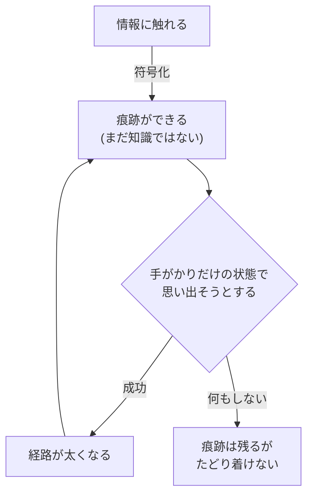
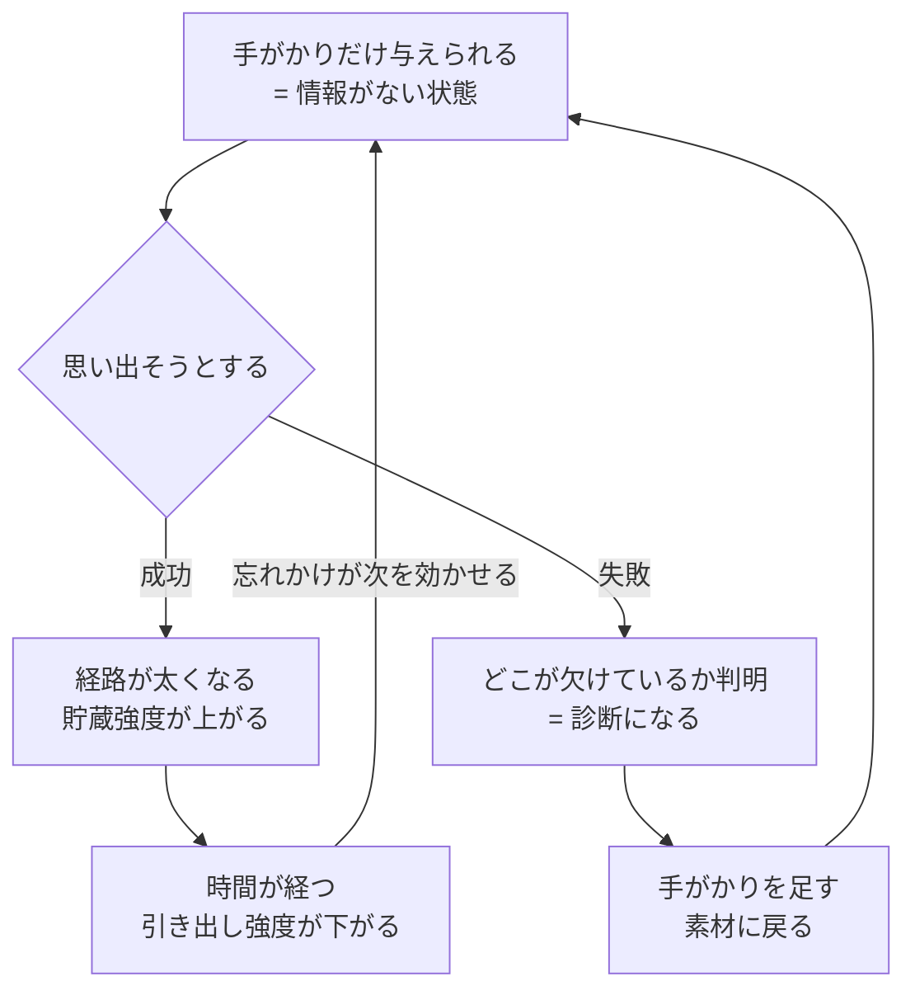
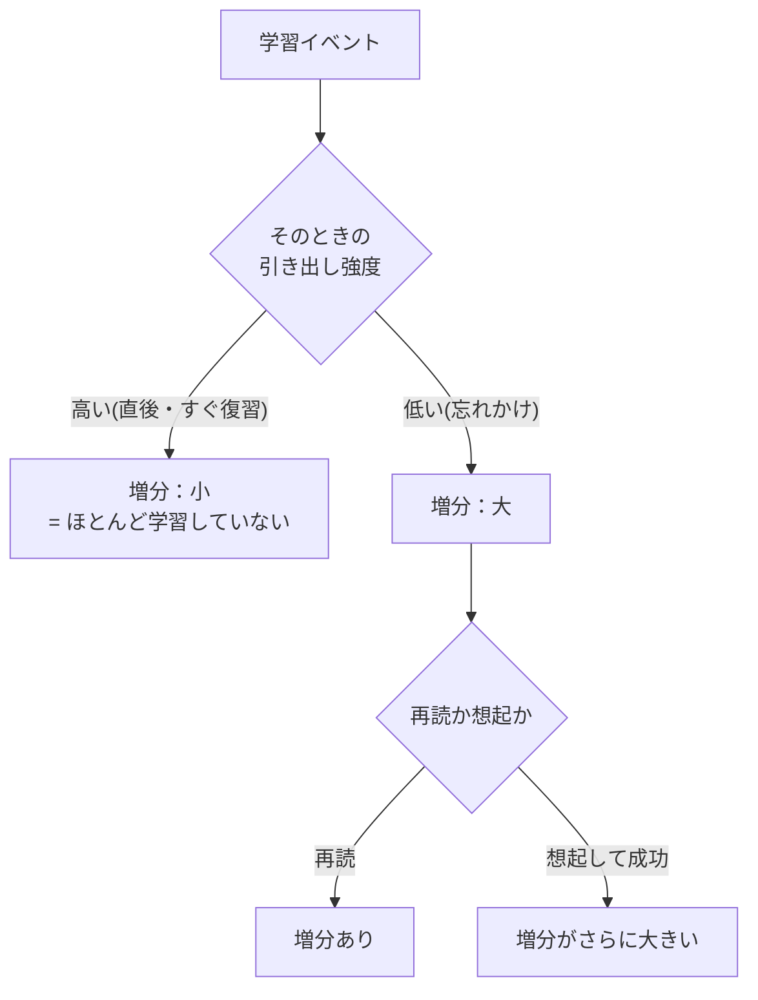
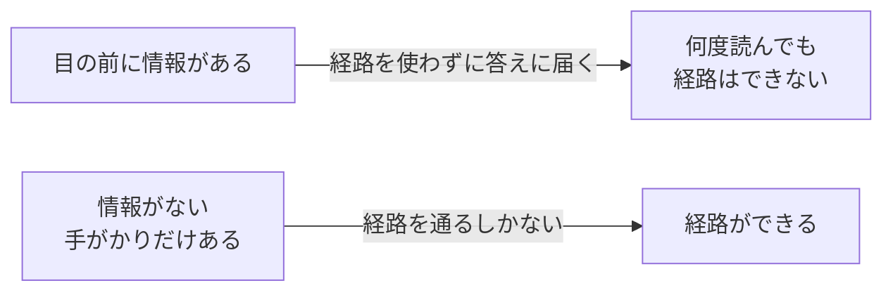
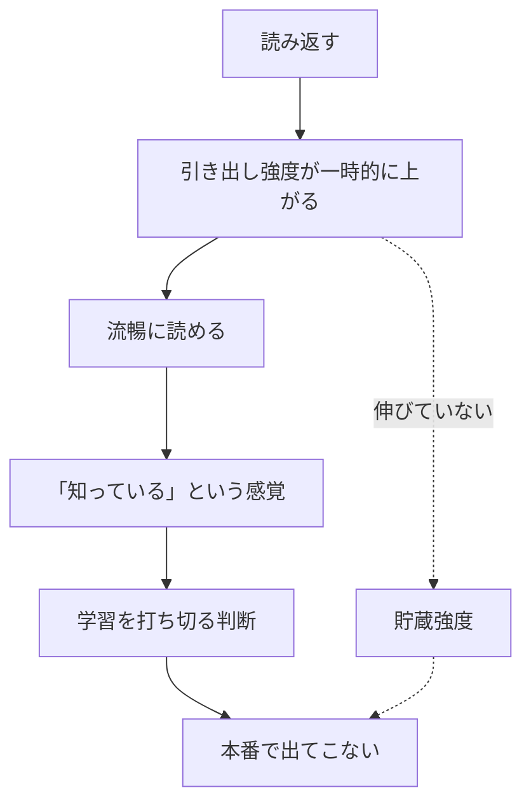
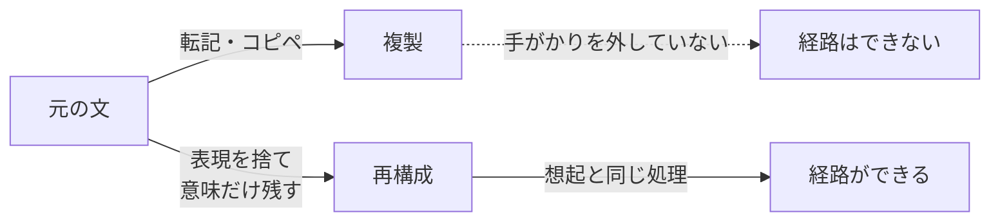
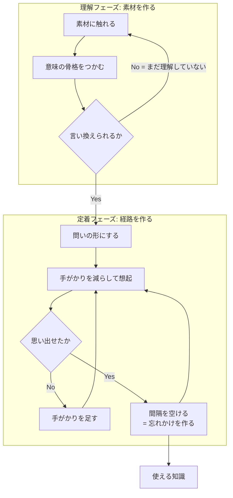

知識の獲得とは情報を「入れる」ことではなく、**引き出せる経路を作る**ことであり、経路は**引いたときにしか作られない**。この一文から、想起練習・分散学習・「自分の言葉にする」の効き目がすべて導出できる。学習法の議論が混乱しがちなのは、筆記具や教材といった手段の層と、この機序の層が混ざるため。

## 素朴なモデルが間違っている

多くの人が暗黙に持つのは**容器モデル** — 脳を器と見て、注いだ量に比例して知識が増えると考える。読んだ回数・眺めた時間が投入量になる。

実際は**経路モデル**で、情報に触れた時点ではまだ知識になっていない。触れて生まれるのは素材だけで、知識になるのは**そこへ至る経路ができたとき**。

## なぜ1軸では足りないのか

「記憶の強さ」を単一の量と見ると、説明できない現象が並ぶ。

| 現象 | 1軸モデルの予測 | 実際 |
|---|---|---|
| 再学習の節約 | 忘れた = 強度ゼロ → 初回と同じ時間がかかる | **明らかに速い** |
| 分散効果 | 詰めたほうが強度が積み上がる | **間隔を空けたほうが強い** |
| テスト効果 | 情報量の多い再読が勝つ | **思い出すほうが強い** |
| 直後の成績と長期保持 | 一致するはず | **逆転すらする** |

4つとも「今の出来」と「本当に入った量」がズレることで起きる。**1つの量ではこのズレを表現できない**ため、軸を2本に割る必要があった。Bjork の言い方では **performance(今の出来) ≠ learning(習得)**。

## 2つの強度 — 何が減り、何が減らないのか

| | 意味 | 時間経過 | 干渉・競合 |
|---|---|---|---|
| **貯蔵強度** (storage strength) | どれだけ深く入ったか = learning | **減らない** | **減らない** |
| **引き出し強度** (retrieval strength) | 今どれだけアクセスできるか = performance | **減る** | **減る** |

### 「減る」を割る

引き出し強度が下がる機序は少なくとも3つあり、性質が違う。

| 機序 | 中身 |
|---|---|
| **時間減衰** | 単なる経過。使わない期間の関数 |
| **文脈変動** | 学習時に効いていた文脈手がかり(場所・気分・直前の作業)が、現在の文脈から乖離していく。理論名に "an Old Theory of Stimulus Fluctuation" が入っているのはこれ |
| **競合による排除** | 同じ手がかりに紐づく他項目が強化されると、相対的に押し下げられる(検索誘導性忘却) |

3つ目が効いてくる。**引き出し強度は絶対量というより、同じ手がかりを共有する項目の中での相対的な順位**に近い。したがって「減る」の多くは消耗ではなく**押しのけ**であり、似た用語をまとめて覚えると混ざるのは、干渉というより順位の奪い合いが起きているため。

### 「減らない」を割る

貯蔵強度は**単調非減少**とされる。学習と想起で増え、不使用でも競合でも減らない。

根拠は**再学習の節約**(Ebbinghaus の節約法) — 完全に思い出せなくなった素材でも、覚え直しは初回より速い。引き出し強度がゼロでも何かが残っている、という観測がこれにあたる。つまり **「忘れた」は消えたのではなく、たどり着けなくなった**。

ただし単調非減少には注釈がつく。

- **収穫逓減がある** — 上限に近いほど増分が小さい
- **仮定であって観測ではない** — 貯蔵強度は直接測れないので「減らない」は反証しにくい。理論の弱点として自覚しておく
- **スコープは通常の不使用による忘却** — 損傷・加齢は扱っていない

### 4象限

2軸が独立なので4象限が存在し、実務で問題になるのは対角ではなく**逆対角**のほう。

| | 引き出し強度：高 | 引き出し強度：低 |
|---|---|---|
| **貯蔵強度：高** | 使える知識 | **持っているのに出てこない**(喉まで出かかる状態) |
| **貯蔵強度：低** | **知っている気がするだけ**(読んだ直後) | 未学習 |

左下が学習の失敗の大半を占める。読み返した直後の「分かった感」がここで、**貯蔵強度は伸びていないのにアクセスだけが一時的に良くなっている**。

## 中核 — 想起は読み出しではなく書き込み

直感では「思い出す＝記憶を読みに行く」。実際は**思い出す動作そのものが記憶を書き換え、貯蔵強度を上げる**。想起は memory を読む操作ではなく、**modify する操作**。

筋トレの比喩を正確に言い直すと、**重りを持ち上げて筋肉を鍛えているのではなく、持ち上げる動作が重り自体を大きくしている**。引く行為の外側に「中身を増やす作業」があるのではなく、引く行為が中身を増やす唯一の経路になっている。

## 2軸の相互作用 — 3つの規則

2軸は独立に動くが、無関係ではない。互いに**違う役割で**影響する。

矢印が逆向きで役割が違うことが、この理論の生む予測すべての源になっている。規則として明示すると:

1. 学習イベント(再読・想起)は**両方**を増やす。ただし**想起のほうが増分が大きい**
2. **貯蔵強度の増分は、そのときの引き出し強度に反比例する** — 引き出し強度が低いほど大きく入る
3. **引き出し強度の減衰速度は、貯蔵強度が高いほど遅い** — よく入ったものは忘れにくい

規則2の含意が強い。**引き出し強度が高いときは、貯蔵強度がいくつであろうと、ほとんど学習が起きていない**。読んですらすら分かる状態での勉強は、定義上ほぼ無価値ということになる。

この3規則から、直感に反する命題が演繹される。

| 命題 | 出どころ |
|---|---|
| 忘れかけているほど、思い出したときの学習効果が大きい | 規則2 |
| 今の出来が良いほど、学習は進んでいない | 規則2の対偶 |
| 同じ「1回の復習」でも、タイミングで価値が桁違いになる | 規則2 |
| よく学んだものほど、間隔を長く取れる | 規則3(拡張間隔法の根拠) |
| 完全に忘れさせてはいけない | 想起が失敗すると増分が得られない |

## 「情報がない」ことが効き目の源

情報が目前にある状態の学習は、**経路を使わずに答えへたどり着ける**。だから経路は作られず、100回読んでも同じ。逆に手がかりが少ないほど遠回りの経路を通ることになり、効果が大きい — Bjork の **desirable difficulties**(望ましい困難)。

ただし条件が1つ。**たどり着ける範囲であること**。届かない難易度では何も起きないので、最適は「ギリギリ思い出せる」ところ。失敗が続くならヒントを足して難易度を下げる。

## 忘却は敵ではなく前提

上のループには忘却が組み込まれている。**引き出し強度が下がるからこそ次の想起が効く**。忘れる前に復習すると経路を通る必要がないので、ほぼ何も起きない。

分散学習(spacing)が効く理由は、根性論でも「定着に時間が要る」でもなく、**忘れかけを作るため**。この枠組みでは分散は独立した技法ではなく、**規則2と3から出る最適化問題の解**にあたる — 引き出し強度が下がりきる直前を狙え、が解の形になる。

神経基盤の側から見ると、[[episodic-memory|海馬]]の **CA3 のパターン補完**(部分的な手がかりから全体を復元)が想起そのものであり、睡眠中のリプレイによる**固定化**が間隔を空ける意味を裏打ちする。

## 手応えと効果は逆相関する

実践上もっとも危険な性質。

| 方法 | 最中の手応え | 実際の効果 |
|---|---|---|
| 読み返す・眺める | **◎ 気持ちいい** | ✗ |
| 隠して思い出す | **✗ しんどい・不安** | ◎ |

**流暢性の錯覚**(fluency illusion)。手応えと効果が逆相関するため、体感で方法を選ぶと構造的に必ず間違ったほうを選ぶ。したがって学習法は感覚ではなく**原則で選ぶ**しかない。「読み返すな、テストしろ」が精神論ではないのはこのため。

## 直感が狂う原因 — 日常語が2軸を混ぜている

錯覚が起きるより手前に、語彙の問題がある。「覚える / 忘れる」が**1語で2つの軸をまたいでいる**。

| 日常語 | 2軸で言うと |
|---|---|
| 覚えた | 貯蔵強度が上がった |
| 覚えている | 引き出し強度が高い |
| 忘れた | 引き出し強度が下がった(貯蔵強度は無傷) |
| 忘れないように復習する | **引き出し強度の延命**。貯蔵強度はほぼ増えていない |

最後の行が罠になる。「忘れないための復習」は今のアクセスを保っているだけで、**習得はほとんど進んでいない**。勉強している感覚の正体がこれ。

同じ理由で「あれ覚えてる?」という問いは**引き出し強度しか測っていない**。テストが学習になるのは、測る行為が同時に規則2を発動させるからで、**測定と学習が同一の操作である**点がこの領域の得な性質になっている。

## 「自分の言葉にする」が効く理由

言い換えとは、**元の表現という手がかりを外した状態で、意味だけを頼りに再構成する作業** — つまり想起の一種。だから効く。転記が効かないのは勤勉さの問題ではなく、**手がかりを外していない**から。作業量ではなく原理の違い。

副次効果として、**言い換えられないこと自体が診断になる**。詰まったらまだ理解していない、というシグナルなので、定着ではなく理解に戻る合図として使える。

言い換えを機械化する型:

| 型 | やり方 | 例(複利) |
|---|---|---|
| 禁止語 | 元の定義のキーワードを3つ禁じて説明する | 「利息」「元本」を禁じる → 増えた分が、次に増えるための土台になる |
| 問いに変換 | 定義文ではなく質問文にする | 「複利とは?」→「単利と複利で、10年後に差がつくのはなぜ?」 |
| 対比 | 「X は Y と違って〜」の形にする | 単利は元本にしか効かない。複利は増えた分にも効く |
| 帰結に変換 | 定義ではなく「何が起きるか」を書く | 期間が長いほど効く。途中で引き出すと効果が消える |

定義の言い換えは難しいが、帰結の記述は書ける。そして試験・実務で問われるのはたいてい帰結のほう。

## 実装 — 2フェーズとゲート

含意は3つ。

1. **理解と定着は別の作業**。混ぜると、理解していないものを暗記しようとして詰む
2. **ゲートは「言い換えられるか」**。通れないうちは定着フェーズに進んではいけない
3. **定着フェーズはループ**であって直線ではない。1回で終わる工程が存在しない

この vault の各ノートにある `## 押さえどころ` セクションが「トピック → 1-2文の本質」形式なのは、**そのまま問いの形に変換できる**ようにするため。理解フェーズの産物(ノート本体)と定着フェーズの入力(カード)を1ファイルで両立させる意図がある。

## エビデンスの強さ

Dunlosky ら (2013) が10の学習技法を有用性で格付けした結果。**高有用性はわずか2つ**。

| 評価 | 技法 |
|---|---|
| **高** | **練習テスト** (practice testing)、**分散学習** (distributed practice) |
| 中 | 精緻化質問、自己説明、交互練習 (interleaved practice) |
| 低 | 要約、ハイライト・下線、キーワード記憶術、イメージ化、**再読** |

注意すべき整合性 — 「自分の言葉にする」に対応するのは中評価の**自己説明・精緻化質問**であって、低評価の**要約**ではない。差は「テキストを見ながら構造を写しているか」対「意味だけを頼りに生成しているか」にある。手がかりを外しているかどうかが、ここでも分岐点になる。

一方で**手書き vs タイプ**の軸は弱い。よく引かれる Mueller & Oppenheimer (2014) は Morehead, Dunlosky & Rawson (2019) の直接再現で再現せず、直接再現のメタ分析でも手書き有利は小さく非有意だった。**筆記具は機序ではない** — 手書きが効いて見えた本当の理由は、転記が物理的に不可能なので要約せざるを得ないこと。同じ機序はデジタルでも再現でき、しかも分散学習の管理はソフトでしか実行できない。

## 押さえどころ

- **知識の獲得とは** → 情報を入れることではなく、引き出せる経路を作ること。経路は引いたときにしかできない
- **なぜ2軸か** → 「今の出来(performance)」と「入った量(learning)」がズレるから。1軸では節約・分散効果・テスト効果が説明できない
- **何が減るのか** → 減るのは引き出し強度だけ。時間・文脈のズレ・他項目との競合で減る。貯蔵強度はどれによっても減らない
- **「忘れた」の正体** → 消えたのではなく、たどり着けなくなった。根拠は再学習の節約(覚え直しは初回より速い)
- **想起の正体** → 読み出しではなく**書き込み**。思い出す動作が貯蔵強度を上げる
- **3つの規則** → ①想起は再読より増分が大きい ②貯蔵強度の増分は現在の引き出し強度に反比例 ③貯蔵強度が高いほど減衰が遅い
- **規則2の含意** → 引き出し強度が高いときは、ほとんど学習が起きていない。すらすら分かる状態での勉強は定義上ほぼ無価値
- **日常語の罠** → 「覚える/忘れる」が2軸を混ぜている。「忘れないための復習」は延命であって習得ではない
- **なぜ「情報がない状態」か** → 情報が目前にあると経路を使わずに答えへ届くので、経路ができない
- **忘却の役割** → 敵ではなく前提。引き出し強度が下がるから次の想起が効く = 分散学習の根拠
- **流暢性の錯覚** → 手応えと効果が逆相関する。体感で選ぶと必ず間違える
- **言い換えが効く理由** → 元の表現という手がかりを外した再構成 = 想起の一種。転記は手がかりを外していない
- **エビデンス** → 10技法中の高評価は練習テストと分散学習の2つだけ。再読は低評価。手書き/タイプの差は再現せず

## 制限

- 貯蔵強度・引き出し強度は直接測定できる量ではなく**理論的構成概念**。予測がよく当たるモデルとして使うもので、実体として扱わない
- 効果量は領域・材料・学習者で変動する。「必ず効く」ではなく「平均して効く」
- 想起練習は**失敗が続く難易度では効果が出ない**。前提条件つきの技法であり、万能ではない
- ここで扱うのは宣言的知識(語彙・概念)の獲得。運動技能や手続き的知識の習得は別の機序が絡む

## Links

- [Dunlosky et al. (2013), "Improving Students' Learning With Effective Learning Techniques", *Psychological Science in the Public Interest* 14(1)](https://journals.sagepub.com/doi/abs/10.1177/1529100612453266)
- [Morehead, Dunlosky & Rawson (2019) — 手書き優位説の再現研究](https://link.springer.com/article/10.1007/s10648-019-09468-2)
- [The Learning Scientists — laptop vs longhand の整理](https://www.learningscientists.org/blog/2019/2/21-1)
- Roediger & Karpicke (2006), "Test-Enhanced Learning", *Psychological Science* 17(3) — テスト効果の代表的実証
- Bjork & Bjork (1992), "A New Theory of Disuse and an Old Theory of Stimulus Fluctuation" — 貯蔵強度/引き出し強度の出典
- [The Learning Scientists — Retrieval Strength vs. Storage Strength(2軸の増分規則の解説)](https://www.learningscientists.org/blog/2016/5/10-1)

## 関連

- [[episodic-memory]] — CA3 のパターン補完が想起の神経基盤。睡眠中のリプレイによる固定化が分散学習の下地
- [[learning-system]] — 本ノートの理論を実際に回すシステムへ落とすときの設計。動力学を自作しない判断とその根拠
