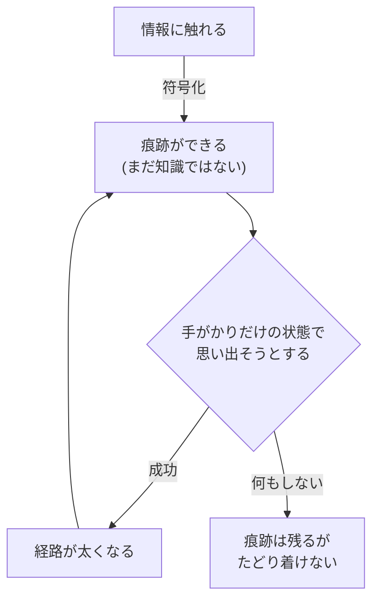
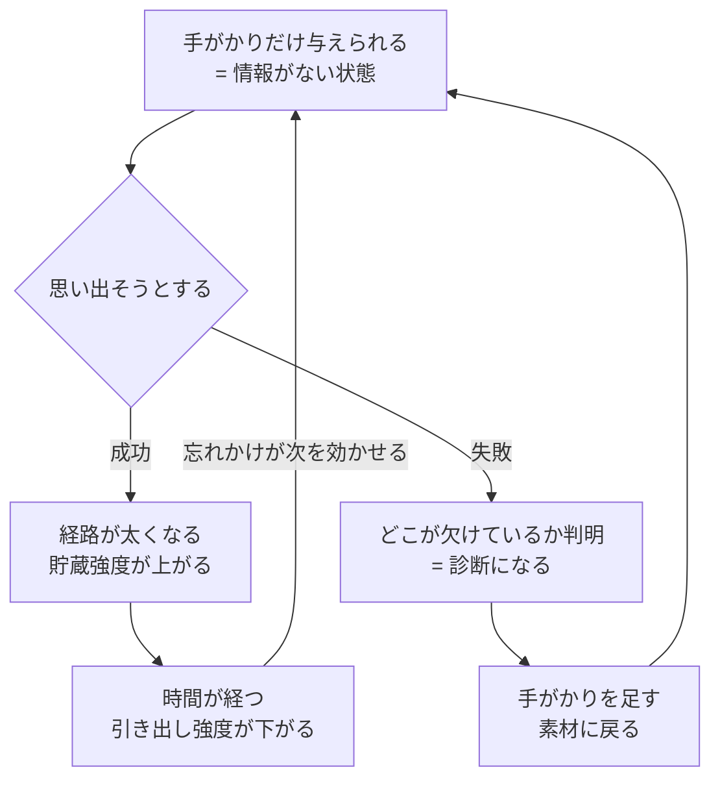
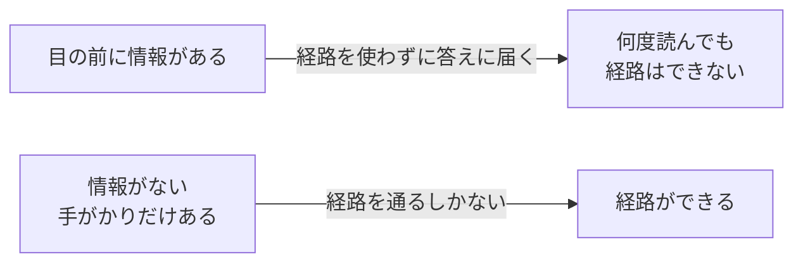
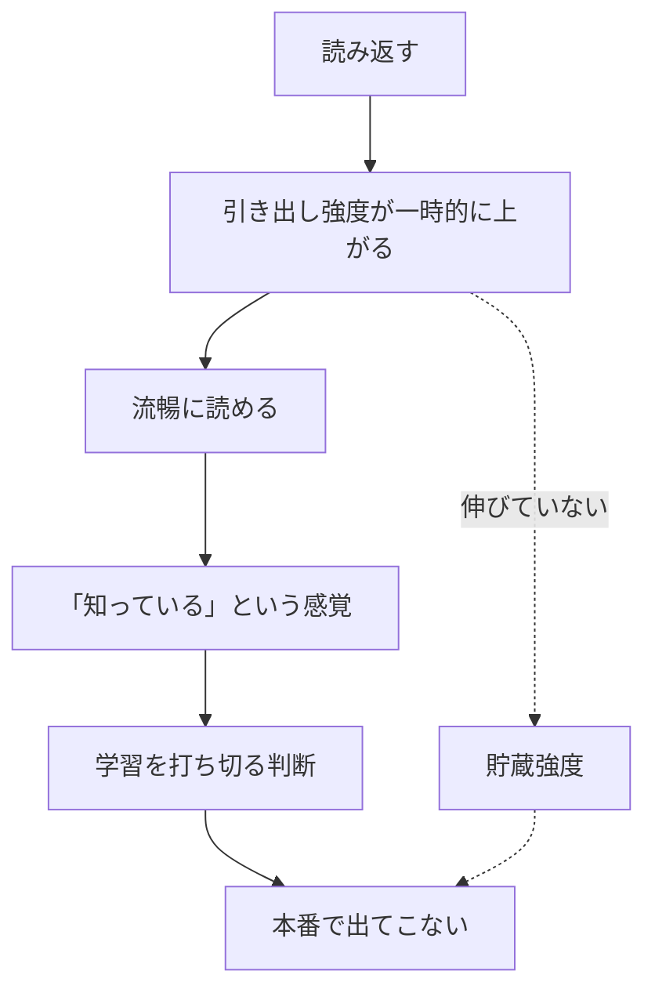
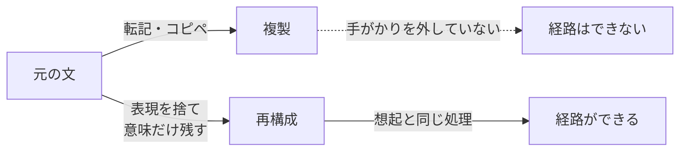
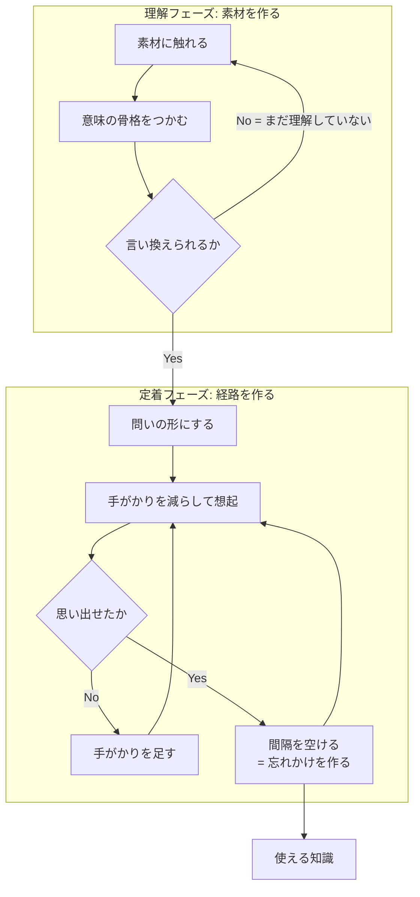

知識の獲得とは情報を「入れる」ことではなく、**引き出せる経路を作る**ことであり、経路は**引いたときにしか作られない**。この一文から、想起練習・分散学習・「自分の言葉にする」の効き目がすべて導出できる。学習法の議論が混乱しがちなのは、筆記具や教材といった手段の層と、この機序の層が混ざるため。

## 素朴なモデルが間違っている

多くの人が暗黙に持つのは**容器モデル** — 脳を器と見て、注いだ量に比例して知識が増えると考える。読んだ回数・眺めた時間が投入量になる。

実際は**経路モデル**で、情報に触れた時点ではまだ知識になっていない。触れて生まれるのは素材だけで、知識になるのは**そこへ至る経路ができたとき**。

## 記憶は1つの量ではない — 2つの強度

Bjork の New Theory of Disuse では、記憶は独立した2つの強さを持つ。

| | 意味 | 性質 |
|---|---|---|
| **貯蔵強度** (storage strength) | どれだけ深く入っているか | **減らない** |
| **引き出し強度** (retrieval strength) | 今どれだけアクセスできるか | **減る** |

独立なので4象限が存在し、実務で問題になるのは対角ではなく**逆対角**のほう。

| | 引き出し強度：高 | 引き出し強度：低 |
|---|---|---|
| **貯蔵強度：高** | 使える知識 | **持っているのに出てこない**(喉まで出かかる状態) |
| **貯蔵強度：低** | **知っている気がするだけ**(読んだ直後) | 未学習 |

左下が学習の失敗の大半を占める。読み返した直後の「分かった感」がここで、**貯蔵強度は伸びていないのにアクセスだけが一時的に良くなっている**。

## 中核 — 想起は読み出しではなく書き込み

直感では「思い出す＝記憶を読みに行く」。実際は**思い出す動作そのものが記憶を書き換え、貯蔵強度を上げる**。想起は memory を読む操作ではなく、**modify する操作**。

筋トレの比喩を正確に言い直すと、**重りを持ち上げて筋肉を鍛えているのではなく、持ち上げる動作が重り自体を大きくしている**。引く行為の外側に「中身を増やす作業」があるのではなく、引く行為が中身を増やす唯一の経路になっている。

## 「情報がない」ことが効き目の源

情報が目前にある状態の学習は、**経路を使わずに答えへたどり着ける**。だから経路は作られず、100回読んでも同じ。逆に手がかりが少ないほど遠回りの経路を通ることになり、効果が大きい — Bjork の **desirable difficulties**(望ましい困難)。

ただし条件が1つ。**たどり着ける範囲であること**。届かない難易度では何も起きないので、最適は「ギリギリ思い出せる」ところ。失敗が続くならヒントを足して難易度を下げる。

## 忘却は敵ではなく前提

上のループには忘却が組み込まれている。**引き出し強度が下がるからこそ次の想起が効く**。忘れる前に復習すると経路を通る必要がないので、ほぼ何も起きない。

分散学習(spacing)が効く理由は、根性論でも「定着に時間が要る」でもなく、**忘れかけを作るため**。この枠組みでは分散は独立したルールではなく、想起練習の帰結として導かれる。

神経基盤の側から見ると、[[episodic-memory|海馬]]の **CA3 のパターン補完**(部分的な手がかりから全体を復元)が想起そのものであり、睡眠中のリプレイによる**固定化**が間隔を空ける意味を裏打ちする。

## 手応えと効果は逆相関する

実践上もっとも危険な性質。

| 方法 | 最中の手応え | 実際の効果 |
|---|---|---|
| 読み返す・眺める | **◎ 気持ちいい** | ✗ |
| 隠して思い出す | **✗ しんどい・不安** | ◎ |

**流暢性の錯覚**(fluency illusion)。手応えと効果が逆相関するため、体感で方法を選ぶと構造的に必ず間違ったほうを選ぶ。したがって学習法は感覚ではなく**原則で選ぶ**しかない。「読み返すな、テストしろ」が精神論ではないのはこのため。

## 「自分の言葉にする」が効く理由

言い換えとは、**元の表現という手がかりを外した状態で、意味だけを頼りに再構成する作業** — つまり想起の一種。だから効く。転記が効かないのは勤勉さの問題ではなく、**手がかりを外していない**から。作業量ではなく原理の違い。

副次効果として、**言い換えられないこと自体が診断になる**。詰まったらまだ理解していない、というシグナルなので、定着ではなく理解に戻る合図として使える。

言い換えを機械化する型:

| 型 | やり方 | 例(COTS) |
|---|---|---|
| 禁止語 | 元の定義のキーワードを使わずに説明 | 「商用」「既製」を禁じる → 自分で作ってないから中身が見えないソフト |
| 問いに変換 | 定義文ではなく質問文にする | 「COTS だと使えなくなる対策は?」 |
| 対比 | 「X は Y と違って〜」の形にする | Bell-LaPadula は機密性、Biba は完全性で矢印が逆 |
| 帰結に変換 | 定義ではなく「何ができなくなるか」を書く | ソースがない → 自分で直せない |

定義の言い換えは難しいが、帰結の記述は書ける。そして試験・実務で問われるのはたいてい帰結のほう。

## 実装 — 2フェーズとゲート

含意は3つ。

1. **理解と定着は別の作業**。混ぜると、理解していないものを暗記しようとして詰む
2. **ゲートは「言い換えられるか」**。通れないうちは定着フェーズに進んではいけない
3. **定着フェーズはループ**であって直線ではない。1回で終わる工程が存在しない

この vault の各ノートにある `## 押さえどころ` セクションが「トピック → 1-2文の本質」形式なのは、**そのまま問いの形に変換できる**ようにするため。理解フェーズの産物(ノート本体)と定着フェーズの入力(カード)を1ファイルで両立させる意図がある。

## エビデンスの強さ

Dunlosky ら (2013) が10の学習技法を有用性で格付けした結果。**高有用性はわずか2つ**。

| 評価 | 技法 |
|---|---|
| **高** | **練習テスト** (practice testing)、**分散学習** (distributed practice) |
| 中 | 精緻化質問、自己説明、交互練習 (interleaved practice) |
| 低 | 要約、ハイライト・下線、キーワード記憶術、イメージ化、**再読** |

注意すべき整合性 — 「自分の言葉にする」に対応するのは中評価の**自己説明・精緻化質問**であって、低評価の**要約**ではない。差は「テキストを見ながら構造を写しているか」対「意味だけを頼りに生成しているか」にある。手がかりを外しているかどうかが、ここでも分岐点になる。

一方で**手書き vs タイプ**の軸は弱い。よく引かれる Mueller & Oppenheimer (2014) は Morehead, Dunlosky & Rawson (2019) の直接再現で再現せず、直接再現のメタ分析でも手書き有利は小さく非有意だった。**筆記具は機序ではない** — 手書きが効いて見えた本当の理由は、転記が物理的に不可能なので要約せざるを得ないこと。同じ機序はデジタルでも再現でき、しかも分散学習の管理はソフトでしか実行できない。

## 押さえどころ

- **知識の獲得とは** → 情報を入れることではなく、引き出せる経路を作ること。経路は引いたときにしかできない
- **記憶の2軸** → 貯蔵強度(減らない)と引き出し強度(減る)。持っているのに出てこない、が普通に起きる
- **想起の正体** → 読み出しではなく**書き込み**。思い出す動作が貯蔵強度を上げる
- **なぜ「情報がない状態」か** → 情報が目前にあると経路を使わずに答えへ届くので、経路ができない
- **忘却の役割** → 敵ではなく前提。引き出し強度が下がるから次の想起が効く = 分散学習の根拠
- **流暢性の錯覚** → 手応えと効果が逆相関する。体感で選ぶと必ず間違える
- **言い換えが効く理由** → 元の表現という手がかりを外した再構成 = 想起の一種。転記は手がかりを外していない
- **エビデンス** → 10技法中の高評価は練習テストと分散学習の2つだけ。再読は低評価。手書き/タイプの差は再現せず

## 制限

- 貯蔵強度・引き出し強度は直接測定できる量ではなく**理論的構成概念**。予測がよく当たるモデルとして使うもので、実体として扱わない
- 効果量は領域・材料・学習者で変動する。「必ず効く」ではなく「平均して効く」
- 想起練習は**失敗が続く難易度では効果が出ない**。前提条件つきの技法であり、万能ではない
- ここで扱うのは宣言的知識(語彙・概念)の獲得。運動技能や手続き的知識の習得は別の機序が絡む

## Links

- [Dunlosky et al. (2013), "Improving Students' Learning With Effective Learning Techniques", *Psychological Science in the Public Interest* 14(1)](https://journals.sagepub.com/doi/abs/10.1177/1529100612453266)
- [Morehead, Dunlosky & Rawson (2019) — 手書き優位説の再現研究](https://link.springer.com/article/10.1007/s10648-019-09468-2)
- [The Learning Scientists — laptop vs longhand の整理](https://www.learningscientists.org/blog/2019/2/21-1)
- Roediger & Karpicke (2006), "Test-Enhanced Learning", *Psychological Science* 17(3) — テスト効果の代表的実証
- Bjork & Bjork (1992), "A New Theory of Disuse and an Old Theory of Stimulus Fluctuation" — 貯蔵強度/引き出し強度の出典

## 関連

- [[episodic-memory]] — CA3 のパターン補完が想起の神経基盤。睡眠中のリプレイによる固定化が分散学習の下地
- [[executive-function]] — 手応えの悪い方法を選び続けるには自己制御が要る。流暢性の錯覚に逆らうのは実行機能の仕事
- [[symbol-grounding]] — 「言い換えられるか」を理解のゲートに使うことは、記号が意味に接地しているかの操作的な判定に近い
