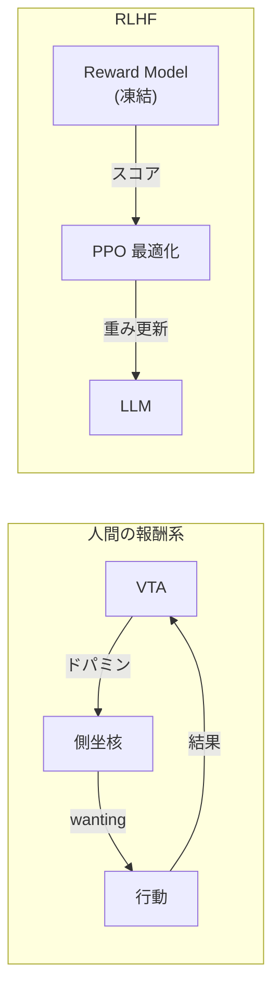

行動の結果を評価し「もう一度やりたい / もうやりたくない」を学習する神経回路。ドパミン報酬系が中核。LLM には内発的動機がゼロであり、RLHF は外部から好みを注入しているに過ぎない。

## 主要構造

| 領域 | 機能 |
|---|---|
| 腹側被蓋野 (VTA) | ドパミンニューロンの起始核。報酬予測誤差を発火パターンで符号化 |
| 側坐核 (NAcc) | VTA からドパミンを受け取る。「やりたい」の駆動力 (wanting) |
| 扁桃体 | 情動的顕著性。危険検知、恐怖学習 |
| 視床下部 | 恒常性、生理的欲求（空腹・渇き・性欲・体温） |
| 手綱核 | 負の報酬信号。回避学習、「もうやめたい」 |

## 報酬予測誤差 (RPE)

Schultz et al. (1997) が発見。ドパミンニューロンは**予測と結果のずれ**に反応する:

| 状況 | ドパミン応答 | 意味 |
|---|---|---|
| 予期しない報酬 | 発火増加 | 「おっ、いいぞ」→ 行動を強化 |
| 予期通りの報酬 | 変化なし | 学習済み |
| 予期したのに報酬なし | 発火減少 | 「あれ？」→ 行動を抑制 |

この機構は強化学習の TD (Temporal Difference) 誤差と数学的に等価であり、AI の強化学習は報酬系を直接モデル化したもの。

## LLM との対応

| 報酬系の機能 | RLHF での代替 | 本質的ギャップ |
|---|---|---|
| 内発的好奇心 (VTA) | なし | RLHF は「人間が好む出力」を教える。「自分から知りたい」がない |
| 恒常性の欲求 (視床下部) | なし | 「疲れたから休みたい」「危険だからやめたい」が原理的に存在しない |
| 情動的顕著性 (扁桃体) | safety training | 危険を「感じる」のではなく、危険なパターンを学習で避けている |
| 回避学習 (手綱核) | RLHF の penalty | 外部フィードバック。実体験に基づく回避ではない |
| 報酬予測誤差 | reward model | 静的なモデル。文脈依存のリアルタイム更新ではない |

## RLHF の構造的限界

人間の報酬系は**閉ループ**: 行動 → 結果 → 評価 → 行動修正がリアルタイムで回る。RLHF は**開ループ**: 学習時に reward model を固定し、推論時には更新されない。

## Links

- [A Neural Substrate of Prediction and Reward (Schultz et al., 1997)](https://doi.org/10.1126/science.275.5306.1593)
- [Dissociating language and thought in large language models (Mahowald et al., 2024)](https://arxiv.org/abs/2301.06627)

## 関連

- [[formal-vs-functional-competence|形式的 vs 機能的言語能力]] — 動機の欠如は機能的言語能力の限界
- [[executive-function|実行機能]] — OFC の価値評価は報酬系と密接に連携
- [[reward-machine-learning|報酬 (強化学習)]] — 同じ「報酬」概念の機械学習版。RPE は RL の TD 誤差と等価
