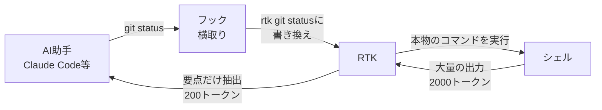

LLM のトークン消費を 60-90% 削減する CLI プロキシ。単一の Rust バイナリ、100+ コマンド対応、オーバーヘッド 5-15ms。

## 何ができる？

AI 助手（Claude Code など）が読み込む長い長い文章を、要点だけに削ってあげる「同時通訳の要約担当」のような道具です。たとえばコマンドの結果が分厚い辞書のようにダラダラ出てくるとき、AI が全部読むと時間もお金もかかります。RTK が間に立って「ここは大事、ここは捨ててOK」と整理してから渡すので、AI の負担が一気に減ります。

嬉しいのは、設定が要らないこと。一度仕込めば、AI が普段通りコマンドを呼ぶだけで、裏で勝手に要約されます。AI は「短くなった」ことに気づきもしません。これで30分の作業で消費する量が約 8 割減ります。

## 用語

- **LLM**: 大量の文章を学んだ「言葉のしくみを覚えた巨大なモデル」。AI 助手の頭脳。
- **トークン**: 文章を機械が数える最小単位。1〜2文字で1トークン。料金と覚えられる量はこれで決まる。
- **CLI プロキシ**: コマンド（CLI）の前に立って、入出力を中継する仕事人。受付のような役割。
- **フィルタリング**: 余計なものを取り除いて、必要なものだけ残すこと。
- **フック**: AI 助手の動きに合わせて、決まった瞬間に自動で割り込ませる仕掛け。「電話が鳴ったら録音する」装置のようなもの。
- **Auto-Rewrite**: AI がコマンドを呼ぶ瞬間に、こっそり「圧縮版」に書き換える仕組み。
- **Permission**: その操作を許可するか、確認するか、止めるかの判定。
- **Exit code**: コマンドが終わるときに残す数字の符号。0なら成功、ほかは失敗の種類を表す。
- **Tee**: 出力を画面に出しつつ、同時にファイルにも保存する仕組み。「コピーを取りながら配る」イメージ。
- **Rust**: 速くて安全なプログラミング言語。プログラム1個で全部入りにできる。
- **SQLite**: 小さなデータベース。ファイル1個で動く家計簿アプリのようなもの。
- **オーバーヘッド**: 余計にかかる時間や負担。「5ms オーバーヘッド」は通常より5ミリ秒だけ余分にかかる、の意味。

## 仕組み



AI 助手とコマンドの間に RTK が立ち、長い出力を要約してから渡します。AI は「短くなった」ことを意識しません。

### 圧縮前後の比較（30分セッション）

| 操作 | 通常 | RTK | 削減 |
|---|---|---|---|
| ファイル一覧 (10回) | 2,000 トークン | 400 | -80% |
| ファイル読み込み (20回) | 40,000 | 12,000 | -70% |
| git の状態確認 (10回) | 3,000 | 600 | -80% |
| 差分確認 (5回) | 10,000 | 2,500 | -75% |
| テスト実行 (5回) | 25,000 | 2,500 | -90% |
| **合計** | **約118,000** | **約23,900** | **-80%** |

文章のページ数で言えば「ぶ厚い本一冊→薄いパンフレット」程度に圧縮されます。

## Core Idea

AI コーディングアシスタント（Claude Code, Cursor, Gemini 等）が CLI コマンドの出力を読む際、大半はノイズ。RTK はコマンド出力をフィルタリング・圧縮してから LLM に渡す。

```
Without RTK:
  Claude → git status → shell → 2,000 tokens (raw)

With RTK:
  Claude → git status → RTK → 200 tokens (filtered)
```

## 4 つの圧縮戦略

### 1. Smart Filtering (50-99%)

ノイズ除去。コメント、空白、ボイラープレート、プログレスバーを削除。

```bash
# git push: 15行 200tokens → 1行 10tokens
rtk git push  # → "ok main"
```

### 2. Grouping (70-90%)

同種のアイテムをルール/ファイル/型でグループ化。

```bash
# ESLint: 500行散在 → ルール別集約
rtk lint
# no-unused-vars (234), semi (89), quotes (45)
```

### 3. Truncation (70-95%)

関連コンテキストを保持、冗長部分をカット。失敗時はフル出力を tee で保存。

```bash
rtk cargo test
# FAILED: 2/15 tests
#   test_edge_case: assertion failed
#   [full output: ~/.local/share/rtk/tee/...]
```

### 4. Deduplication (70-85%)

繰り返しログ行をカウント付きで折りたたみ。

```bash
rtk docker logs app
# [error] Connection timeout (×100)
```

## Auto-Rewrite Hook

最大のキモ。Bash コマンドを **実行前に透過的に書き換える**。

```bash
rtk init -g  # Claude Code にフックをインストール

# 以降、Claude が "git status" を呼ぶと
# フックが自動で "rtk git status" に書き換え
# Claude は書き換えを認識しない — 圧縮された出力だけ受け取る
```

フックは Rust 側の `rtk rewrite` コマンドに委譲。100+ のパターンマッチルールで分類。

### Permission System

```
exit 0 → allow  (自動許可)
exit 1 → no rewrite (RTK対象外、そのまま実行)
exit 2 → deny   (ブロック)
exit 3 → ask    (ユーザー確認)
```

デフォルトは **ask** (exit 3)。最小権限原則。

## 対応 AI ツール

| ツール | フック方式 | コマンド |
|---|---|---|
| Claude Code | PreToolUse bash hook | `rtk init -g` |
| Cursor | hooks.json | `rtk init --agent cursor` |
| Gemini CLI | BeforeTool hook | `rtk init -g --gemini` |
| Codex | AGENTS.md | `rtk init -g --codex` |
| Windsurf | .windsurfrules | `rtk init --agent windsurf` |
| Cline | .clinerules | `rtk init --agent cline` |

計 12 ツール対応。

## 対応コマンド (100+)

### Git (70-92%)

```bash
rtk git status    # コンパクトステータス
rtk git log       # 1行コミット
rtk git diff      # 圧縮 diff
rtk git add       # → "ok"
rtk git commit    # → "ok abc1234"
rtk git push      # → "ok main"
```

### テストランナー (85-99%)

```bash
rtk cargo test      # Rust (-90%)
rtk jest / vitest   # JS (-99%)
rtk pytest          # Python (-90%)
rtk go test         # Go (-90%)
rtk rake test       # Ruby (-90%)
```

失敗テストのみ表示、成功は件数だけ。

### Lint / Build (70-87%)

```bash
rtk lint            # ESLint/Biome ルール別グループ
rtk tsc             # TypeScript エラーファイル別
rtk cargo clippy    # Clippy 警告圧縮
rtk ruff check      # Python lint
```

### ファイル / 検索 (50-80%)

```bash
rtk ls .            # ディレクトリツリー圧縮
rtk read file.rs    # コード読み取り（コメント除去モードあり）
rtk grep pattern .  # ファイル別グループ化
rtk find "*.rs" .   # コンパクト結果
```

### Cloud / Container (70-85%)

```bash
rtk aws ec2 describe-instances  # コンパクトリスト
rtk docker ps                   # コンパクト一覧
rtk kubectl logs pod            # ログ重複除去
```

## Analytics: rtk gain

SQLite でコマンドごとのトークン消費を記録。90日間保持。

```bash
rtk gain              # サマリー
rtk gain --graph      # ASCII グラフ (30日)
rtk gain --daily      # 日別ブレークダウン
rtk gain --quota      # USD 換算節約額
```

### rtk discover

Claude Code のセッション履歴をスキャンして、RTK を使えばもっと節約できたコマンドを特定。

```bash
rtk discover
# rtk git: 12 uses, est. 2,400 tokens saved
# rtk lint: 8 uses, est. 1,200 tokens saved
# Current adoption: 65%
```

## Architecture

```
src/
├── cmds/     42モジュール (git/, rust/, js/, python/, go/, ruby/, cloud/, system/)
├── core/     11モジュール (filter, tracking, tee, config, stream)
├── hooks/    8モジュール (init, rewrite, permissions)
├── analytics/ 4モジュール (gain, session, economics)
└── discover/ 5モジュール (registry, rules, lexer)
```

### Design Decisions

- **Rust**: 4.1MB 単一バイナリ、5-15ms オーバーヘッド、ゼロ依存
- **SQLite**: トラッキング DB、設定不要、90日自動クリーンアップ
- **Exit Code 保持**: CI/CD 互換性のため必須
- **Tee**: 失敗時にフル出力をディスクに保存 → LLM が再実行せず読める
- **Graceful Degradation**: フィルタ失敗時は生出力をパススルー

## 30分セッションの Token 節約

| 操作 | 回数 | 通常 | RTK | 削減 |
|---|---|---|---|---|
| ls / tree | 10x | 2,000 | 400 | -80% |
| cat / read | 20x | 40,000 | 12,000 | -70% |
| git status | 10x | 3,000 | 600 | -80% |
| git diff | 5x | 10,000 | 2,500 | -75% |
| cargo/npm test | 5x | 25,000 | 2,500 | -90% |
| **合計** | | **~118,000** | **~23,900** | **-80%** |

## Links

- [GitHub](https://github.com/rtk-ai/rtk)
- [Website](https://www.rtk-ai.app)
- [Discord](https://discord.gg/RySmvNF5kF)
