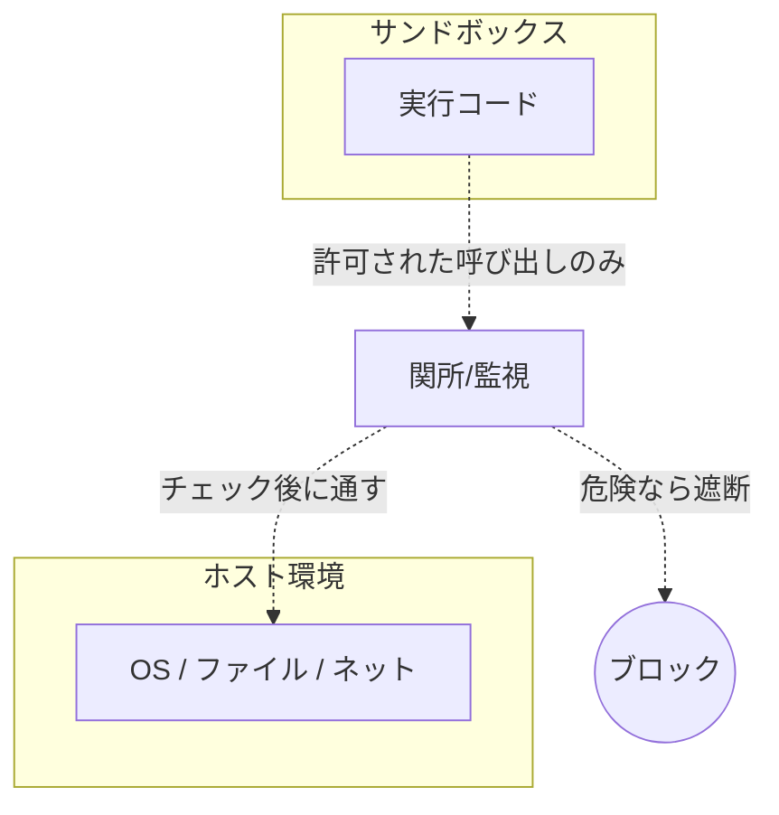

信頼できないプログラムを、外に害を出さない「隔離された部屋」の中で動かす仕組み。

## 何ができる？／なぜ重要？

実験室で危険な薬品を扱うとき、防護ガラスや換気装置のある専用部屋でやりますね。万一こぼれても、他の部屋には影響しないように設計されています。あるいは病院の隔離病棟は、外と空気が混ざらないようになっていて、感染を広げません。サンドボックスは、この「防護室」をプログラムの世界で作るものです。

たとえば、見ず知らずの人が書いたコードや、AI が自動で生成したコマンドを、いきなり自分のパソコンで動かすのは怖いですよね。ファイルを消されたり、変な通信をされるかもしれません。そこで「ここから外には出られない」「ファイルは指定の場所しか触れない」「ネットは決まった先にしか接続できない」と制限した部屋を用意して、その中で動かします。これがあるおかげで、プレイグラウンドでコードをすぐ試せたり、エージェントに作業を任せても安心できたりするのです。

## 仕組み

外の世界と中のコードの間に「関所」を置きます。コードが何かを呼び出すたびに関所が内容を確認し、許可された範囲なら通し、危険な操作は遮断します。中で何が起きても、関所を越えなければ外には影響しません。

## 用語

- **サンドボックス**: 砂場の意。何をしても外に被害が及ばない場所。
- **隔離 (isolation)**: 外の世界から切り離して動かすこと。
- **権限 (permission)**: 何をしてよいかの許可リスト。
- **コンテナ**: OS レベルで隔離する代表技術（Docker など）。
- **VM**: 仮想マシン。OS まるごと別世界として動かす。
- **Wasm サンドボックス**: WebAssembly が標準で持つ安全な実行環境。
- **seccomp**: Linux でシステムコールを絞る仕組み。
- **chroot / jail**: ファイルシステムを限定して見せる古典的手法。
- **ケイパビリティ**: 「これだけはできる」を細かく与える方式。

## vault 内での使われ方

- [[porta]] — capability-based MCP bridge。WASM (wasmtime) 隔離と macOS sandbox-exec によるネイティブ制限の二モードを提供する
- [[claude-code]] — Permission system (allow/ask/deny) と PreToolUse/PostToolUse hooks でツール実行を制御する CLI エージェント

## 関連概念

- [[effect-system]] — 副作用を型で制限する、サンドボックスの言語版

## Links

- [Wikipedia: Sandbox (computer security)](https://en.wikipedia.org/wiki/Sandbox_(computer_security))
- [WebAssembly Security](https://webassembly.org/docs/security/)
