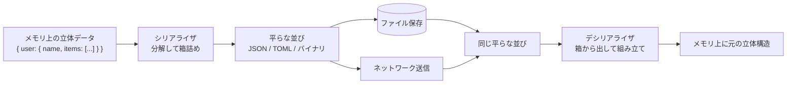

メモリ上にある立体的なデータ構造を、保存や送信ができる「平らな並び」に変える作業。引っ越しの前に家具を分解して箱詰めするようなもの。

## 何ができる？／なぜ重要？

引っ越しにたとえます。家の中ではタンスや椅子は組み立てられた状態ですが、トラックに積むには分解して梱包しなければなりません。引っ越し先に着いたら、また同じ手順で組み立てます。プログラムのデータも同じで、メモリ上では「オブジェクトの中にリストがあって、その中にまた別のオブジェクトがあって…」という立体構造になっていますが、ファイルに書き出したり、ネットワーク越しに送ったりするには、一旦バラして「文字や数字の一列の並び」にする必要があります。これがシリアライゼーション（直列化）です。受け取った側は逆の作業（デシリアライゼーション）で元の立体構造に組み立て直します。

なぜ重要かというと、保存・送信・通信のすべてに必要だからです。設定ファイル、API 通信、データベース保存、画面遷移時の state 引き渡し、AI モデルのパラメータ保存…どれも形式の選択でアプリの寿命や性能が決まります。可読性、サイズ、速度、互換性、それぞれを天秤にかけて形式を選ぶことになります。

## 仕組み

両端のシリアライザとデシリアライザは「同じ形式」のルールに従っているので、書いた側と読む側がまったく別のプログラム・別の言語でも問題なく組み立て直せます。どの形式を選ぶかでファイルの大きさ・読み書き速度・人間の読みやすさが大きく変わります。

## 用語

- **シリアライゼーション (Serialization)**: 立体データを直列の並びに変換する作業。「直列化」「整列化」とも訳す。
- **デシリアライゼーション (Deserialization)**: 直列の並びを元の立体に戻す作業。
- **JSON**: 人間も読めるテキスト形式。Web で最普及。
- **TOML**: 設定ファイル向きのテキスト形式。読みやすさ重視。
- **YAML**: インデントベースのテキスト形式。設定や CI でよく使われる。
- **CSV / TSV**: 行と列の表形式。表計算と相性がよい。
- **Base64**: バイナリをテキストに収める変換。シリアライズの最終仕上げに使うことも多い。
- **Protocol Buffers / MessagePack**: 機械同士の通信向きの効率的なバイナリ形式。
- **スキーマ**: 「このデータはこういう形」と決めた型の取り決め。互換性管理に効く。
- **後方互換性**: 古い読み手でも新しいデータが読めること。スキーマ進化の重要要件。

## vault 内での使われ方

- [[almide-toml]] — TOML v1.0 パーサ／シリアライザ。`toml.parse` / `toml.stringify` と Codec 経由の `encode` / `decode[T]` を提供
- [[almide-yaml]] — YAML パーサ／シリアライザ。`yaml.parse` / `yaml.stringify` と Codec 連携を提供
- [[almide-csv]] — RFC 4180 準拠の CSV。`csv.parse` (array of arrays) と `csv.parse_records` (header → array of objects) の両 API
- [[almide-base64]] — Base64 (RFC 4648) と URL-safe Base64。文字列 / バイト両 API
- [[resepy]] — Python 製 DSV (CSV / TSV / 任意 delimiter) 変換 CLI / ライブラリ。`convert` と `cat`（複数ファイル merge）を提供
- [[almide]] — `Codec` プロトコルを言語標準に提供。`type T: Codec` を派生すると各 serializer が自動で encode / decode に対応
- [[lean4-rust-backend]] — `lean-ir-export` で Lean Environment から Decl を独自 JSON に書き出し、`lean-ir-codegen` が serde で読んで Rust ソースを生成
- [[whenm]] — Event Calculus を Prolog ファクトとして表現し、`exportProlog()` / `importProlog()` で外部に取り出せる

## 関連概念

- [[codec]] — シリアライゼーションは codec の代表的な使われ方
- [[mcp]] — JSON-RPC のシリアライズ規約に基づく
- [[edge-computing]] — エッジ間でのデータ送受信は形式選びがそのまま性能に効く

## Links

- [Serialization (Wikipedia)](https://en.wikipedia.org/wiki/Serialization)
- [JSON (公式)](https://www.json.org/)
- [Protocol Buffers (Google)](https://protobuf.dev/)
