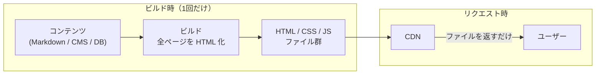

**ビルド時に全ページの HTML を生成しておき、静的ファイルとして配信する**レンダリング戦略。[[ssr|SSR]] と同じ「サーバー側で HTML を作る」でも、タイミングが「リクエスト時」ではなく「デプロイ前」。リクエスト時の計算はゼロで、配信は [[anycast-cdn|CDN]] に置くだけ。

## 仕組み

本質は「レンダリングを 1 回だけやって結果を全員に使い回す」— つまり**究極のキャッシュ**。SSR が毎リクエスト計算するのに対し、SSG は N 人目のアクセスにも 1 人目と同じファイルを返す。

## トレードオフ

| 長所 | 短所 |
|---|---|
| 最速（TTFB は CDN のファイル配信のみ） | 更新にリビルドが必要 — 反映にタイムラグ |
| 最安（レンダリングサーバー不要） | ビルド時間がページ数に比例 — 数万ページ級で苦しくなる |
| 最も堅牢（落ちるサーバーが無い、攻撃面が小さい） | リクエスト時情報を使えない — パーソナライズ不可 |
| スケールは CDN 任せ | 「全員に同じもの」しか出せない |

## 限界への回答

| 手法 | 何を解決するか |
|---|---|
| ISR (Incremental Static Regeneration) | 「更新のたびに全ビルド」を解消。期限切れページをリクエストを契機に裏で再生成する（stale-while-revalidate の発想） |
| On-demand revalidation | CMS 更新の Webhook で該当ページだけ再生成 |
| SSG + クライアント JS | 枠は静的に固定し、ユーザー固有部分（カート数・ログイン名）だけクライアントで fetch して埋める |
| Islands Architecture | 静的 HTML の中に interactive な島だけ埋め込む（Astro） |

この「静的配信 + API + クライアント JS」という構成を思想として掲げたのが **Jamstack**（2016〜, Netlify）。

## 向くケース

**誰が見ても同じで、更新頻度がビルドで追える**サイト。ブログ・ドキュメント・LP・マーケティングサイト。このリポジトリの viewer（Astro 製）も SSG そのもの。

## 押さえどころ（カード化候補）

- SSG の定義 → ビルド時に全ページの HTML を生成して静的配信する戦略。SSR との違いはレンダリングのタイミング（リクエスト時 vs デプロイ前）
- SSG の本質 → 究極のキャッシュ。レンダリングを 1 回だけ行い、結果を全リクエストに使い回す
- SSG の 3 つの限界 → 更新にリビルドが要る / ビルド時間がページ数に比例 / リクエスト時情報が使えない（パーソナライズ不可）
- ISR とは → 期限切れの静的ページをリクエスト契機に裏で再生成する仕組み。stale-while-revalidate の発想で全ビルドを不要にする
- Jamstack とは → 静的配信 + API + クライアント JS という構成の思想（2016, Netlify）。SSG はその中核
- SSG が向くケース → 誰が見ても同じ・更新がビルドで追えるサイト（ブログ・ドキュメント・LP）

## Links

- [Static Rendering — patterns.dev](https://www.patterns.dev/react/static-rendering/)
- [Incremental Static Regeneration — Next.js](https://nextjs.org/docs/app/guides/incremental-static-regeneration)
- [Jamstack](https://jamstack.org/)

## 関連

- [[rendering-strategies]] — CSR/SSR/SSG を横並びで比較する親ノート
- [[ssr]] — 同じ「サーバー側で作る」をリクエスト時に行う隣人
- [[csr]] — 静的配信という点は同じだが、HTML の中身を作る場所が違う
- [[anycast-cdn]] — SSG の配信基盤。TTFB 最小化の実体
