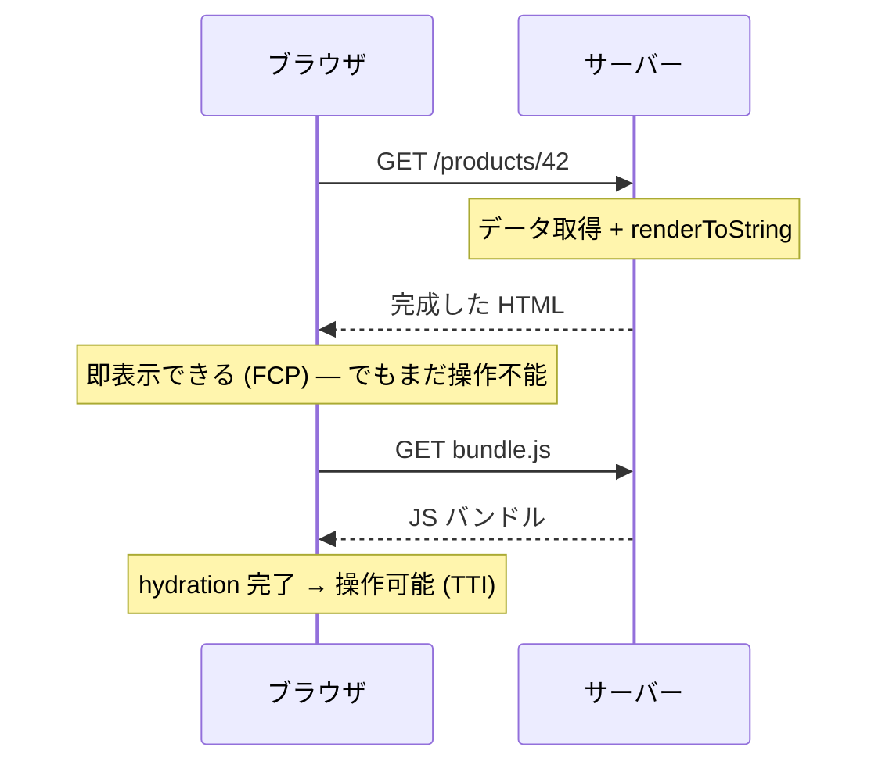

**リクエストのたびにサーバーで HTML を生成して返す**レンダリング戦略。ブラウザは受け取った瞬間から表示できるため初回表示が速く、SEO・OGP に完全対応する。代償はリクエストごとのサーバー計算コストと運用。[[rendering-strategies|レンダリング戦略]]の一角。

## 二つの世代

| | 古典 SSR | モダン SSR |
|---|---|---|
| 代表 | CGI, PHP, [[rails\|Rails]], Django | Next.js, Nuxt, SvelteKit |
| クライアント側 | HTML は完成品。動きは jQuery 等を別途追加 | 同じコンポーネントをクライアントでも実行して hydration |
| 遷移 | フルページリロード（MPA） | 2 ページ目以降は [[spa\|SPA]] 遷移 |
| コードベース | サーバー用とクライアント用が分離 | **isomorphic / universal** — 1 つのコードが両方で動く |

モダン SSR の核心は **isomorphic JavaScript**: React の `renderToString` 等で、同じコンポーネントツリーをサーバーでは HTML 文字列に、クライアントでは DOM 操作に使う。「Rails への回帰」ではなく、**CSR の資産（コンポーネントモデル）を保ったまま初回だけサーバーで描く折衷**。

## Hydration — SSR を理解する鍵

サーバー産の HTML は**見えるが操作できない**（イベントハンドラが無い）。クライアントで同じコンポーネントツリーを再構築し、既存の DOM に紐付けてハンドラを張る処理が **hydration**。

ここから **FCP と TTI のギャップ**（見えるのに反応しない uncanny valley）が生まれる。しかも hydration はレンダリングとほぼ同等の計算を二度やる無駄を含むため、これを削る方向にフレームワークは進化している:

- **Streaming SSR** — HTML をチャンクで送り、揃った部分から表示（React `renderToPipeableStream`）
- **RSC (React Server Components)** — サーバー専用コンポーネントの JS をクライアントに送らず、hydration 対象を interactive な部分だけに絞る
- **Islands Architecture** — ページの大部分を静的 HTML にし、動く「島」だけ hydrate する（Astro）
- **Edge SSR** — レンダリングを [[edge-computing|エッジ]]（[[v8-isolates|V8 Isolates]] 等）で実行して TTFB を削る

## トレードオフ

| 長所 | 短所 |
|---|---|
| 初回表示が速い（完成 HTML が届く） | リクエストごとにサーバーで計算（コスト・スケール設計が必要） |
| SEO / OGP に完全対応 | TTFB がサーバー処理時間に依存 |
| データ取得がサーバー内で完結（クライアントからの API 往復より速い） | hydration のコストと FCP/TTI ギャップ |
| リクエスト時情報（Cookie・地域・A/B）でパーソナライズできる | サーバー運用が必須（[[ssg\|SSG]] のような「置くだけ」は不可） |

## 向くケース

**内容がユーザーやタイミングで変わり、かつ検索流入が重要なページ**。EC の商品ページ、ニュース、SNS のフィード・プロフィール。内容が全員同じなら [[ssg|SSG]] で足り、SEO が不要なら [[csr|CSR]] で足りる — SSR は両方の要件が重なったときの答え。

## 押さえどころ（カード化候補）

- SSR の定義 → リクエストごとにサーバーで HTML を生成して返す戦略。初回表示と SEO に強く、サーバーコストが代償
- 古典 SSR とモダン SSR の違い → 古典は HTML が完成品で動きは別途。モダンは同じコンポーネントを両側で実行する isomorphic + hydration
- hydration とは → サーバー産 HTML にクライアントで同じツリーを再構築しイベントハンドラを紐付ける処理。「見えるが操作できない」ギャップの原因
- FCP と TTI のギャップ → SSR は FCP が速いが hydration 完了までは操作不能。この uncanny valley の解消が RSC / Islands / Streaming の動機
- RSC が解決するもの → サーバー専用コンポーネントの JS をクライアントに送らないことで、バンドルと hydration 対象を interactive な部分だけに絞る
- SSR が向くケース → パーソナライズまたは高頻度更新 × SEO が重なるページ（EC 商品・ニュース・フィード）

## Links

- [Rendering on the Web — web.dev](https://web.dev/articles/rendering-on-the-web)
- [Server-side Rendering — patterns.dev](https://www.patterns.dev/react/server-side-rendering/)
- [Islands Architecture — Jason Miller](https://jasonformat.com/islands-architecture/)

## 関連

- [[rendering-strategies]] — CSR/SSR/SSG を横並びで比較する親ノート
- [[csr]] — 対極の戦略。HTML 生成をブラウザに委ねる
- [[ssg]] — 同じ「サーバー側で作る」をビルド時に行う隣人
- [[spa]] — モダン SSR は初回 SSR + 以降 SPA 遷移のハイブリッド
- [[edge-computing]] / [[v8-isolates]] — Edge SSR の実行基盤
- [[rails]] — 古典 SSR の代表格
