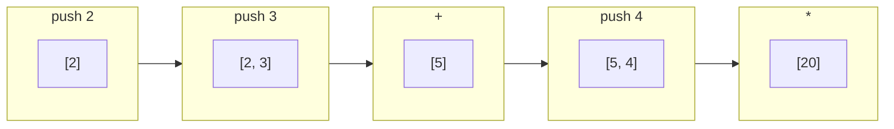

スタック上の値を操作して計算を進めるプログラミングパラダイム。1970年の [[forth|Forth]] を起源とし、PostScript、JVM バイトコード、[[wasm-core|WebAssembly]] など、コンパイラ・VM 設計に広く浸透している。関数合成そのものをプログラミングの基本操作とする連接型 (concatenative) パラダイムの計算基盤。

## プログラマ向けの一言

**変数がない。引数も戻り値もない。あるのはスタックだけ。** 値を積んで、演算子が上から取って結果を積む。それだけ。

## コードで理解する

```ts
// スタックマシンのシミュレータ
function run(program: string): number[] {
  const stack: number[] = [];

  for (const token of program.split(" ")) {
    switch (token) {
      case "+": { const b = stack.pop()!; const a = stack.pop()!; stack.push(a + b); break; }
      case "*": { const b = stack.pop()!; const a = stack.pop()!; stack.push(a * b); break; }
      case "dup":  stack.push(stack[stack.length - 1]); break;  // 複製
      case "swap": { const b = stack.pop()!; const a = stack.pop()!; stack.push(b, a); break; }
      case "drop": stack.pop(); break;
      default:     stack.push(Number(token)); break;  // 数値をpush
    }
  }
  return stack;
}

// 3 + 4
run("3 4 +");          // [7]

// (2 + 3) * 4
run("2 3 + 4 *");      // [20]

// 括弧が要らない — 逆ポーランド記法 (RPN)
// 通常:  (2 + 3) * 4
// RPN:   2 3 + 4 *
// 演算子が来た瞬間に実行できる → パーサ不要
```

## 実行の可視化

`2 3 + 4 *` の実行過程:



命令ごとにスタックの状態が決定的に遷移する。各ステップで「今スタックに何が何個あるか」が静的に分かる — これがバリデーションの容易さに直結する。

## 逆ポーランド記法 (RPN)

スタック指向の表記法は逆ポーランド記法 (Reverse Polish Notation) と呼ばれる。

| 表記法 | 式の書き方 | 括弧 | パーサ |
|---|---|---|---|
| 中置記法 (infix) | `(2 + 3) * 4` | 必要 | 演算子の優先順位を解析する必要あり |
| 前置記法 (prefix / Polish) | `* + 2 3 4` | 不要 | [[lisp\|Lisp]] の S 式はこの変種 |
| 後置記法 (postfix / RPN) | `2 3 + 4 *` | 不要 | トークンを左から読むだけで実行可能 |

RPN の核心: **演算子が現れた瞬間に必要なオペランドはすべてスタック上に揃っている**。構文解析が不要になるため、コンパイラ・インタプリタが極端に単純になる。

## なぜスタックマシンか

### コンパクトな命令エンコーディング

レジスタマシンは「どのレジスタからどのレジスタへ」を命令に埋め込む必要がある:

```
; レジスタマシン (x86風)
add eax, ebx, ecx    ; 3つのオペランド指定 → 命令が長い

; スタックマシン
i32.add               ; オペランド指定不要 → 1バイト (0x6a)
```

オペランド指定分のバイトが不要 → **バイナリサイズが小さくなる**。ネットワーク転送が前提の [[wasm-core|WebAssembly]] にとって、この差は本質的。

### ハードウェア非依存

| CPU | 汎用レジスタ数 |
|---|---|
| x86_64 | 16 本 |
| AArch64 (ARM) | 31 本 |
| RISC-V | 32 本 |

レジスタ構成は CPU ごとにまったく異なる。スタックマシンは特定のレジスタ構成を前提としないため、どの CPU でも均等に JIT/AOT コンパイルできる。

### バリデーションの容易さ

スタックマシンの命令列を先頭からなぞるだけで、各時点のスタック深さと型を静的に決定できる。この性質が [[wasm-core|Wasm の形式的安全性保証]] (Progress & Preservation) の計算基盤になっている。

### スタックマシン vs レジスタマシン

| 観点 | スタックマシン | レジスタマシン |
|---|---|---|
| 命令サイズ | 小さい (オペランド指定不要) | 大きい (レジスタ番号が必要) |
| 命令数 | 多い (ロード/ストアが増える) | 少ない (レジスタ間で直接演算) |
| バイナリサイズ | 小さい | 大きい |
| 実行速度 (解釈) | 遅い (メモリアクセス多) | 速い (レジスタは CPU 内) |
| 実装の複雑さ | 極めて単純 | レジスタ割り当てが複雑 |
| JIT 後の性能 | JIT がレジスタに割り当て → 差は縮む | ネイティブに近い |
| 検証の容易さ | 線形時間で型チェック可能 | データフロー解析が必要 |
| 代表例 | JVM, Wasm, Forth, PostScript | x86, ARM, Lua VM, Dalvik |

実際の CPU はすべてレジスタマシン。スタックマシンは「中間表現 (IR)」や「配布フォーマット」として使われ、最終的には JIT/AOT でレジスタマシンのコードに変換される。

## スタック操作語

```
dup    ( a -- a a )       スタックトップを複製
drop   ( a -- )           スタックトップを捨てる
swap   ( a b -- b a )     上の2つを入れ替え
over   ( a b -- a b a )   2番目をコピーしてトップに
rot    ( a b c -- b c a ) 3番目をトップに回す
nip    ( a b -- b )       2番目を捨てる (= swap drop)
tuck   ( a b -- b a b )   トップを2番目の下にコピー (= swap over)
```

`( a b -- b a )` はスタック効果記法 (stack effect notation)。`--` の左が入力、右が出力。Forth の伝統で、すべてのワード（関数）にこの記法でシグネチャを付ける。

## 連接型プログラミング (Concatenative Programming)

スタック指向言語の多くは連接型 (concatenative) でもある。プログラムの結合が関数合成に対応するパラダイム。

```forth
\ Forth: ワードの並びがそのまま関数合成
: double  2 * ;
: quadruple  double double ;    \ double . double (関数合成)

5 quadruple   \ → 20
```

```ts
// 通常の関数型: 合成には明示的な compose が必要
const double = (x: number) => x * 2;
const quadruple = compose(double, double);
quadruple(5);  // → 20

// 連接型: 「プログラムの連結 = 関数の合成」
// "double double" は double を2回適用する合成関数そのもの
// 特別な合成演算子が不要 — 空白 (並置) が合成
```

連接型の数学的背景: プログラムはスタック変換 `Stack → Stack` の射。並置が射の合成。**圏論的にはモノイドのスタック上の自己関手の圏**。

## 計算理論上の位置づけ

スタックマシンの計算能力は、スタックの本数で決まる:

| スタック数 | 計算能力 | 対応する計算モデル |
|---|---|---|
| 0 | 有限状態 | 有限オートマトン (FSA) |
| 1 | 文脈自由言語 | [[type-2-grammar\|プッシュダウンオートマトン (PDA)]] |
| 2 以上 | チューリング完全 | チューリングマシン |

Forth はデータスタックとリターンスタックの 2 本を持つ → **チューリング完全**。WebAssembly もオペランドスタック + コールスタック + 線形メモリでチューリング完全。

## 実世界での応用

スタック指向は「言語」だけでなく、VM・バイトコード・ハードウェアの設計原理として広く使われている。

| 応用 | 年代 | 特徴 |
|---|---|---|
| [[forth\|Forth]] | 1970 | 元祖。数 KB でコンパイラが書ける。宇宙探査機 (Philae) で使用 |
| HP 電卓 (RPN) | 1972 | HP-35 以降。括弧不要で科学計算。エンジニアに愛された |
| PostScript | 1982 | ページ記述言語。PDF の前身。Forth の影響を強く受ける |
| JVM バイトコード | 1995 | Java のコンパイルターゲット。スタックベース IR |
| CIL (.NET) | 2000 | C# / F# のコンパイルターゲット。JVM と同じくスタックベース |
| Bitcoin Script | 2009 | トランザクション検証。意図的にチューリング不完全 (ループなし) |
| [[wasm-core\|WebAssembly]] | 2017 | ブラウザ/Edge ランタイム。バイナリサイズ・ポータビリティ・安全性のためにスタックマシンを採用 |
| Ethereum EVM | 2015 | スマートコントラクト実行。256-bit ワードのスタックマシン |
| Factor | 2003 | 現代的なスタック指向言語。型推論、GC、FFI 完備 |

JVM と Wasm はどちらもスタックマシンだが、設計思想が異なる:

| 観点 | JVM | WebAssembly |
|---|---|---|
| 型システム | オブジェクト指向 (参照型 + プリミティブ) | 4 数値型のみ (i32/i64/f32/f64) |
| メモリモデル | GC 管理のヒープ | 線形メモリ (手動管理) |
| 制御フロー | goto あり | 構造化のみ (goto なし) |
| 検証 | クラスロード時に bytecode verifier | ロード時にバリデーション (線形時間) |
| 設計目標 | Java の移植性 | Web の安全性 + 速度 |

## 押さえどころ

- スタック指向の本質 → 変数なし、すべてスタック上の push/pop。演算子は上から取って結果を積む。逆ポーランド記法により構文解析が不要
- なぜ WebAssembly がスタックマシンか → バイナリサイズの最小化 (オペランド指定不要)、ハードウェア非依存 (レジスタ構成に依存しない)、バリデーションの容易さ (線形時間で型チェック)
- スタック vs レジスタの実態 → スタックマシンは「配布・検証フォーマット」。最終的に JIT/AOT でレジスタマシンのネイティブコードに変換される。直接解釈ではレジスタマシンが速い
- 連接型との関係 → スタック指向言語の多くは連接型。プログラムの並置が関数合成に対応。特別な合成演算子が不要
- 計算能力はスタック数で決まる → 1本=PDA (文脈自由)、2本以上=チューリング完全。Forth はデータスタック+リターンスタックの2本
- スタック効果記法 → `( a b -- b a )` で入力と出力を宣言。Forth の伝統で関数のシグネチャを表す

## 関連

- [[forth|Forth]] — スタック指向の元祖 (1970)
- [[wasm-core]] — WebAssembly もスタックマシン。バイナリサイズ最小化・ポータビリティ・バリデーション容易性が採用理由
- [[lisp|LISP]] — 前置記法 (prefix) で対照的。ただし「言語自体を拡張する」思想は共通
- [[type-2-grammar|Type 2 文法（文脈自由文法）]] — PDA (1スタック) の計算能力が文脈自由言語に対応
- [[fifo-lifo|FIFO / LIFO]] — スタックは LIFO データ構造
- [[lambda-calculus|λ計算]] — 関数適用の計算モデル。スタック指向は値の変換、λ計算は束縛と置換で対照的
- [[github-com-mruby-mruby|mruby]] — RiteVM は**レジスタ**マシン。スタックVM(YARV/Wasm)との対比例
