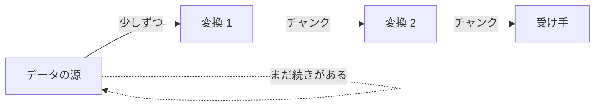

データをまとめて受け取らず、少しずつ流れてくる順に処理していく方式。

## 何ができる？／なぜ重要？

巨大なダムから一気に水を流すと下流が壊れますが、川のように流れ続けていれば、田んぼも工場も少しずつ水を使えますね。あるいは工場のベルトコンベアを思い浮かべてください。製品が一気に山積みで届くのではなく、一個ずつ順に流れてくるから、各作業者が無理なくさばけます。ストリーミング処理は、まさにこの「川」や「コンベア」をプログラムでやる方法です。

これがあると、動画を全部ダウンロードし終わる前から再生を始められたり、AI が長い文章を答える途中から画面に表示できたりします。メモリも節約できます。たとえば 100GB のログファイルを「一気に全部読んでから処理」しようとするとパソコンがパンクしますが、「一行ずつ流して処理」すれば、ノート PC でもさばけます。大きなデータや、時間のかかる処理を「待たせない」ための基本技術です。

## 仕組み

データはチャンク（かたまり）の単位で次々と流れます。各処理は届いたチャンクをすぐに次へ送るので、最初のデータが届いた時点ですでに最後の出口に何かが出始めます。全部が揃うのを待つ必要がありません。

## 用語

- **ストリーム**: 流れ続けるデータの列。
- **チャンク**: 流れの単位となるかたまり。
- **バックプレッシャー**: 受け手が追いつかないとき、送り手にスピードを落としてもらう仕組み。
- **パイプライン**: 複数の処理をつなげて流す経路。
- **イテレータ**: 一つずつ取り出す仕組み。
- **buffer**: 一時的に貯めておく場所。流れを滑らかにする。
- **SSE (Server-Sent Events)**: サーバから少しずつ文字列を送る方式。
- **チャネル**: ストリームを受け渡す配管。

## vault 内での使われ方

- [[nagare]] — ストリーミング処理の中核実装
- [[unillm]] — LLM の出力をストリームで受け取り、即座に表示
- [[fractop]] — ジョブをチャンクに分割して並列に流す
- [[iteratop]] — ストリームを操作するイテレータ群
- [[llmine]] — LLM への入力をストリーム化するパイプライン
- [[llm-queue-dispatcher]] — リクエストを順次流して処理
- [[premaid]] — ダイアグラム生成過程の段階的出力

## 関連概念

- [[async-await]] — ストリーム処理は async と一体で扱われやすい
- [[effect-system]] — 「流れる」副作用を型で管理する設計
- [[agentic-coding]] — エージェントの応答をストリームで返す UX

## Links

- [Wikipedia: Stream processing](https://en.wikipedia.org/wiki/Stream_processing)
- [Reactive Streams](https://www.reactive-streams.org/)
