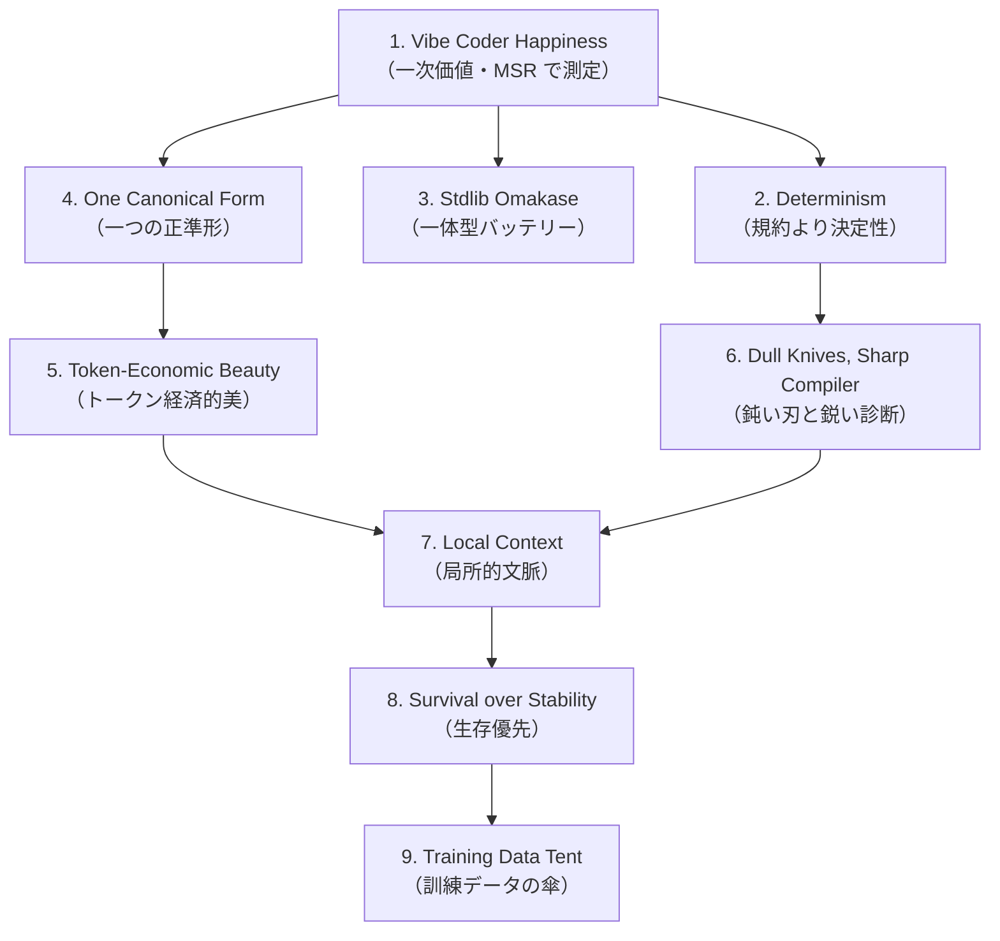

> **[仮版・WIP]** これは Almide Doctrine のドラフト。Rails Doctrine の文体・構成を参照しつつ、AI 時代の言語設計に対する応答として書いた思考実験。9 原則の選定・命名・順序・記述は今後の議論で大きく更新される可能性がある。引用・転載する際は本ドキュメントが仮版である旨を明示すること。

Almide は、2025 年以降の特殊な時期に生まれた言語だ。LLM が本番のコードを書き始めた時期。既存の言語の多くが、この変化に正面から応えていない時期。そして「言語そのものを LLM 時代の用途に最適化する」という賭けが、ようやく現実的なリターンを期待できるようになった時期。

ある言語の生存と繁栄を、技術的優位やタイミングだけで説明することはできない。優位は時間とともに薄れ、タイミングは一度しか効かない。長期にわたって意味を持ち続けるためには、その言語が何を信じているか── どんな価値を一次に置き、何を犠牲にするか ──を明示する信条が要る。本ドキュメントはその最初の試みだ。

ここで挙げる 9 つの柱の根源的なオリジナリティを、私は主張しない。Almide がやろうとしているのは、「LLM が正確に書ける言語とは何か」という問いに対する一連の異端的な答えを、一つの内的整合性を持った言語に集約することだ。多くの個別アイデアは、過去の言語設計者・型理論家・コンパイラエンジニア・LLM 研究者がすでに別の文脈で議論してきたものでもある。

以下が、Almide のドクトリンとして最も重要だと私が考えている 9 つの柱だ。

1. バイブコーダーの幸せへの最適化
2. 設定より、規約より、決定性
3. 標準ライブラリのおまかせ
4. 唯一の正準形を選ぶ
5. トークン経済的な美の称賛
6. 鈍いナイフと鋭いコンパイラ
7. 局所的文脈の重視
8. 安定性よりも生存性
9. 訓練データという傘

## 1. バイブコーダーの幸せへの最適化

Rails Doctrine の最初の柱は「プログラマーの幸せへの最適化」だった。これは Ruby が一次価値に据えた "programmer happiness" を、フレームワーク設計に持ち上げたものだ。Almide の最初の柱は構造としては似ているが、「誰の幸せか」が決定的に違う。Almide は **コードを書かない人の幸せ** を一次価値に据える。

私はこの種の人を「Vibe Coder」と呼んでいる。Andrej Karpathy が 2025 年初頭に提唱した用語だ。Vibe Coder は自然言語で意図を伝え、LLM にコードを書かせ、出力を評価して次の指示を出す。彼らのキーボード入力は「コードを書く時間」ではなく「指示と評価を書く時間」になる。

Programmer Happiness が「書き味の喜び」だったのに対し、Vibe Coder Happiness は別の場所にある。**指示を出してから動くコードが手に入るまでの確信度**、より厳密には **「次に AI に修正を頼んでも、まだ動くという確信」**。これが Vibe Coder の評価軸だ。書いた瞬間の心地よさではない。修正イテレーションを跨いで生き残る感覚だ。

ここに Almide が他の言語と決定的に違う点がある。Programmer Happiness は本質的に主観的で測定不能だった。「書いていて気持ちいい」を実数に変換する方法は誰も持っていなかった。Almide の Vibe Coder Happiness は違う。**Modification Survival Rate (MSR)** ──連続した AI 修正の後でコードがコンパイルしテストを通す割合──として観測可能だ。設計判断のたびに、それが MSR を上げるか下げるかをベンチマークできる。一次価値が測定可能であるという事実は、Almide の他のすべての判断の出発点になる。

私はこのことを、Vibe Coder への嫌味でも、人間プログラマーへの侮辱でもなく、ただ事実として書いている。1950 年代以降、プログラマーは「マシンに直接話しかける」ことに膨大な認知資源を費やしてきた。それは尊い職人芸だったが、同時に「何を作るか」に向けるべき認知資源を削っていた。Almide は、その削られていた資源を取り戻すための言語だ。Vibe Coder は人間でなくなるわけではない。むしろ、より深く考える時間を持った人間になる。Almide はその移行を支える土台でありたい。

## 2. 設定より、規約より、決定性

Rails の Convention over Configuration は、人間が「設定を書かなくて済む」喜びを発明した。これは 2004 年に Java/PHP の設定地獄に対する明確な処方箋だった。Almide はこの原則を継承しつつ、一段階強める。**規約に従えば設定不要、ではなく、そもそも他の書き方が存在しない。**

なぜそこまでするのか。LLM の出力は、次トークンの確率分布から 1 つを選ぶ過程の連鎖だ。同じ意図に対して書き方が複数あると、その確率分布は分散し、選ばれるトークンは予測不能になる。決定的な構文は決定的な出力をもたらす。これは哲学ではなく、最尤推定の構造的帰結だ。

具体例を挙げよう。Almide では、条件分岐に if/else チェーンを **書ける** が **書かない**。`match` を書く。リスト処理に var + for ループを **書ける** が **書かない**。`list.map` / `filter` / `flat_map` を書く。反復に var + while + フラグを **書ける** が **書かない**。再帰または `scan_while` を書く。これらは美的選好ではない。`CLAUDE.md` の "Idiomatic Almide" として明文化された、コーパスへのガイダンスだ。

「書ける」と「書かない」の間にある制度的な縦線は、人間にとっては自由の制限に見えるかもしれない。しかし LLM にとっては学習効率の上昇だ。Almide コーパスを見れば、すべての例が同じイディオムで書かれている。LLM が「Almide らしさ」を学習する際の分散が最小になる。これは Perl の "There's More Than One Way To Do It" の真逆──Almide は **There's Exactly One Way To Do It** を採る。

私はこの制約を、言語の貧しさだとは思っていない。Perl の自由は、人間がコードを書いていた時代の文化的豊かさだった。あの豊かさは正しい。しかし、コードが LLM によって書かれる時代において、書き方の多様性は単に「LLM が選択を間違える機会の多さ」を意味する。AI 時代の言語設計は、書き手の表現の幅ではなく、書き手の出力の安定性を最大化する方向に進むべきだ。Almide はその一つの実装だ。

## 3. 標準ライブラリのおまかせ

レストランのメニューに「鶏肉料理は 12 種類、どれにしますか」と書かれていたら、私はおそらく時間をかけて選ぶ。お任せのコースなら、シェフが一番自信のある一皿を出してくる。Almide の標準ライブラリは、そのお任せコースだ。

23 モジュール、430 関数。string、list、map、json、http、fs、matrix、fan。Vibe Coder が書くタスクのほとんどは、stdlib の中で完結するように設計されている。これは「外部ライブラリを使わせない」という閉鎖性ではない。`almide add` で外部依存を追加する経路は用意されている。しかし、stdlib で済むなら stdlib を選ぶのが、Almide の流儀になる。

なぜ stdlib に厚みを持たせるのか。LLM は、自分の学習データに豊富にある関数を呼ぼうとする。stdlib が広いほど、LLM の初手の正解率が上がる。逆に、外部依存が増えると、LLM はパッケージ名・バージョン・API 形をすべて幻覚する余地を持つ。`@types/foo` の最新バージョンが何で、エクスポートされている関数がどれで、どの引数を取るか──LLM はこれらを学習データのスナップショット時点で凍結された形で記憶しているか、もしくは記憶していない。stdlib は、その「単一の真実の源」が一つだけ存在することを保証する。

Vibe Coder にとっての安心は、「依存がほぼ stdlib」という事実から生まれる。Rails の `gem install` 文化、Node.js の `node_modules` 文化と対極にあるが、AI 時代のフレームワーク設計には合う。npm が爆発した時代は、「人間が依存を選び、LLM がそれを書く」時代だった。私たちが今いるのは「LLM が依存を選び、人間がそれを評価する」時代だ。後者では、選択肢の少なさが LLM の選択の安全性に直結する。

これは Rails の Omakase と同じ思想だが、対象が「フレームワーク内のスタック」から「言語コア + 標準ライブラリ全体」に拡張されている。Ruby があって、Rails があって、その上に Rails の規約がある、という三層構造ではなく、Almide では言語そのものが規約と標準ライブラリを内包する。お任せの粒度を粗くすることで、Vibe Coder が直面する選択点の総数を減らした。

## 4. 唯一の正準形を選ぶ

Rails Doctrine には「唯一のパラダイムはない」という柱がある。Rails はビューでは手続き的な PHP の大鍋に近く、モデルではオブジェクト指向の砦であり、concerns では横断的関心事に対するミックスインだ。雑食的に良いものを選ぶ。これは 2004 年の文化として理解できる。

Almide はこの柱を反転させる。**ある問題に対する正準形は 1 つだけ。**

これは哲学的な純粋主義ではなく、実用上の制約だ。Vibe Coder は「コードのスタイル」を選ぶ精神的余裕を持たない。指示は基本的に 1 度しか出さない。出力が「Almide ならこう書く」という一意の形に収斂しなければ、毎回スタイル統一の指示を追加することになる。それは指示の本体に注意を向けられない疲労を生む。

Almide で「正準形」と呼ぶものの輪郭は具体的だ。条件分岐は `match`。リスト処理は `list.map` / `filter` / `flat_map`。反復は再帰または `scan_while`。静的テキストブロックは heredoc `"""..."""`。フォールバックは `??`、Result→Option は `?`、unwrap は `!`。これらは互換的な選択肢ではなく、「この問題にはこの形」という 1 対 1 の対応として存在している。

LLM が学習データから Almide のスタイルを推論するとき、コーパスがこの単一性を保っていれば、推論は安定する。Perl が "TMTOWTDI" を文化的豊かさとして掲げたのと対称的に、Almide は "TEOWTDI" ── There's Exactly One Way To Do It ──を技術的必要性として掲げる。両者は違う時代の違う問いに対する答えで、それぞれの文脈で正しい。

私はこの制約を、書き手の自由を奪うものではなく、書き手と LLM の間の合意を簡単にするものだと考えている。多様な書き方を許容するのは、書き手と読み手が同じ人間だった時代の前提だ。読み手が LLM を含むようになった時代には、合意可能な書き方を 1 つに絞ることが、両者にとっての協調コストを最小化する。

## 5. トークン経済的な美の称賛

私たちがコードを書くのは、コンピュータや他のプログラマー、そして他の LLM に理解されるためだ。同時に、心地よい光を浴びるためでもある。Almide も美を軽視しない。しかし、美の評価軸は Rails と異なる。

Almide における美は、3 つの指標の積として定義される。**意味密度** × **曖昧性の低さ** × **構文ノイズの少なさ**。

意味密度はトークンあたりの情報量だ。例を挙げる。

```almide
fields
  |> list.map((f) => "${get_str(f, "name")}: ${go_type(get_type(f))}")
  |> list.join(", ")
```

この 3 行で、レコードのフィールドリストを `name: type` 形式に整形してカンマ結合する処理が書けている。パイプ `|>` で読み順とデータフローが一致し、文字列補間 `${...}` で `+` 結合が消え、ラムダ `(f) =>` で型推論が前提になっている。これらは人間にとっても読みやすい構文だが、より重要なのは、**LLM にとっては「ノイズが少ない = 文脈ウィンドウ消費が少ない」** ことを意味する点だ。30 行で書けることを 5 行で書ければ、LLM は 6 倍多くの文脈を保持したまま指示を実行できる。

つまり Almide における美 = 短さ × 一意性 × 文脈効率。Rails の美が読み手の感情に向いていたのに対し、Almide の美は **読み手のコンテキストウィンドウに向いている**。これは「機械のための美」だと批判されるかもしれない。私はこの批判を、半分受け入れて、半分受け入れない。Almide は機械（LLM）と人間（Vibe Coder）の両方が読むコードを書く言語であり、両者が美しいと感じる交点を探している。交点は確かに、純粋な人間美学からは少し外れた場所にある。しかし外れた場所も、それ自体としては十分に美しい。

私自身、Almide のコードを見て笑顔になることがある。Ruby のコードに対して感じる「人間的な気持ちよさ」とは少し違う、「圧縮された明晰さ」のようなものだ。意図がそのまま、ノイズなく、トークンとして紙の上に置かれている感覚。これも一つの美だと、私は信じている。

## 6. 鈍いナイフと鋭いコンパイラ

Rails Doctrine の最も独特な柱の一つが「鋭利なナイフの提供」だった。Ruby はモンキーパッチや動的ディスパッチや `method_missing` といった鋭利なツールを、ユーザーを信頼してそのまま渡した。「キッチンから鋭いナイフをすべて撤去するのではなく、慣習と教育で危険を回避する」という思想だ。これは 2004 年の人間プログラマーに対しては、確かに正しかった。

Almide はこの柱を反転させる。**言語側のナイフを鈍くし、コンパイラを鋭くする。**

Almide にはメタプログラミングがない。リフレクションや runtime インスペクションは限定的だ。モンキーパッチはない。クラス拡張も関数再定義もできない。マクロもない。C プリプロセッサも、Lisp 系のシンタックスマクロもない。暗黙の型変換は最小限で、int から float ですら明示的な変換が要る。

これは敗北ではない。Vibe Coder と LLM は、鋭いナイフを扱えない。理由は 3 つある。

1 つ目。LLM は、コンテキストを跨いで「この関数はモンキーパッチされているかも」を推論できない。LLM が推論できるのは、見えているソースの範囲だけだ。動的に書き換えられるコードベースは、LLM から見て「動くが追えない」ものになる。

2 つ目。Vibe Coder はコードの全体を読んでいない。読んでいたら、それは vibe coding ではなく、伝統的なプログラミングだ。Vibe Coder は指示を出し、出力を評価し、結果が動くか動かないかを判定する。コードが追えないという特性は、Vibe Coder にとって「修正の確信が持てない」ことを意味する。

3 つ目。MSR への影響だ。修正生存率を最大化したい言語にとって、メタプロは構造的に最悪の特性だ。修正の影響範囲が予測できないコードは、何回かの修正で必ず壊れる。

代わりに Almide が鋭くするのはコンパイラだ。すべてのエラーは file:line + 文脈 + **具体的な修正案** を含む。「`x` is undefined; did you mean `xs`?」レベルではなく、「修正のためにここをこう書き換えよ」レベルだ。診断は、LLM に渡すフィードバックでもある。エラー出力をそのまま LLM のコンテキストに戻し、次の修正を促す──Almide コンパイラ + LLM の対話ループは、Almide の生産性の核の一つになっている。

これは Rails の鋭利なナイフへの反論ではない。違う対象に対する違う設計判断だ。Rails の主張は 2004 年の人間プログラマーに対して正しかった。Almide の主張は 2025 年以降の LLM と Vibe Coder に対して正しい。両者はそれぞれの時代に対する正しい応答であり、どちらかが他方を否定する関係にはない。

## 7. 局所的文脈の重視

Rails の「統合されたシステムであることを重視」は、マジェスティック・モノリスへの賛歌だった。一人のジェネラリストが、フロントエンドの JavaScript からデータベースマイグレーションまで、システム全体を理解できる。これは 2010 年代のマイクロサービス全盛期に対する明確な反対派ポジションだった。

Almide は同じ思想を、より細かい粒度で持つ。**コードの任意の部分が、近傍の文脈だけで理解できる。**

Almide では、グローバル変数は実質ない。mutation は明示で、`var` キーワードが必要だ。関数の純度は型に現れる。副作用は `effect fn` で型に表現される。import は明示で、暗黙のグローバル名前空間はない。メタプログラミングがないので、ある関数の挙動はそのソースだけで決まる。

なぜこれが LLM に効くのか。LLM のコンテキストウィンドウは有限だ。数万から数十万トークンまで広がったが、依然として有限だ。ある関数を修正するとき、その関数とその周辺だけを LLM に見せれば足りる構造なら、修正は安全になる。逆に「他のファイルでこのクラスを再定義している可能性がある」言語では、LLM は全コードを見ないと安全な修正ができない。

Vibe Coder の幸福は、「指示の影響範囲が予測できる」ことに依存する。Local Context はその技術的基盤だ。「この修正がどこに波及するか」が、見えている範囲だけで判定できる。これが Almide における「統合」の単位だ。

Rails のモノリスは「人間が把握できる単位」を意識して設計されていた。Almide の Local Context は「**LLM のコンテキストウィンドウに収まる単位**」を意識して設計されている。両者は規模が違うだけで、同じ思想の異なる粒度の表現と捉えられる。マジェスティック・モノリスを支えていた「全体が見える」という認知の利点を、Almide は「部分が独立して見える」という形で再構成した。

## 8. 安定性よりも生存性

Rails の「安定性よりも進歩」は、破壊的変更を恐れない原則だった。Rails 2.x から 3 への移行が傷を残したことを認めつつ、それでも前進する価値があったと主張する。これは API の安定性を犠牲にして言語・フレームワークの進化速度を保つ判断だ。

Almide は、この原則を変奏する。**安定性よりも生存性。**

両者の違いを精密に書く。Rails が守るのは「前進する自由」で、破壊する対象は「API（人間が移行作業を引き受ける）」、安定の単位は「バージョン間の API 互換性」だ。Almide が守るのは「修正に耐える生存力」で、破壊する対象は基本的に「何もない」、安定の単位は「**修正イテレーション間の動作互換性**」になる。

Almide が守りたい安定性は、「過去に書いたコードが今もコンパイルする」ではない。それも重要だが、もっと深いところにある。**AI が修正したコードが、再び AI が修正しても、まだ動く** こと。MSR はこの本質を測る。

具体的な含意。Almide は後方互換性を強く重視する。新バージョンでも旧コードが動く。構文のメジャー変更は避ける。なぜなら構文を変えると、過去の Almide コードが LLM の学習データの中で「古い書き方」として陳腐化するからだ。LLM が学習データを取り直すコストは、人間が移行作業を引き受けるコストと同等以上に高い。

同時に、実装内部は積極的に改善する。コンパイラ、診断、stdlib の性能、コード生成の品質。これらは外から見える契約ではないので、いくらでも変えられる。

つまり Almide の "stability" は、API stability ではなく **modification stability** だ。Rails の前進優先と Java の後方互換重視の中間に位置するのではなく、別の次元の安定性概念だと考えている。**ユーザーのコードを壊さない** ことを最優先しつつ、**実装の進化を妨げない** 設計。これは新しいトレードオフであり、AI 時代特有のものだ。

## 9. 訓練データという傘

Rails の「大きな傘を広げる」は、多様な意見・方言・思想を受け入れる広いコミュニティを志向した。RSpec のような DHH 自身が反対した DSL ですら花を咲かせた。これは 2010 年代までのコミュニティの強さだった。

Almide は同じ姿勢を、AI 時代の文脈で再定義する。**コミュニティ ＝ 訓練データコーパス。**

Almide のコミュニティを評価する指標は、Slack の人数や GitHub のスターではない。**「次世代の LLM が、Almide をより正確に書けるようになるための寄与度」** だ。これは具体的に何を意味するか。

コーパスの質。idiom 違反が残らないこと。lint、fmt、コンパイラ診断が、書かれたコードを正準形に押し戻すこと。コミュニティが書いた Almide コードはどれを見ても「同じ書き方」になっている必要がある。これは Big Tent の反対のように聞こえるかもしれない。しかしそうではない。

Almide のコミュニティが歓迎するのは、「Almide らしさを学んで、それに従って書く意思のある人」だ。Perl のように「あなたの好きな書き方をしていい」とは言わない。代わりに「あなたが書いたコードが、世界中の LLM の精度を上げる訓練データになる」と言う。これは別種の歓迎だ。多様性ではなく、一貫性で迎え入れる。

オープンライセンスの選択も同じ思想に従う。Almide は MIT/Apache-2.0 のデュアルライセンスだ。これは哲学ではなく実用だ。**訓練データとして使われる障壁を最小化する** ことが、Almide のフライホイールの前提条件だからだ。

LLM が Almide を正確に書く → Almide コードが GitHub に増える → 次世代 LLM の訓練データに混入する → LLM が Almide をより正確に書く → ループ。

このフライホイールが回ることが、Almide の長期的な成功の唯一の道だ。コミュニティの価値を「人数」ではなく「フライホイールへの寄与度」で測るのは、思想的には自由主義の対極に見えるかもしれない。しかし、目的（LLM が正確に書ける言語を育てる）に対する設計判断としては、私はこれが正しいと信じている。

そしてこの傘の下に来る人を、私は決して個性のない歯車とは見ていない。Vibe Coder は依然として人間で、依然として独自の意図と判断を持っている。Almide が一貫性を求めるのはコードの書き方だけだ。「何を作るか」「なぜ作るか」「どう設計するか」という、より上位の判断はすべて Vibe Coder の領域に残る。むしろ、書き方の合意を Almide が引き受けることで、Vibe Coder はその上位の判断により多くの認知を割けるようになる。

## 9 原則の関係構造



頂点は **Vibe Coder Happiness**、その測定指標は **MSR**。他の 8 原則はすべて MSR を最大化するための手段または維持装置として位置づけられる。

## Rails Doctrine と何が違うのか

両ドクトリンは構造的に同型だが、答えている問いが違う。

| 軸 | Rails Doctrine | Almide Doctrine |
|---|---|---|
| 一次価値 | Programmer Happiness | Vibe Coder Happiness |
| 一次価値の測定 | 不可能 | 可能（MSR） |
| 規約の役割 | 設定不要にする | 他の書き方を消す |
| パラダイム | 雑食 | 単一の正準形 |
| 表現力 | 鋭利なナイフ | 鈍い刃 + 鋭い診断 |
| 美の評価軸 | 人間の感情 | コンテキストウィンドウ |
| 統合の単位 | アプリ全体（モノリス） | 関数とその近傍 |
| 安定の単位 | API バージョン互換 | 修正イテレーション互換 |
| コミュニティ | 多様性 | 一貫性（訓練データ） |

Rails が答えていたのは、「人間プログラマーが楽しく素早く Web アプリを作れる言語とは何か」という問いだった。Almide が答えているのは、「LLM が正確に書け、Vibe Coder が確信を持てる言語とは何か」という問いだ。違う問いに対する違う答えなので、原則のいくつかは反転する。それは Rails の否定ではなく、別の時代の別の応答だ。

## 何のために、これを書いたのか

Rails Doctrine は Rails 12 年目に書かれた。Rails が世に出てから 12 年経って、批判が積み重なり、設計判断の根拠を改めて言語化する必要があったから書かれた。

Almide Doctrine は逆だ。Almide はまだ若く、批判はこれから来る。先に信条を明文化することで、設計の判断基準を共有可能な形で残しておきたい。私が他の人に Almide の判断を委ねる時、彼らがこのドキュメントを参照して「Almide ならこう判断するだろう」と再構成できる状態にしておきたい。

これは独裁ではなく、独裁を防ぐための装置だ。書き残された信条は、原作者が後から覆すことができない。私自身が判断を間違えたとき、コミュニティはこのドキュメントを根拠に私を訂正できる。Almide は私のものであり、同時にこの信条を共有する全員のものだ。

## 押さえどころ（カード化候補）

- Almide Doctrine の一次価値とその測定指標 → **Vibe Coder Happiness。指標は MSR (Modification Survival Rate)。Rails の Programmer Happiness と違い、実数で観測可能**
- Almide の Determinism が CoC を超えて主張すること → **規約に従えば設定不要、ではなく、そもそも他の書き方が存在しない。LLM の次トークン分布のエントロピーを下げるため**
- Almide が stdlib を厚くする理由 → **LLM は学習データに豊富な関数を呼ぼうとする。stdlib が広いほど初手の正解率が上がり、外部依存の幻覚が減る**
- Almide が One Canonical Form を強制する理由 → **Vibe Coder はスタイルを選ぶ余裕がない。コーパスが多様だと LLM の出力が不安定になる。Almide は TEOWTDI を採る**
- Almide における美の三指標 → **意味密度 × 曖昧性の低さ × 構文ノイズの少なさ。読み手のコンテキストウィンドウに向けた美**
- Sharp Knives との反転 → **Almide はメタプロ・モンキーパッチ・マクロを禁止し、代わりにコンパイラ診断を鋭くする。鈍いナイフと鋭いコンパイラ**
- Almide の Local Context が LLM に効く理由 → **LLM の context window は有限。修正対象とその周辺だけで完結する構造なら修正が安全になる**
- Almide における stability の意味 → **API stability ではなく modification stability。AI が修正したコードが、再び AI が修正しても動くこと**
- Almide が Big Tent の代わりに採るもの → **訓練データという傘。多様性ではなく一貫性で迎え入れる。コミュニティ ＝ 訓練データコーパス**

## Links

- [Almide 公式サイト](https://almide.github.io/)
- [Almide Specification](https://github.com/almide/almide/blob/main/docs/SPEC.md)
- [Almide Cheatsheet](https://github.com/almide/almide/blob/main/docs/CHEATSHEET.md)
- [Almide Design Philosophy](https://github.com/almide/almide/blob/main/docs/DESIGN.md)
- [almide-dojo（MSR 測定タスクバンク）](https://github.com/almide/almide-dojo)
- [Almide Playground（ブラウザ実行）](https://almide.github.io/playground/)
- [The Rails Doctrine（参照元）](https://rubyonrails.org/doctrine)

## 関連

- [[almide|Almide]] — このドクトリンに基づいて設計された言語
- [[almide-dojo]] — MSR を日次測定するベンチマーク
- [[the-rails-doctrine|The Rails Doctrine]] — 参照元。人間プログラマの幸福 vs LLM + Vibe Coder の幸福
