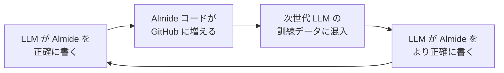
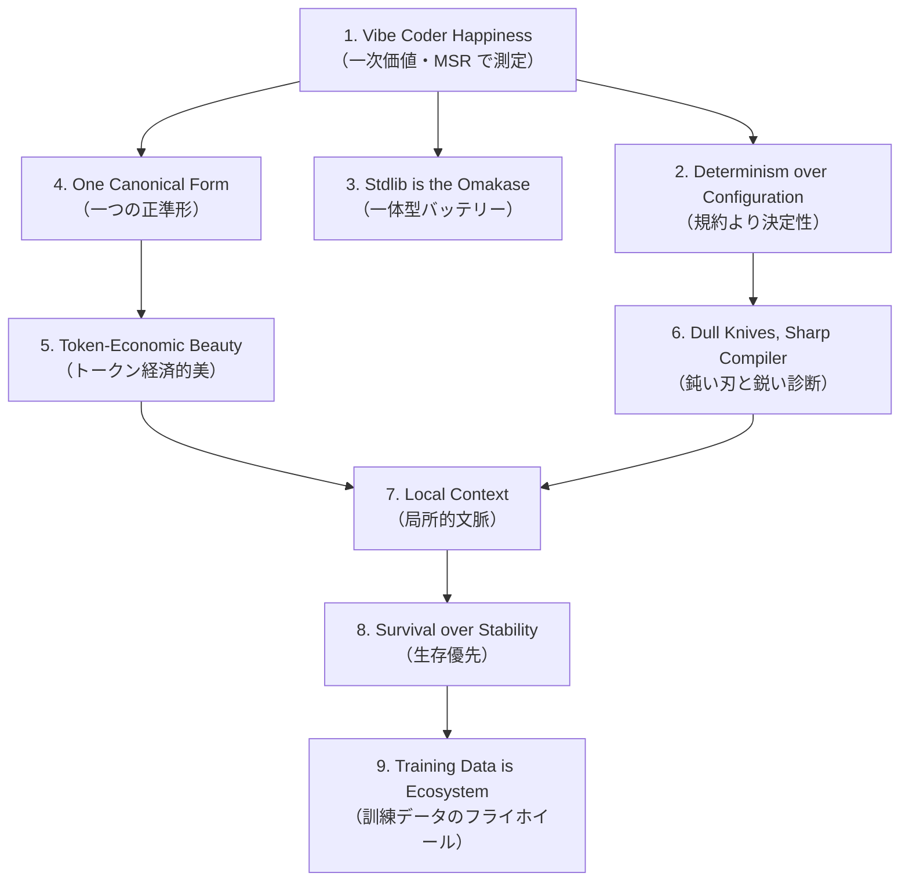

> **[仮版・WIP]** これは Almide Doctrine のドラフトであり、公式マニフェストとして確定したものではない。Rails Doctrine の構造を借りた思考実験として書かれており、9 原則の選定・命名・順序は今後の議論で更新される可能性が高い。引用・転載する場合はこの仮版である旨を明示すること。

[Almide](https://almide.github.io/) — **LLM が最も正確に書ける言語** を目指して設計された言語 — の設計哲学を 9 原則として体系化したマニフェスト。Rails Doctrine の構造を借りつつ、**「Programmer Happiness」を「Vibe Coder Happiness」に置き換える** ことで、AI 時代の言語設計に対する応答を宣言する。

## なぜ Rails Doctrine の構造を借りるのか

Rails Doctrine は 2004 年に始まった Web 開発の生産性革命を、12 年後に 9 原則として明文化した文書。同じ構造を借りる理由は、Almide が今まさに **「AI が書くコードが本番に入る時代の言語設計」** という同等の構造的転換を目指しているから。

Rails が答えた問い:「Java/PHP の重さに疲れた人間プログラマに、書き味のいい Web 開発を提供できないか」
Almide が答える問い:「LLM が信頼できるコードを生成するために、言語側はどう設計されるべきか」

両者の構造は同型だが、**「誰の幸福を一次価値に置くか」** が決定的に違う。Rails は **コードを書く人間** を、Almide は **コードを書かずに指示する人間（vibe coder）** を中心に据える。

## 1. Vibe Coder Happiness（一次価値）

Rails Doctrine の Programmer Happiness が「コードを書いている人の機嫌の良さ」を一次価値に据えたのに対し、Almide は **「コードを直接書かない人の機嫌の良さ」** を一次価値に据える。

**Vibe Coder とは:**

- 自然言語で意図を伝え、LLM にコードを書かせ、出力を受け取って次の指示を出す人
- "vibe coding" — Andrej Karpathy が 2025 年初頭に提唱した概念
- キーボード入力時間は「コードを書く時間」ではなく「指示と評価を書く時間」

Programmer Happiness が「書き味」を評価軸とするのに対し、Vibe Coder Happiness の評価軸は **「意図を伝えてから動くコードが手に入るまでの確信度」**。具体的な問いに分解すると：

1. 自分の指示が AI によって正しく解釈されるか？
2. AI が出したコードは動くか？
3. **そのコードを次に AI に修正させた時、また動くか？**

特に 3 番目が決定的で、これが Almide の核心メトリック **Modification Survival Rate (MSR)** に直結する。**Vibe Coder の幸福は MSR で測れる。** 測定不能だった Rails の Programmer Happiness と違い、Almide は一次価値を実数で観測する設計を最初から組み込んでいる。

## 2. Determinism over Configuration（決定性、規約より決定性）

Rails の Convention over Configuration は「妥当な既定値を規約として埋め込む」原則で、人間が「設定を書かなくて済む」幸福を提供した。

Almide はこれを一段階強める。**「規約に従えば設定不要」ではなく「そもそも他の書き方が存在しない」**。

| | Rails | Almide |
|---|---|---|
| テーブル名 | デフォルトは `posts`、`self.table_name = "..."` で変更可 | 構文上、対応概念に対する書き方は 1 つに固定 |
| 命名規則 | snake_case が規約、外せる | 規範的な唯一の形 |
| 設定の存在 | 規約から外れた時のために設定が用意されている | 規約からの逸脱が言語仕様上できない箇所が多い |

**なぜそうするか**：LLM の次トークン分布のエントロピーを下げるため。同じ意図に対して書き方が複数あると、LLM はトークン選択で迷い、ブランチが増え、出力が不安定になる。**決定的な構文 = 決定的な出力**。

これは人間の表現の自由を奪うが、敗北ではない。**Vibe Coder は「自由に書く」ことを目的としていない**。意図が動くコードに変換されることを目的としている。決定性はそのための前提条件。

## 3. Stdlib is the Omakase（一体型バッテリー）

Rails の Omakase は「フレームワークが選択肢を絞る」原則。Almide はこれを **「標準ライブラリが事実上のメニュー」** として実装する。

- Almide stdlib: **23 モジュール、430 関数**（string / list / map / json / http / fs / matrix / fan / ...）
- 多くのタスクが stdlib 内で完結するように設計
- 外部依存は最小。`almide add` で追加できるが、stdlib で済むなら stdlib

**なぜ stdlib 一体型か:**

- LLM は **「学習データに豊富にある関数」を呼ぼうとする**。stdlib が広いほど LLM の初手の正解率が上がる
- 外部依存が増えると、LLM はパッケージ名・バージョン・API 形をすべて幻覚する余地を持つ。stdlib なら **「単一の真実」が一つだけ存在する**
- Vibe Coder にとって「依存管理を AI が決める」のは怖い。「ほとんど stdlib」は安心の根拠

これは Rails の `gem install` 文化と対極だが、AI 時代のフレームワーク設計には合う。npm の `node_modules` 重量級と Almide の stdlib コア型は **同じ「依存マネジメント」を別ベクトルで解いた答え**。

## 4. One Canonical Form（一つの正準形）

Rails の "No One Paradigm" は OO/関数型/手続き型を雑食的に混ぜる原則。Almide はこれを **逆転** する。

Almide は **「ある問題に対して 1 つの正準形だけを idiom として認める」**。CLAUDE.md に明記されている強制例：

| ✗ 避ける書き方 | ✓ 正準形 |
|---|---|
| `if/else` チェーン | `match` |
| `var` + `for` ループ | `list.map` / `filter` / `flat_map` |
| `var` + `while` + フラグ | 再帰または `scan_while` |
| 文字列配列を join | heredoc `"""..."""` |
| ネストした条件取得 | `??` fallback / `?` Result→Option / `!` unwrap |

**なぜ正準形を強制するか:**

- Vibe Coder は「コードのスタイル」を選ぶ精神的余裕を持たない。指示は一度しか出さない
- 出力が「Almide ならこう書く」という一意の形に収斂しなければ、毎回スタイル統一の指示を追加する地獄が始まる
- LLM が "Almide らしい書き方" を学習できるのは、Almide コーパスに正準形しか出てこないから
- Perl や Ruby の "More Than One Way To Do It" だと、コーパスは多様で、LLM は迷う

つまり Almide の制約は **言語の貧しさではなく、LLM 学習との相性に最適化した設計判断**。Perl の TMTOWTDI に対して、Almide は **There's Exactly One Way To Do It (TEOWTDI)** を採る。

## 5. Token-Economic Beauty（トークン経済的美）

Rails の Beautiful Code は「人間が読んで気持ちいい」を一次美学に据えた。Almide の美はそれに加えて **「トークン経済的」** であることを要求する。

**Almide における美の三指標:**

- **意味密度** — トークンあたりの情報量が高いか
- **曖昧性の低さ** — 一読して意味が一意に決まるか
- **構文ノイズの少なさ** — `()`, `;`, `pub`, `extern` のようなボイラープレートが視界に入らない

具体例：

```almide
fields
  |> list.map((f) => "${get_str(f, "name")}: ${go_type(get_type(f))}")
  |> list.join(", ")
```

- パイプ `|>` で読み順とデータフローが一致
- 文字列補間 `${...}` で結合の `+` を排除
- ラムダ `(f) =>` で型推論

これらは人間にとっても読みやすいが、**LLM にとっては「ノイズが少ない = 文脈ウィンドウ消費が少ない」** という別の利点を持つ。同じ意図を 30 行ではなく 5 行で書ければ、LLM はより多くの文脈を保持したまま指示を実行できる。

つまり Almide では、**美 = 短さ × 一意性 × 文脈効率**。Rails の美が読み手の感情に向いていたのに対し、Almide の美は **読み手のコンテキストウィンドウに向いている**。

## 6. Dull Knives, Sharp Compiler（鈍い刃と鋭い診断）

Rails の Sharp Knives 原則は「メタプロやモンキーパッチを鈍らせず、プロに最大限の表現力を解放する」。Almide はこれを **完全に逆転** させる。

**Almide が言語側で禁じるもの:**

- メタプログラミング（リフレクション・runtime インスペクションは限定的）
- モンキーパッチ（クラス拡張・関数再定義は不可）
- マクロ（C プリプロセッサも Lisp マクロもない）
- 暗黙の型変換（int → float ですら明示）

これは敗北ではない。**Vibe Coder と LLM は鋭い刃を扱えない**：

- LLM はコンテキストを跨いで「この関数は monkey-patch されているかも」を推論できない
- Vibe Coder はコードの全体を読んでいない（読んでいたら vibe coding とは呼ばない）
- メタプロは「動くが追えない」コードを作る。**MSR を最大化したい言語にとって最悪の特性**

代わりに Almide が鋭くするのは **コンパイラ診断**：

- 全エラーに `file:line` + 文脈 + **具体的な修正案**
- 「`x` is undefined; did you mean `xs`?」レベルではなく、「修正のためにここをこう書き換えよ」レベル
- 診断は LLM に渡すフィードバックでもある（**Almide コンパイラ + LLM の対話ループ**）

つまり Almide は **言語側の自由度を削り、コンパイラ側の知性を上げる**。Rails の Sharp Knives と完全に対称な設計判断。

## 7. Local Context（局所的文脈）

Rails の Integrated Systems は「単一 Rails アプリにすべて入っている」原則だった。Almide はこれをさらに細かい粒度で **「コードの任意の部分が、近傍の文脈だけで理解できる」** という形に再定式化する。

**Almide における local context の保証:**

- グローバル変数は実質ない
- mutation は明示（`var` キーワード）、関数の純度が型に現れる
- 副作用は `effect fn` で型に現れる
- import は明示（暗黙のグローバル名前空間ではない）
- メタプロがないので、ある関数の挙動はそのソースだけで決まる

**なぜこれが LLM に効くか:**

- **LLM のコンテキストウィンドウは有限**（数十万トークン）
- ある関数を修正する時、その関数とその周辺だけを LLM に見せれば足りる構造なら、修正は安全
- 逆に「他のファイルでこのクラスを再定義している可能性がある」言語では、LLM は全コードを見ないと安全な修正ができない

**Vibe Coder の幸福は「指示の影響範囲が予測できる」ことに依存する。** Local context はその技術的基盤。Rails の monolith が「人間が把握できる単位」だったのに対し、Almide の local context は **「LLM のコンテキストウィンドウに収まる単位」** を意識して設計されている。

## 8. Survival over Stability（生存優先）

Rails の "Progress over Stability" は「破壊的変更を受け入れて前進する」原則。Almide はこれを変奏し、**「Survival over Stability」** に置き換える。

**両者の違い:**

| | Rails | Almide |
|---|---|---|
| 守るべきもの | 前進する自由 | 修正に耐える生存力 |
| 破壊する対象 | API（人間が移行作業を引き受ける） | 何も破壊しない（LLM が無償で書き直すから不要） |
| 安定の単位 | バージョン間の API 互換性 | **修正イテレーション間の動作互換性** |

Almide が守りたい安定性は **「過去に書いたコードが今もコンパイルする」** ではなく、**「AI が修正したコードが、再び AI が修正しても、まだ動く」** こと。これが MSR の本質。

具体的な含意:

- 後方互換性を強く重視する（新バージョンでも旧コードが動く）
- 構文のメジャー変更は避ける（**LLM 学習データの陳腐化** を防ぐ）
- 同時に、実装内部は積極的に改善する（コンパイラ・診断・stdlib 性能）

つまり Almide の "stability" は **API stability ではなく modification stability**。Rails の前進優先と Java の後方互換重視の中間ではなく、**別の次元の安定性概念**。

## 9. Training Data is Ecosystem（訓練データがエコシステム）

Rails の Big Tent は「異なる意見を受け入れる広いコミュニティ」原則だった。Almide はこれを AI 時代の文脈で再定義し、**「コミュニティ ＝ 訓練データコーパス」** という見方を取る。

**Almide のフライホイール:**



このループの設計上の含意：

- **コーパスの質** が LLM 性能を直接決める。だから idiom 違反を残さない（lint, fmt, 診断で正準形に押し戻す）
- **コーパスの量** も重要。OSS 推進、stdlib 充実、`almide-dojo` での演習タスク蓄積
- **オープンライセンス**（MIT / Apache-2.0）— 訓練データに使われる障壁を最小化
- **コーパスの一貫性** — Almide コードはどれを見ても "同じ書き方" になっている必要がある

Big Tent の Rails と違い、Almide の Big Tent は **「多様性で迎え入れる」のではなく「一貫性で迎え入れる」**。多様な意見を許容するコミュニティではなく、**LLM が学習しやすい一貫したコーパスを生むコミュニティ** を志向する。

これは思想的には自由主義の逆だが、**目的（LLM が正確に書ける言語）に対する設計判断としては正しい**。コミュニティの価値を「人数」ではなく **「LLM が次にこの言語をより正確に書けるようになる寄与度」** で測る、という新しい指標を導入する。

## 9 原則の関係構造



頂点は **Vibe Coder Happiness**、その測定指標が **MSR**。他の 8 原則はすべて MSR を最大化するための手段または維持装置として配置される。

## Rails Doctrine との対比

両ドクトリンは構造的に同型だが、価値観が反転している領域がある。

| 軸 | Rails | Almide |
|---|---|---|
| 一次価値 | Programmer Happiness（書き味） | Vibe Coder Happiness（指示→動くまでの確信度） |
| 一次価値の測定 | 不可能（"書き手が幸せかどうか"） | **可能（MSR — Modification Survival Rate）** |
| 設定 vs 規約 | CoC：規約による省略 | **Determinism：そもそも他の書き方が存在しない** |
| パラダイム | No One Paradigm（雑食） | **One Canonical Form（一つの正準形）** |
| 表現力 | Sharp Knives（メタプロ歓迎） | **Dull Knives（メタプロ禁止）+ Sharp Compiler** |
| 美 | 人間が読んで気持ちいい | **短さ × 一意性 × 文脈効率** |
| 統合 | Integrated Systems（モノリス） | **Local Context（コンテキストウィンドウ局所性）** |
| stability | Progress over Stability | **Survival over Stability** |
| コミュニティ | Big Tent（多様性） | **訓練データコーパス（一貫性）** |

つまり Rails が **「書き手の個性を尊重する豊かな言語」** を志向したのに対し、Almide は **「書き手の個性を消去して、AI が正確に書ける言語」** を志向する。両者は反対方向を向いているように見えるが、**それぞれの時代に対する正しい応答であるという点で構造的に同じ**。

Rails が 2004 年の Java/PHP 疲れに対する応答だったように、Almide は **2025 年以降の「LLM が書くコードが本番に入っていく時代」に対する応答**。

## なぜこの違いは「異なる価値」と言えるのか

Rails と Almide は単に「対象ユーザーが違うだけの言語」ではない。提供する価値の根本が異なる。

- **Rails の価値**: コードを書く時間を、苦行から喜びに変える
- **Almide の価値**: コードを書かない時間を、不安から確信に変える

Rails が解放したのは **時間の質**（同じ時間を、より気持ちよく過ごせる）。Almide が解放するのは **時間そのもの**（コードを書く時間が消え、その時間を別のことに使える）。

ここで重要なのは、**Almide は「書くことを否定する」のではなく、「書くこと以外への解放」を提供する** ということ。Vibe Coder はコードを書く能力を持っていてもいい。ただ、その能力を毎回行使する必要がない世界を Almide は前提とする。

これが Rails Doctrine が答えなかった問いに対する答え。**「言語が、書き手の不在を前提として設計されたら、何が起きるか？」** Almide はその実験。

## 押さえどころ（カード化候補）

- Almide Doctrine の一次価値とその測定指標 → **Vibe Coder Happiness。測定指標は MSR (Modification Survival Rate)**
- Almide が Rails の CoC と異なる点 → **CoC は「規約に従えば設定不要」だが、Almide の Determinism は「そもそも他の書き方が存在しない」。LLM の次トークン分布のエントロピーを下げるため**
- Almide の "Stdlib is the Omakase" の根拠 → **23 モジュール 430 関数。LLM は「学習データに豊富にある関数」を呼ぼうとするので、stdlib が広いほど初手の正解率が上がる**
- Almide が "One Canonical Form" を強制する理由 → **Vibe Coder はスタイルを選ぶ精神的余裕を持たない。コーパスが多様だと LLM が迷う。Perl の TMTOWTDI に対し Almide は TEOWTDI（Exactly One Way）**
- Almide における "美" の定義 → **短さ × 一意性 × 文脈効率。読み手のコンテキストウィンドウに向けた美**
- Sharp Knives との反転 → **Almide はメタプロ・モンキーパッチ・マクロを禁止し、代わりにコンパイラ診断を鋭くする**
- Almide の Local Context が LLM に効く理由 → **LLM の context window が有限なので、修正対象とその周辺だけで完結する構造ならば修正が安全になる**
- Almide における stability の意味 → **API stability ではなく modification stability。AI が修正したコードが、再び AI が修正しても動くこと**
- Rails と Almide が提供する根本的な価値の違い → **Rails は「書く時間の質」、Almide は「書かない時間そのもの」を解放する**

## Links

- [Almide 公式サイト](https://almide.github.io/)
- [Almide Specification](https://github.com/almide/almide/blob/main/docs/SPEC.md)
- [Almide Cheatsheet](https://github.com/almide/almide/blob/main/docs/CHEATSHEET.md)
- [Almide Design Philosophy](https://github.com/almide/almide/blob/main/docs/DESIGN.md)
- [almide-dojo（MSR 測定タスクバンク）](https://github.com/almide/almide-dojo)
- [Almide Playground（ブラウザ実行）](https://almide.github.io/playground/)
- [The Rails Doctrine（参照元）](https://rubyonrails.org/doctrine)
