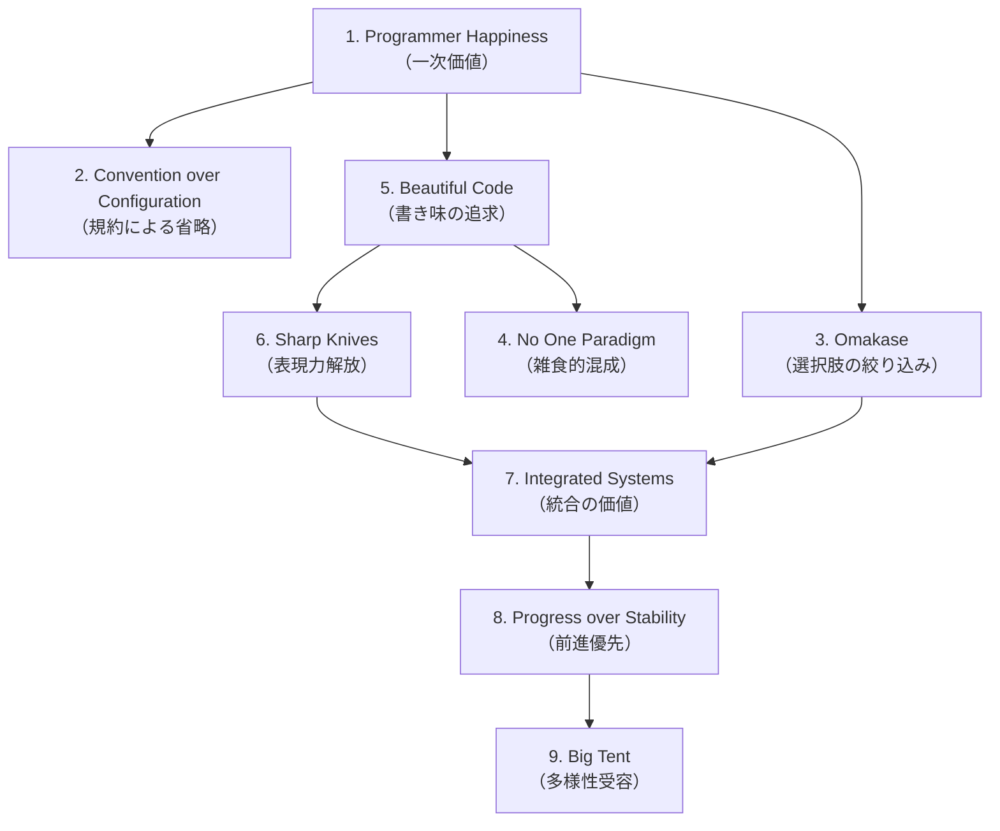

DHH が 2016 年に公開した [[rails]] の **設計哲学を 9 つの柱として明文化したマニフェスト**。Rails 自体は 2004 年から存在するが、その背後にあった原則を後から体系化したのが本書。Rails コアコミッタやコミュニティの判断基準であり、後続フレームワーク・スタートアップ思想にも影響を残した。

## なぜマニフェストとして書かれたか

2016 年時点で Rails は登場から 12 年経ち、企業システムにも採用される一方、批判（魔法すぎる、テストしにくい、規模化で詰まる、TDD は死んだ発言など）も増えていた。DHH は **「Rails の判断はどういう価値観から来ているのか」を文章化することで、批判への応答と新規参入者への教育を同時に成立させる** 必要を感じていた。

Rails Doctrine は次の 9 原則からなる。

## 1. Optimize for programmer happiness

[[ruby]] の設計者 Matz が掲げた **「programmer happiness」を、言語からフレームワーク設計に持ち上げた**。`render :json => @post` のように「コードに見えない宣言文」を許容するのは、機能ではなく書き手の気分を一次目標に置いているから。

DHH 自身が「Rails が他より良いかどうかを正確には測れないが、Rails で書いている時の自分は確かに幸せだ」と書いている。**測定不能な価値を一次目標として明言した OSS フレームワーク** という点がこの原則の珍しさ。

## 2. Convention over Configuration

[[convention-over-configuration]] 参照。9 原則の中でも最も技術的に具体的で、現場で日々効く原則。**「規約に従う限りコードは消える」** という Rails の生産性の中核を支える。

## 3. The menu is omakase（おまかせメニュー）

DHH は **寿司屋の「お任せ」を比喩に使い、「フレームワークが選択肢を絞り込んで提供する」ことを積極的に肯定する**。

- Rails 5.x までは Webpack 統合、Rails 6 で ActiveStorage、Rails 7 で Hotwire / Turbo / Stimulus と、**「公式が選んだ一式」が時代ごとに更新されてアプリと共に同梱される**
- ユーザーは「どの ORM を使うか」「どのテンプレートエンジンを使うか」を選ばずに済む（外したい時だけ外す）
- これは「自由を与えれば開発者は最良の選択をする」という前提への明確な反論

**選択肢の多さは生産性を下げる** という立場。React + 100 個の状態管理ライブラリで疲弊する 2010 年代後半のフロントエンド事情と対照的なポジション。

## 4. No one paradigm（パラダイムを一つに絞らない）

OO 純粋主義者・関数型純粋主義者・手続き型派、すべての一面的な処方箋を Rails は拒絶する。

- ActiveRecord は OO + DSL
- ビューは手続き的な ERB
- 一部のヘルパーは関数型的な合成
- 設定は宣言的（DSL）

**「正しい一つのパラダイム」を信奉せず、その時々で読みやすいものを選ぶ** 雑食性。これは批判の的にもなる（"Rails コードはパラダイムが混在していて美しくない"）が、DHH は意図的に維持している。

## 5. Exalt beautiful code（美しいコードを称揚する）

**コードの美しさは生産性指標と並ぶ第一級の価値** とする。読みやすさ・対称性・宣言性の高さが「動くこと」と同等に重視される。

- `5.times do ... end`
- `validates :email, presence: true, uniqueness: true`
- `has_many :comments, dependent: :destroy`

これらは技術的には不要な糖衣構文だが、Rails はあえて Ruby の表現力を最大限使って **コードを「読み物」として成立させる** ことを目指す。

逆説的に「美しさのために性能を犠牲にする」場面もある（メタプログラミングのオーバーヘッド等）。それは意識的なトレードオフ。

## 6. Provide sharp knives（鋭利な刃物を提供する）

**メタプログラミング・モンキーパッチ・動的型といった「危険な道具」を、安全策で鈍らせず鋭利なまま提供する**。

- 既存クラスを開いて再定義できる（`String.class_eval`）
- ActiveSupport が `Object`、`Array`、`String` 等の組み込みクラスを拡張している
- `method_missing` で動的にメソッドを生成する

これは「素人が触ると怪我する」が、**プロフェッショナルに対しては最大限の表現力を解放する** という哲学。Java の "everything is final by default" と正反対のスタンス。

DHH の表現：「子供から刃物を取り上げるのは正しい。だが大人を子供扱いすべきではない。」

## 7. Value integrated systems（統合されたシステムを評価する）

**マイクロサービスや関心の分離を盲目的に追わない**。むしろ「一つの Rails アプリに全部入っている」ことの価値を主張する。

- DHH の有名な記事「The Majestic Monolith」（2016）は、Basecamp が単一の Rails アプリで成立していること、Shopify / GitHub も同様であることを根拠に **「monolith は劣等ではない、規模化しても十分機能する」** と論じた
- 統合されているからこそ「データベースから UI まで一人の開発者が一日で機能を追加できる」という生産性が成立する
- 分散システムは複雑性を導入する。それを払うだけの規模・要請がない時点で導入するのは早計

これは 2010 年代のマイクロサービス全盛期に **明確な反対派ポジション** として機能した。後の「modular monolith」「Majestic Monolith」「Shopify の pods 構造」など、monolith の再評価潮流の出発点の一つ。

## 8. Progress over stability（安定よりも進歩）

**API の破壊的変更を恐れない**。Rails 2 → 3 → 4 → 5 → 6 → 7 で、それぞれ大きな変更が入った：

- Rails 3：merger with Merb、ARel 導入、Bundler 標準化
- Rails 4：Strong Parameters、Turbolinks、Russian Doll Caching
- Rails 5：API モード、ActionCable、Turbolinks 5
- Rails 6：Webpacker、ActionMailbox、ActionText、Multi DB
- Rails 7：Hotwire（Turbo + Stimulus）、import maps、CSS バンドラ標準化

**「後方互換性のために古い API を引きずるくらいなら、移行コストを払って前進する」** 立場。これは Java の世代別 API 共存と対照的。

副作用として、**Rails のメジャーバージョン跨ぎはアップグレード作業が常に発生する**。これは欠点だが、停滞よりマシだという判断。

## 9. Push up a big tent（大きなテントを張る）

**異なる意見・異なるスタイルを受け入れる広いコミュニティを志向する**。

- 関数型派も OO 派も、Mac ユーザーも Linux ユーザーも、TDD 派も No-TDD 派も、皆同じ Rails を使える
- DHH 自身は強い意見を持つが、コミュニティはその意見を必ずしも共有する必要がない
- "I don't agree with you, but I respect your right to use Rails differently"

これは前述の "No one paradigm" の組織論版。**「強い意見を持つリーダー」と「多様な利用者」の両立** を意図的に設計している。

## 9 原則の関係構造

つまり 9 原則は **「programmer happiness」を頂点とする一つの価値体系**。CoC や Omakase は手段、Big Tent はその価値体系を維持するための社会的装置。

## 後続への影響

Rails Doctrine は Rails 内部の文書だが、その思想は他にも波及している：

- **Phoenix（Elixir）** — 「Phoenix Doctrine」を公開していないが、José Valim（DHH の元 Rails コアコミッタ）が同様の opinionated framework を Elixir に持ち込んだ
- **Laravel（PHP）** — Taylor Otwell が「laravel ecosystem」として omakase 路線を踏襲
- **DHH 自身の他の発信** — 「Getting Real」「Rework」「Remote」「The Majestic Monolith」「You Can't Buy Integration」 等、Rails Doctrine と同じ思想を別文脈で展開
- **「opinionated software」という語の標準化** — 元々は Rails 文脈の用語だったが、現在は Vercel / Supabase / Convex 等の現代 PaaS 説明でも使われる

## 押さえどころ（カード化候補）

- Rails Doctrine が公開された年と意図 → **2016 年。Rails 12 年目に「Rails の判断基準を後から体系化する」必要から DHH が執筆**
- Doctrine 9 原則のうち「programmer happiness」の出所 → **[[ruby]] 設計者 Matz の言語設計目標を、フレームワーク設計に持ち上げたもの**
- 「The menu is omakase」の意味 → **寿司屋の「お任せ」の比喩。フレームワークが選択肢を絞り込んで提供することを積極的に肯定する**
- 「Sharp knives」の核 → **メタプログラミングや monkey patching を安全策で鈍らせず、プロに対して最大限の表現力を解放する**
- 「Integrated Systems」が示す代表的論考 → **「The Majestic Monolith」（2016）。マイクロサービス全盛期に対する monolith 再評価の出発点**
- 「Progress over stability」の副作用 → **Rails メジャーバージョン跨ぎでアップグレード作業が常に発生するが、停滞よりマシだという判断**
- 9 原則の頂点に置かれる価値 → **Programmer Happiness（プログラマの幸福）。他 8 原則はこの一次価値の手段または維持装置**
- Doctrine の社会装置的原則 → **「Big Tent」— 強い意見を持つリーダーと多様な利用者の両立を意図的に設計**
- Doctrine が後続に残した語 → **「opinionated software」が現代 PaaS（Vercel, Supabase, Convex 等）の説明用語として定着**

## Links

- [The Rails Doctrine（公式・全文）](https://rubyonrails.org/doctrine)
- [The Majestic Monolith — DHH (2016)](https://m.signalvnoise.com/the-majestic-monolith/)
- [DHH のブログ Signal v. Noise](https://world.hey.com/dhh)
- [Getting Real（37signals）](https://basecamp.com/gettingreal)
