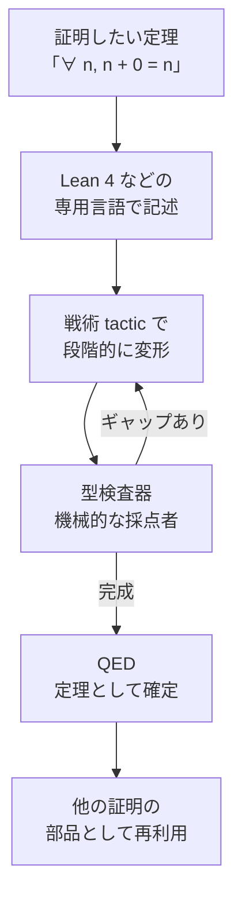

数学の証明を、コンピュータが一行ずつ厳密にチェックできる形で書く分野。論理パズルの正解を計算機が「ここに穴はない」と検算してくれる。

## 何ができる？／なぜ重要？

採点者にたとえます。普通の数学の証明は、人間の採点者が「だいたい合ってる」と判断して〇を付けます。しかし採点者も人間なので、巧妙な穴を見落とすことがあります。定理証明は、採点者として「絶対に見落とさない計算機」を雇うようなものです。証明を専用言語で書くと、計算機が「この行はこのルールで成り立っている」「ここから次へ飛ぶのは論理的に許される」を 1 つ残らずチェックし、最後まで通れば「証明完了」と判定します。

なぜ重要かというと、本当に間違いが許されない場面、たとえば飛行機の制御、暗号、銀行の決済、コンパイラ、AI の安全性検証など、「動くだけでなく、論理的に正しいと証明された」ソフトウェアを作れるからです。プログラムと数学の証明が同じ言語で書ける（カリー＝ハワード対応）ので、「型を満たすコード」がそのまま「証明された定理」になるという深い面白さもあります。

## 仕組み

人間は「ゴール」と「どう攻めるか（戦術）」を書き、計算機が論理ルールに照らして 1 行ずつ確認します。途中で穴があれば証明は受理されず、人間は戦術を書き直します。最終的に通れば、その定理は他の証明から呼び出せる確定した部品になります。

## 用語

- **定理証明 (Theorem Proving)**: 数学的な命題が真であることを機械的に検証する作業。
- **証明アシスタント (Proof Assistant)**: 人間と計算機が協力して証明を組み立てるツール（Lean, Coq, Agda, Isabelle など）。
- **Lean 4**: マイクロソフト発の証明アシスタント兼プログラミング言語。数学コミュニティで急成長中。
- **戦術 (Tactic)**: 「ここはこう攻める」という証明の手筋。`induction`、`simp`、`rfl` などのコマンド。
- **型検査器**: コードの型が辻褄合うか調べる機械。証明アシスタントでは「論理が辻褄合うか」を調べる役目も兼ねる。
- **依存型 (Dependent Type)**: 型に値が含められる強力な型システム。「長さ n のベクトル」のような型が書ける。
- **カリー＝ハワード対応**: 「型 = 命題」「プログラム = 証明」と見なせる対応関係。プログラミングと数学が一致する。
- **mathlib**: Lean 4 の巨大な数学ライブラリ。証明済み定理が数十万件以上集まっている。
- **公理 (Axiom)**: 証明なしに「正しい」とする出発点。少なければ少ないほど信頼が高い。
- **形式手法 (Formal Methods)**: 数学的に厳密にソフトウェアを設計・検証する手法群。

## vault 内での使われ方

- [[lean4-rust-backend]] — Lean 4 を Rust に変換して高速実行するバックエンド
- [[lean2ts]] — Lean 4 の証明を TypeScript の property test に変換
- [[lean4-learning]] — Lean 4 の学習用リポジトリ群
- [[almide]] — 言語設計の参考として、型システムの厳密さに通じる
- [[almide-grammar]] — 文法の形式仕様。証明的な厳密さに通じる

## 関連概念

- [[capability-based-security]] — 「証明された権限のみ実行」の発想に通じる
- [[serialization]] — Lean IR を JSON で受け渡す部分など、形式表現の文脈
- [[mcp]] — 形式仕様としてのプロトコル

## Links

- [Theorem proving (Wikipedia)](https://en.wikipedia.org/wiki/Automated_theorem_proving)
- [Lean 4 公式](https://lean-lang.org/)
- [Mathematics in Lean (mathlib4)](https://leanprover-community.github.io/mathematics_in_lean/)
