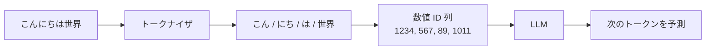

LLM が文章を扱うときの「最小単位」。文章はトークンに分解されてからモデルに渡され、料金もトークン量で計算される。

## 何ができる？／なぜ重要？

長い文章を細かい付箋に切り分けるところを想像してください。「こんにちは」を「こん」「にち」「は」のような小さな付箋にして、機械はその付箋の並びとしてだけ文章を理解します。LLM にとってはこの付箋（トークン）こそが世界のすべてで、人間が見ている「文字」や「単語」をそのまま扱っているわけではありません。

これが重要なのは、LLM の「記憶量」も「料金」もすべてトークンで計算されるからです。コンテキストウィンドウが「20万トークン」というのは付箋を20万枚まで机に並べられる、という意味です。なければ、なぜ長文の入力が突然切られたり、料金が膨らんだりするのか説明できません。トークンを理解すると、コストとパフォーマンスを直接コントロールできるようになります。

## 仕組み

トークナイザが文章を切り分け、各トークンに番号を振り、その数列をモデルに渡します。日本語は1〜2文字で1トークン、英語は単語1つでだいたい1トークンが目安です。

## 用語

- **トークナイザ**: 文章をトークン列に分解する装置。
- **BPE (Byte Pair Encoding)**: よく使われるトークナイザの方式。よく出る文字の並びをまとめて1トークンにする。
- **Vocabulary (語彙)**: トークナイザが扱える全トークンの一覧。
- **Context Window**: モデルが一度に処理できるトークン数の上限。
- **Input Tokens / Output Tokens**: 入力に使ったトークン数と、出力したトークン数。料金が別々に計算される。
- **トークン圧縮**: 余計なトークンを削って情報量を保ったまま量を減らす技術。
- **特殊トークン**: 文の始まりや終わりを示すマーク用のトークン。
- **マルチバイト**: 日本語のように1文字が複数バイトの言語。トークン消費が多めになりがち。

## vault 内での使われ方

- [[fuzztok]] — トークン単位のファジング（テスト入力生成）
- [[rtk]] — コマンド出力をトークンレベルで圧縮
- [[unillm]] — 複数 LLM プロバイダのトークン計算を統一
- [[llm-throttle]] — トークン消費量に応じたレートリミット
- [[llm-queue-dispatcher]] — トークン量を考慮したキュー処理
- [[llmine]] — トークン関連ユーティリティ
- [[memory-rag]] — トークン制限内で関連情報を抽出
- [[memre]] — トークン消費を抑えた記憶管理
- [[capto]] — トークン消費を意識したキャプチャ
- [[fractop]] — トークン量で分割処理
- [[claude-code]] — トークン量を意識したエージェント
- [[agentic-coding]] — トークン経済学が中心テーマ

## 関連概念

- [[llm]] — トークンは LLM の動作単位
- [[api]] — API 利用料はトークン量で課金される
- [[parser]] — トークン化は言語処理の最初のステップでもある

## Links

- [OpenAI Tokenizer](https://platform.openai.com/tokenizer)
- [Wikipedia: 形態素解析（関連概念）](https://ja.wikipedia.org/wiki/%E5%BD%A2%E6%85%8B%E7%B4%A0%E8%A7%A3%E6%9E%90)
