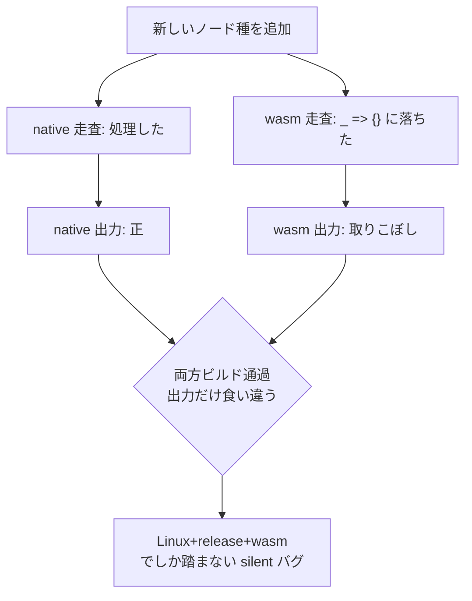

マルチターゲット codegen で最も危険なバグは「間違った処理」ではなく「**抜けた処理**」 — パスが手書き再帰で `match expr.kind { … _ => {} }` と書くと、明示していないノード種が `_` に落ちて**黙って素通り**する。片方のターゲットだけが処理し他方が取りこぼせば、出力が silent に乖離する。これを**走査の網羅性 (traversal/site totality)** として静的に保証すべき、という原則。

## なぜ silent な乖離になるか

単一ターゲットなら「最適化漏れ」で済むことが、native(Rust 経由)と WASM の2系統では「**出力が食い違うが、どちらもビルドは通る**」になる。しかも特定の config — Linux + release + wasm 強制 — でしか踏まないパスに潜むと、ローカルでは再現せず、その CI 枠だけが落ちる(あるいは誰も気づかない)。

## 単発ではなくクラス

今日の2件は同じ形 — 「走査が忘れたノード種」:

| バグ | 取りこぼした所 |
|---|---|
| map_foreach の Swiss-table 取り残し | 反復ノードの後始末サイト |
| variant の identity-hash | バリアント payload のハッシュサイト |

そして [[anf-closure-lifting-bug]] も同型(ANF パスが `__closure_*` 関数を走査していなかった)。→ 個別修正では尽きない。**「走査が漏れる」という構造そのもの**が源流。

## Almide での規模

- roadmap `codegen-traversal-totality`: **37 パス中 ~24** が `match expr.kind { … _ => {} }` の手書き再帰。各々が「ノード取りこぼし＝silent な native↔WASM 乖離」の地雷。
- `correctness-guarantee-gaps`: **`emit_wasm` 自体が最大ギャップ**(手書きサイトの塊)。

## 効くのは discipline ではなく静的保証

「新しいノード種を足したら 24 パス全部に手で追加する」運用は**スケールせず、失敗が silent**。構造で潰す:

| 手段 | 仕組み | 効果 |
|---|---|---|
| catch-all を禁じた網羅 match | `_ => {}` を消す | 新バリアント追加が**型エラー**になり、全サイトを潰すまでビルドが通らない |
| [[recursion-schemes\|catamorphism]] / 汎用走査 | 畳み込みが構造的に全ノードを訪れる | per-node の代数だけ書けば totality は fold が担保 |
| 仕組みの位置づけ | [[make-illegal-states-unrepresentable\|「取りこぼし」を表現不能にする]] を走査に適用 | 漏れが「書ける状態」として存在しなくなる |

兄弟は [[deterministic-codegen\|Determinism/Purity Belt]] — どちらも「忘れるな/使うな」という規律を**機械的な CI ゲート**に変換する発想。

→ なぜ最高レバレッジか: [[sweep]] や [[almide-differential-gate\|差分ゲート]]は乖離を**事後に**捕まえる。totality を静的にすると**クラスごと構造的に消える** — 一番捕まえにくい「特定 config でしか出ない silent バグ」を源流で断つ。

## cross-target 等価性の残ギャップ

totality(#1)を筆頭に、native↔WASM で残る既知の乖離:

| # | ギャップ | 中身 | 直し方 |
|---|---|---|---|
| 1 | **traversal/site totality** | ~24/37 パスの手書き再帰。源流クラス | 取りこぼしをコンパイルエラー/CI fail に |
| 2 | **float.to_string** | wasm が固定精度、native は [[ryu\|Ryu]](最短往復)。同じ float が `0.3` vs `0.30000000000000004` に。唯一の tracked な数値乖離 | wasm ランタイムに Ryu 移植 |
| 3 | **fan. の意味論** | race/any/timeout/map-err が cross-target で乖離(ビルドは通る) | 仕様を固定し両ターゲットで一致させる |
| 4 | **closure completeness** | wasm-remaining(意図的 skip 8件) | 残りを実装し skip を解消 |
| 5 | **ゲートのカバレッジ穴** | `wasm_cross_target_spec` は `spec/wasm_cross/` の手選びファイルしか byte 比較しない。今日の variant バグは `hash_protocol_test` が wasm_cross に無く素通り、Test WASM だけが捕捉 | ゲートを全 spec に広げる |

**#1 と #5 は同じ「カバレッジ穴」が2層に出たもの** — #1 はコンパイラ自身の走査の穴、#5 はテストゲートのファイル選定の穴。どちらも問いは「本当に全部訪れたか?」。

## 押さえどころ（カード化候補）

- **源流クラス** → silent な native↔WASM 乖離の大半は「走査の取りこぼし」。`match kind { … _ => {} }` の `_` がノードを黙って捨てる。
- **なぜ危険** → ビルドは両方通る。特定 config(Linux+release+wasm)でしか踏まず、ローカル再現しない。
- **規模** → 37 パス中 ~24 が手書き再帰。emit_wasm が最大の塊。
- **直し方** → discipline でなく静的保証。catch-all を消す網羅 match / [[recursion-schemes\|catamorphism]] / 「取りこぼしを表現不能に」。事後ゲートより源流で効く。
- **残ギャップ** → totality・float([[ryu\|Ryu]])・fan 意味論・closure・ゲート網羅穴。

## 関連

- [[anf-closure-lifting-bug]] — このクラスの一事例(ANF が `__closure_*` を走査し損ねた)。postcondition が検出
- [[sweep]] — 乖離を事後に炙り出す側(native vs WASM 差分)。totality はそれを源流で減らす
- [[almide-differential-gate]] — 出力照合ゲート。残ギャップ #5 のカバレッジ穴はここ
- [[deterministic-codegen]] — 規律を CI grep に変える兄弟ゲート
- [[recursion-schemes]] — catamorphism = 手書き再帰を全域な畳み込みに置換。totality を構造で得る
- [[make-illegal-states-unrepresentable]] — 「取りこぼし」を型で表現不能にする一般原則
- [[ryu]] — 残ギャップ #2 の native 側。最短往復の float→文字列
- [[almide]] — Pipeline Verification Chain を持つコンパイラ本体
