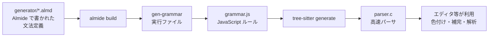

[[almide|Almide]] の [Tree-sitter](https://tree-sitter.github.io/) grammar。**grammar 自体が Almide で書かれている** — `generator/` 配下は手書き JS ではなく純 Almide コードで、それが `grammar.js` を生成する。

## 何ができる？

書かれたプログラムを機械が理解するための「地図」を作る仕組みです。本でいうと、文章を読んで「これは主語、これは動詞、ここは引用部分」と章立てを自動で作ってくれる係に相当します。地図ができれば、エディタが正しく色を塗ったり、間違いを指摘したり、自動補完したりできるようになります。

おもしろいのは、この地図を作る道具自体が Almide という言語そのもので書かれている点です。「Almide を Almide で読み解く」という、自分の足で立つような不思議な構造です。これは、Almide エコシステムを Almide だけで作れることを証明する実験でもあります。

## 用語

- **parser (パーサ)**: 文章を読んで構造を取り出す機械。日本語の「文の構造を図解する」作業の自動版。
- **grammar (文法)**: その言語の「並び方ルール」を機械が読める形で書いたもの。
- **Tree-sitter**: パーサを作るためのオープンソースの土台。多くのエディタで使われている。
- **AST (抽象構文木)**: プログラムを「枝分かれする木」の形に整理した結果。本の目次のような階層構造。
- **self-hosting (自己ホスティング)**: ある言語の道具を、その言語自身で作ること。鏡が自分を映すような関係。
- **ADT (代数的データ型)**: 「これかこれか」と複数の形を持てるデータの型。「丸または四角または三角」と並べて定義できる。
- **ルール**: 文法の構成要素。たとえば「`if` 式は `if` の後に条件、そのあとに本体」みたいな並びを 1 個ずつ定義する。
- **generator**: 元のデータから自動でファイルを書き出すプログラム（ここでは `grammar.js` を吐く側）。
- **`grammar.js`**: Tree-sitter が文法定義として読み込む JavaScript ファイル。最終的なルールブック。
- **`parser.c`**: Tree-sitter が `grammar.js` から自動生成する、超高速で動く C 言語のパーサ実体。
- **拡張子**: ファイル名の最後にある「種類タグ」。Almide のソースコードは `.almd`。

## 仕組み



Almide で書かれた文法定義から、最終的に超高速な C 言語のパーサが生まれます。途中で JavaScript ファイルを経由する 2 段ロケットのような流れです。

## Self-Hosting Pipeline

```
generator/*.almd
  → almide build → gen-grammar binary
  → ./gen-grammar > grammar.js
  → tree-sitter generate → src/parser.c
```

Almide のミッションを体現する: AI が言語エコシステムを丸ごと Almide で生み出せること。

## Rule ADT

文法ルールは ADT としてモデル化されている。

```almide
type Rule =
  | Seq(List[Rule])
  | Choice(List[Rule])
  | Repeat(Rule)
  | Str(String)
  | Ref(String)
  | Field(String, Rule)
  | PrecLeft(Int, Rule)
  | ...

fn emit(rule: Rule) -> String = match rule {
  Seq(rules) => "seq(" ++ string.join(list.map(rules, emit), ", ") ++ ")"
  Ref(name) => "$." ++ name
  ...
}
```

各文法ルールは `(String, Rule)` を返す関数として定義する：

```almide
fn if_expression() -> (String, Rule) =
  ("if_expression", Seq([
    Str("if"),
    Field("condition", Ref("expression")),
    Str("then"),
    Field("consequence", Ref("expression")),
    Str("else"),
    Field("alternative", Ref("expression"))
  ]))
```

## Coverage

- モジュール / import / 関数 / 型 / trait / impl / test
- Effect system (`effect fn`, `async`)
- ガード付きパターンマッチ
- パイプ演算子 (`|>`)
- ジェネリクス (`[T]` 構文)
- 文字列補間 (`"Hello, ${name}"`)
- Heredoc 文字列 (`"""..."""`)
- Result/Option コンストラクタ (`ok` / `err` / `some` / `none`)

## Usage

### Rust

```rust
use tree_sitter_almide::LANGUAGE;

let mut parser = tree_sitter::Parser::new();
parser.set_language(&LANGUAGE.into()).unwrap();
let tree = parser.parse(source, None).unwrap();
```

### Node.js

```js
const Parser = require("tree-sitter");
const Almide = require("tree-sitter-almide");

const parser = new Parser();
parser.setLanguage(Almide);
```

## 開発フロー

```bash
# generator から再生成
cd generator
almide build main.almd -o gen-grammar
./gen-grammar > ../grammar.js

cd ..
tree-sitter generate
tree-sitter parse example.almd

# 高速リビルド（Almide 不要）
tree-sitter generate
cargo test
```

## ファイル拡張子

`.almd`

## 関連

- [[almide]] — パース対象の言語本体
- [[almide-grammar]] — キーワード等の Single Source of Truth、generator が import
- [[vscode-almide]] — 同じく almide-grammar を参照する editor 統合
- [[codopsy]] — tree-sitter ベースの 25 言語アナライザ。Almide も対象に含む

## Links

- [GitHub](https://github.com/almide/tree-sitter-almide)
