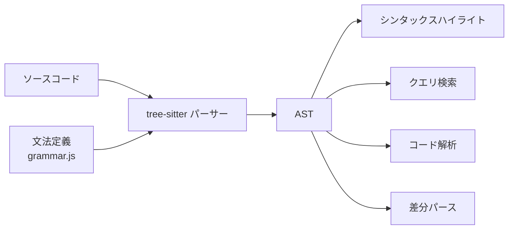

ソースコードから「文法的な骨格（AST）」を高速に作るためのライブラリ。多言語対応で、エディタのシンタックスハイライトやコード解析の土台として広く使われている。

## 何ができる？／なぜ重要？

部屋を散らかった本棚として想像してください。Tree-sitter は、雑多に積まれた本（ソースコード）を見て、「これは小説、これは技術書、ここから章、ここから節」と自動でジャンル分け＆目次を作ってくれる司書のような存在です。しかも複数の言語（日本語の本も英語の本も）に対応していて、本が一冊書き換わっても全部読み直さず差分だけ整理し直してくれます。

これが嬉しいのは、エディタが瞬時にコードの構造を理解できるようになることです。色付け、コードジャンプ、リファクタ、品質計測、検索…すべてが「文字列の正規表現」ではなく「構造の問い合わせ」でできるようになります。なければ、各エディタ・各ツールが言語ごとにバラバラの実装を抱える羽目になります。

## 仕組み

文法定義から自動生成されたパーサーがソースコードを読み込み、AST を作ります。コードを編集しても全体を読み直さず、差分だけ更新するのが特徴です。

## 用語

- **Grammar**: 言語の文法を定義したファイル（`grammar.js`）。
- **Parser**: 文法から自動生成された、AST を作る本体。
- **Query**: AST に対する問い合わせ言語。「全ての関数定義を取得」などが書ける。
- **Incremental Parsing**: コードの変更箇所だけを再解析する仕組み。高速。
- **Node Type**: AST 上のノードの種類（例: `function_declaration`）。
- **Capture**: クエリ結果として取り出されたノード。
- **Bindings**: tree-sitter を各言語から呼び出すためのラッパー（Rust、Node、WASM など）。
- **WASM Build**: ブラウザでも動かせるよう WASM にビルドした版。

## vault 内での使われ方

- [[tree-sitter-almide]] — Almide 言語の tree-sitter 文法
- [[almide-grammar]] — Almide の文法定義（tree-sitter で利用）
- [[famulus2]] — tree-sitter で AST を解析するコード分析ツール
- [[famulus]] — AST 解析の前身プロジェクト
- [[codopsy]] — AST 経由で品質計測（tree-sitter 活用）
- [[codopsy-ts]] — TypeScript 版。tree-sitter 系の AST を活用
- [[vscode-almide]] — VSCode 拡張で tree-sitter ハイライト
- [[lean2ts]] — AST 変換ツール

## 関連概念

- [[ast]] — tree-sitter が生成するデータ構造
- [[parser]] — tree-sitter はパーサーの一種
- [[wasm]] — tree-sitter は WASM でも動く
- [[compiler]] — tree-sitter は字句・構文解析の段階を担う

## Links

- [Tree-sitter 公式](https://tree-sitter.github.io/tree-sitter/)
- [GitHub: tree-sitter](https://github.com/tree-sitter/tree-sitter)
