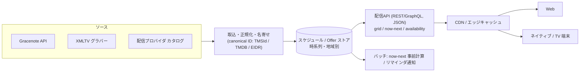

[[tv-guide-apps|番組表 / EPG]] システムの設計。核心は **「多数ソースから集めた編成・配信データを、canonical ID に名寄せして、読み込み主体（read-heavy）で配る」** こと。放送EPG型と配信ガイド型でデータの“主役”が違い、それが設計全体を分ける。

## 全体構成

## データモデル（正規形）

| エンティティ | 中身 | 主役になる型 |
|---|---|---|
| Channel / Station | 局・サービス（`prgSvcId`）、ロゴ、地域 | 放送EPG |
| Program / Title | 作品。シリーズは Episode を持つ | 両方 |
| **Airing / Schedule** | チャンネル × 開始時刻 × 長さ（**時系列の核**） | 放送EPG |
| **Offer / Availability** | 作品 × プロバイダ × 地域 × 種別(sub/rent/buy) × **deeplink** | 配信ガイド |
| Identity | 上記を束ねる正規ID（TMSId / IMDb / TMDB / EIDR） | 両方 |
| Metadata | ジャンル、レーティング、画像、人物 | 両方 |

- **放送EPG型**: `Airing`(時刻×チャンネル) が核。グリッドは時間範囲クエリで引く
- **配信ガイド型**: `Offer`(可用性) が核。時間軸グリッドは無く「どこで観られるか」を引く。JustWatch は **"offer" を最小単位**にこの全体を設計

## 取込パイプライン（ETL）

1. **収集** — Gracenote API / XMLTV グラバー(`tv_grab_*`) / プロバイダカタログを取得
2. **正規化** — フォーマット差を吸収（XML/JSON → 内部スキーマ）
3. **名寄せ（entity resolution）** — 別ソースの同一作品を **1つの canonical ID に統合・重複排除**。ここが最難関。JustWatch は IMDb/TMDB/EIDR へマッチ
4. **検証** — 欠損・矛盾・時刻重複のチェック（自動 + 手動補正。JustWatch は AI + 人手のクロス確認）
5. **冪等 upsert で蓄積** — 編成変更や可用性変動を上書き反映

更新頻度: 放送は高頻度、**配信可用性は日次（JustWatch は最低24h ごと、140+ 国・600+ サービス・40万+ 作品）**。

## 蓄積とクエリ

- **スケジュールは時系列データ**。グリッドの中核クエリ = 「チャンネル群 C のうち、時間窓 `[t0,t1]` に**重なる** Airing を全部」→ **範囲・オーバーラップ索引**が肝
- **read-heavy / write-periodic** → 読み最適化。`now/next` のスナップショットを**バッチ事前計算**して O(1) で返す
- **地域・時間でパーティション**。保存は UTC、表示でタイムゾーン変換
- ユーザー横断でほぼ共有のデータ → **CDN/エッジで強くキャッシュ**（番組表は分単位でしか変わらない）。個別化は端（ウォッチリスト等）だけ

## 配信 API

- REST / GraphQL で **JSON** を返すのが定番。エンドポイントは `grid`(channels×window) / `now-next` / `search` / `availability`
- **locale/region ルーティング** — 国コードで地域インスタンスへ（JustWatch の locale システム）。リンクは国別サブパスへ
- **deeplink** — 各プロバイダのアプリへ直接遷移する形式を作品×プラットフォーム別に保持

## フロント（グリッド UI）

- **2次元グリッド**: 横=時間軸、縦=チャンネル。**now ライン**と深夜マーカー。セル幅 ∝ 番組長（可変幅）
- **[[virtual-scrolling|仮想スクロール]]が必須** — 可視範囲＋バッファだけ描画。数千番組／数百万セルを定メモリで扱う
- **非同期・遅延ロード** — 時間窓・チャンネル範囲ごとにフェッチ
- エッジケース: 窓の境界をまたぐ番組、ライブの延長（スポーツ超過で以降がずれる）

## 横断的関心事

- **リマインダ通知** — Airing 開始時刻をキーにしたスケジュールジョブ
- **推薦・個別化** — 配信ガイド型の価値中心（視聴履歴ベース）
- **SEO（Web）** — 「○○ どこで配信」検索意図に、作品×可用性ページをサーバレンダリングして当てる

## 勘所

- **名寄せ（entity resolution）が全システムの背骨** — ソース間の同一性をどれだけ正確に1つのIDへ畳めるかで品質が決まる
- **可用性のチャーン** — Offer は日次で入れ替わる。鮮度パイプラインが死ぬと価値が即劣化
- **ライブの揮発性** — 放送グリッドは延長で動く。下流の now/next・通知まで波及する前提で組む
- **read-heavy を素直に活かす** — グリッドは共有資産。事前計算＋エッジキャッシュで安く速く。DB を毎リクエスト叩かない

## 関連

- [[virtual-scrolling|仮想スクロール]] — グリッド UI を成立させる中核テクニック
- [[tv-guide-oss|番組表 OSS / EPG ライブラリ]] — 各層に対応する OSS（iptv-org/epg・Tvheadend・Planby 等）
- [[tv-guide-apps|番組表アプリ / EPG]] — プロダクト事例とデータソース（このアーキの上に載る層）
- [[streaming-software|配信ソフトウェア]] — 配信を「作る」側
- [[app-release-flow|App Release Flow]] / [[android-release-flow|Android Release Flow]] — ネイティブ/TV端末化の流れ

## Links

- [What is EPG and how does it work (Muvi)](https://www.muvi.com/blogs/what-is-epg-and-how-does-it-work/)
- [JustWatch API Documentation](https://apis.justwatch.com/docs/api/)
- [Implementing a TV Guide with SwiftUI (David Cordero)](https://dcordero.me/posts/implementing-a-tvguide-with-swiftui.html)
- [How to build a TV-style program grid (FastPix)](https://fastpix.com/blog/how-to-build-a-tv-style-program-grid-for-online-channels)
