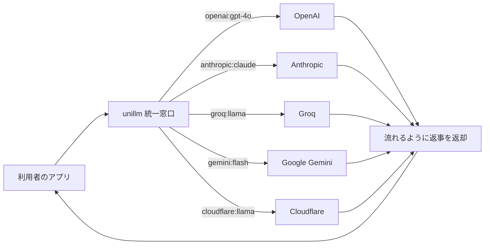

エッジコンピューティング向けの統一 LLM インターフェース。型安全な fluent API で複数プロバイダを単一の呼び出しで扱う。[[famulus]] / [[famulus2]] が利用するプロバイダ抽象層。

## 何ができる？

複数の AI 業者（OpenAI、Anthropic、Groq、Gemini など）への注文窓口を 1 つにまとめる「電話交換手」のような役割を果たします。普通ならお店ごとに違うレジに並び直さないといけないところを、コンビニのように「どこの商品でも同じレジで買える」状態にします。新しい AI 業者を試したいときも、注文書（コード）の宛先を 1 行書き換えるだけで切り替え可能です。これにより「どの AI が一番良いか」を気軽に比較でき、特定の業者に縛られずに済みます。

## 用語

- **LLM**: 大量の文章を学習して人間のように文章を作れる AI のこと（ChatGPT の中身）
- **プロバイダ**: AI を提供する会社（OpenAI、Anthropic、Google など）
- **API**: 外部のサービスに「これお願い」と注文するための窓口
- **エッジコンピューティング**: ユーザーの近くのコンピュータで処理する仕組み。注文を東京の本部まで送らず、近所のコンビニで完結させるイメージ
- **ストリーミング**: 出来上がった分から順に少しずつ届ける方式。Netflix のように全部ダウンロードを待たずに観られる
- **fluent API**: 文章のように繋げて書ける呼び出し方。「コーヒーを注文 → ミルク追加 → 砂糖少なめ」のように動作を連結する
- **Zod schema**: 「答えはこの形で返してね」という型紙。受け取ったデータが約束通りの形か自動チェックする
- **バックプレッシャー**: 受け手が追いつかないとき、送り手側が自動で速度を落とす仕組み
- **コールドスタート**: しばらく使われていないサービスが起動するまでの待ち時間
- **Cloudflare Workers**: ユーザーの近くで動かせる軽量な実行環境（エッジ）

## 仕組み



利用者は 1 つの窓口に「どの業者の、どのモデルを使いたいか」を文字列で伝えるだけ。unillm が裏で正しい業者に取り次ぎ、返事を流れ（ストリーム）として戻します。業者を変えたくなったら、文字列を書き換えるだけで済みます。

## Core Idea

「LLM プロバイダ毎に SDK を持つ」のではなく、`provider:model` 文字列でプロバイダを切り替える。レスポンスは [[nagare|nagare]] の `Stream<T>` を返し、ストリーミングと reactive 操作を標準化。

- バンドル: ~50KB
- コールドスタート: ~10ms
- 依存: Zod のみ (~11KB)
- メモリ: 自動チャンキング・バックプレッシャー

## 対応プロバイダ (48 モデル)

| プロバイダ | モデル数 | 代表モデル |
|---|---|---|
| Anthropic | 8 | claude-opus-4-5, claude-haiku-4-5, claude-sonnet-4-5 |
| OpenAI | 9 | gpt-4o, gpt-4o-mini |
| Groq | 7 | llama-3.3-70b-versatile, llama-3.1-8b-instant |
| Gemini | 8 | gemini-3-pro-preview, gemini-2.5-flash |
| Cloudflare | 13 | llama-4-scout, qwen2.5-coder-32b |
| DeepSeek / Kimi | — | famulus 経由で利用 |

## 使用例

### Fluent API

```ts
import { unillm } from "@aid-on/unillm";

const response = await unillm()
  .model("openai:gpt-4o-mini")
  .credentials({ openaiApiKey: process.env.OPENAI_API_KEY })
  .temperature(0.7)
  .generate("Explain quantum computing");
```

### Streaming with [[nagare]]

```ts
import type { Stream } from "@aid-on/nagare";

const stream: Stream<string> = await unillm()
  .model("groq:llama-3.3-70b-versatile")
  .credentials({ groqApiKey: "..." })
  .stream("Write a story");

await stream
  .map(chunk => chunk.trim())
  .filter(chunk => chunk.length > 0)
  .throttle(16)
  .tap(console.log)
  .toSSE();
```

### 構造化出力 (Zod schema)

```ts
const PersonSchema = z.object({
  name: z.string(),
  age: z.number(),
  skills: z.array(z.string())
});

const result = await unillm()
  .model("groq:llama-3.1-8b-instant")
  .credentials({ groqApiKey: "..." })
  .schema(PersonSchema)
  .generate("Generate a software engineer profile");

result.object.name; // type-safe
```

### Provider Shortcuts

```ts
import { anthropic, openai, groq, gemini, cloudflare } from "@aid-on/unillm";

await anthropic.sonnet("sk-ant-...").generate("Hello");
await openai.mini("sk-...").generate("Hello");
await groq.instant("gsk_...").generate("Hello");
```

## エラーハンドリング

```ts
import { UnillmError, RateLimitError } from "@aid-on/unillm";

try {
  await unillm().model(...).generate(...);
} catch (error) {
  if (error instanceof RateLimitError) {
    console.log(`Retry after ${error.retryAfter}ms`);
  }
}
```

## Edge Runtime

Cloudflare Workers での直接利用:

```ts
export default {
  async fetch(request, env) {
    const stream = await unillm()
      .model("cloudflare:@cf/meta/llama-3.1-8b-instruct")
      .credentials({ accountId: env.CF_ACCOUNT_ID, apiToken: env.CF_API_TOKEN })
      .stream("Hello");

    return new Response(stream.toReadableStream(), {
      headers: { "Content-Type": "text/event-stream" }
    });
  }
};
```

## 関連

- [[nagare]] — ストリーミング基盤
- [[famulus]] / [[famulus2]] — unillm を介して 7 プロバイダ対応
- [[fractop]] / [[whenm]] / [[templex]] — unillm をバックエンドとして利用
- [[fuzztok]] — トークン推定で組み合わせ可能

## Links

- [GitHub](https://github.com/Aid-On/unillm)
- [npm](https://www.npmjs.com/package/@aid-on/unillm)
