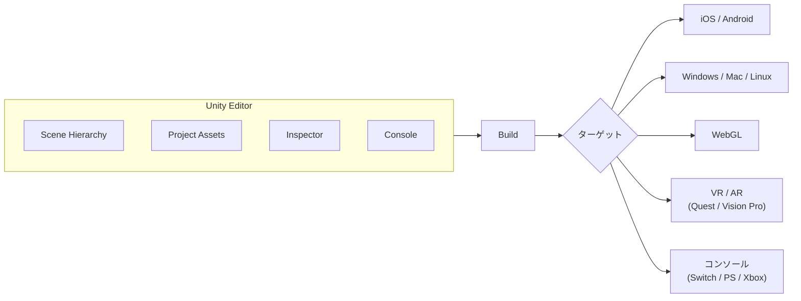
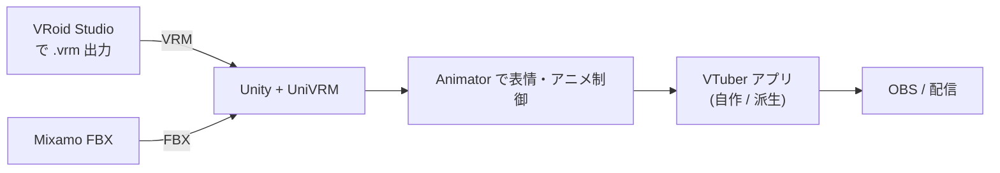

クロスプラットフォームの **ゲーム / リアルタイム 3D エンジン**。Unity Technologies が開発、商用ゲーム業界で **Unreal Engine と双璧**。スマホゲームの大半、VR/AR の主要部分、VTuber 系・教育・建築可視化までカバーする万能エンジン。スクリプトは C#。

## 何ができるエンジンか

3D / 2D ゲームを **企画から配信までワンストップ**で作れる：

- **シーン構築** — オブジェクト配置、ライティング、物理、ナビゲーション
- **スクリプティング** — C# でゲームロジック
- **アセット読み込み** — [[fbx|FBX]] / [[gltf|glTF]] / 画像 / 音 / [[vrm|VRM]] (UniVRM 経由)
- **アニメーション** — Animator / Animation Clip / Blend Tree
- **UI** — Canvas + UI Toolkit
- **レンダリング** — Built-in / URP（軽量）/ HDRP（高品質）
- **物理** — Rigidbody, Collider, NavMesh
- **マルチプラットフォーム書き出し** — iOS / Android / Windows / Mac / Linux / WebGL / Switch / PS / Xbox / VR HMD

## エディタとランタイムの構造



エディタ上でシーンを組み立てて Play すると **その場でゲームが走る**（C# はリロード可、Unity v6 では Hot Reload 強化）。

## レンダーパイプライン3種

| パイプライン | 用途 | 特徴 |
|---|---|---|
| **Built-in (Legacy)** | 古いプロジェクト | 最初からある定番、新規には非推奨 |
| **URP (Universal Render Pipeline)** | モバイル・Web・軽量 PC | 軽くて広いプラットフォーム、VRChat/VTuber 系の主流 |
| **HDRP (High Definition Render Pipeline)** | ハイエンド PC・コンソール | 写実、フルレイトレ、CPU/GPU 高負荷 |

VRM・VTuber アバターはほぼ **URP** で扱うのが標準。MToon シェーダも URP 対応版が用意されている。

## C# スクリプティング

```csharp
using UnityEngine;

public class PlayerMover : MonoBehaviour
{
    public float speed = 5f;

    void Update()
    {
        var dx = Input.GetAxis("Horizontal");
        var dz = Input.GetAxis("Vertical");
        transform.Translate(new Vector3(dx, 0, dz) * speed * Time.deltaTime);
    }
}
```

`MonoBehaviour` を継承するクラスを GameObject にアタッチ → エディタで public フィールドが自動で表示される。`Start` / `Update` / `FixedUpdate` / `OnCollisionEnter` 等のライフサイクルメソッドが呼ばれる。

## アセットインポート

Unity が **3D アセットの終着点** になっている：

- `.fbx` をドラッグ → 自動で Mesh / Material / Animation Clip に分解、Skeleton 作成
- `.gltf` / `.glb` も同様（v6 から公式 importer）
- `.vrm` は **UniVRM** という公式 add-on を入れて読み込み（Humanoid Avatar に変換）
- [[mixamo|Mixamo]] の FBX → そのままドロップで Animation Clip として登録

## VTuber / VRM ワークフロー



VRChat / cluster / バーチャルキャスト等の **VR ライブ系プラットフォームは内部で Unity を使っている**。VTuber アプリ（自作 / 派生）の制作プラットフォームとしても Unity が最有力。

## ライセンス

| プラン | 対象 | 制約 |
|---|---|---|
| **Personal** | 売上 / 資金調達が一定額以下（年 $200K 程度） | スプラッシュロゴ必須 |
| **Pro** | 売上が制限を超える企業 | 年契約、ロゴ自由 |
| **Enterprise** | 大企業向け | カスタム契約 |

2023 年に **Runtime Fee（インストール課金）** 導入を試みて炎上 → 撤回。現在は売上ベースの段階課金に戻っている。**個人 VTuber や小規模スタジオは実質 Personal 無料**。

## バージョンとリリースサイクル

- 旧: 半年ごとにメジャーリリース、年 1 回 LTS（Long-term Support）
- **Unity 6（2024 末リリース、現行）** — 数字飛ばし。Unity 2023 LTS の後継としてブランディングを刷新
- LTS 版は **2 年サポート**、商用プロジェクトはこちらが主流
- Unity 2022 LTS / Unity 6 LTS が現在のメイン選択肢

## C# / .NET 周辺

- **C# バージョン**: Unity 6 で C# 9（一部 10）。Unity 2022 LTS は C# 9
- **.NET ランタイム**: Mono または IL2CPP（後者がモバイル / コンソール出力時の標準）
- **Unity Package Manager (UPM)** で外部パッケージ管理

## 競合: Unity vs Unreal

| 観点 | Unity | Unreal Engine |
|---|---|---|
| **得意領域** | モバイル、2D、軽量 3D、VR、VTuber | 写実 3D、AAA ゲーム、MetaHuman、シネマティック |
| **言語** | C# | C++ + Blueprint（ノードグラフ） |
| **ライセンス** | 無料 + 売上段階課金 | 売上の 5%（$1M 超で発生） |
| **アセット** | Asset Store | Marketplace（Epic 提供素材多数） |
| **学習コスト** | 中 | 高（C++ + Blueprint 両方） |
| **VTuber/VRM** | UniVRM で対応、デファクト | VRM4U 等あるが少数派 |

## 押さえどころ（カード化候補）

- Unity の開発元と特徴 → **Unity Technologies が開発するクロスプラットフォームのリアルタイム 3D / ゲームエンジン。スクリプト言語は C#。モバイルゲーム・VR・VTuber 周辺で圧倒的シェア**
- Unity の3つのレンダーパイプライン → **Built-in (旧来)、URP (Universal、軽量、モバイル/VR/VTuber 主流)、HDRP (High Definition、写実・ハイエンド PC)**
- Unity が読み込める 3D 形式 → **FBX (主)、glTF (Unity 6 公式対応)、VRM (UniVRM 経由)。Mixamo の FBX も直接ドロップで Animation Clip 化**
- Unity のスクリプティングモデル → **MonoBehaviour を継承したクラスを GameObject にアタッチし、Start / Update / FixedUpdate などのライフサイクルメソッドで処理を書く C# 中心**
- Unity のライセンス体系 → **Personal (売上一定額以下で無料、スプラッシュロゴ必須)、Pro (年契約・ロゴ自由)、Enterprise。2023 年に Runtime Fee で炎上したが撤回し現在は売上段階課金**
- Unity と Unreal の使い分け → **Unity は C# でモバイル/2D/軽量3D/VR/VTuber が得意。Unreal は C++/Blueprint で写実 3D/AAA ゲーム/MetaHuman/シネマティックが得意**

## Links

- [Unity 公式](https://unity.com/)
- [Unity 6 リリースノート](https://unity.com/releases/unity-6)
- [UniVRM (VRM ↔ Unity)](https://github.com/vrm-c/UniVRM)
- [Unity Asset Store](https://assetstore.unity.com/)
