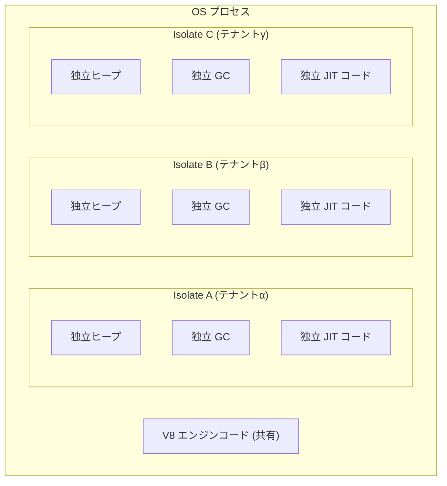
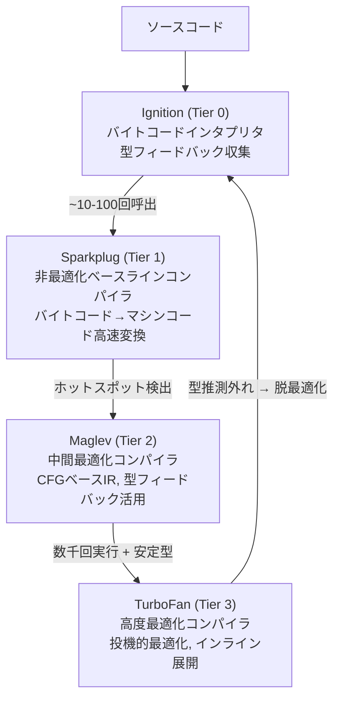
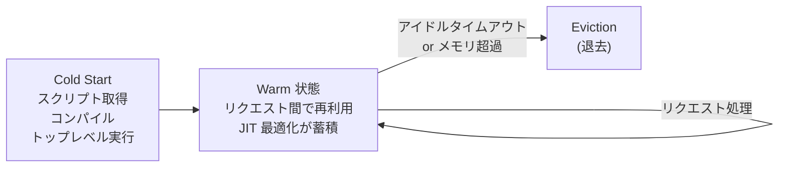
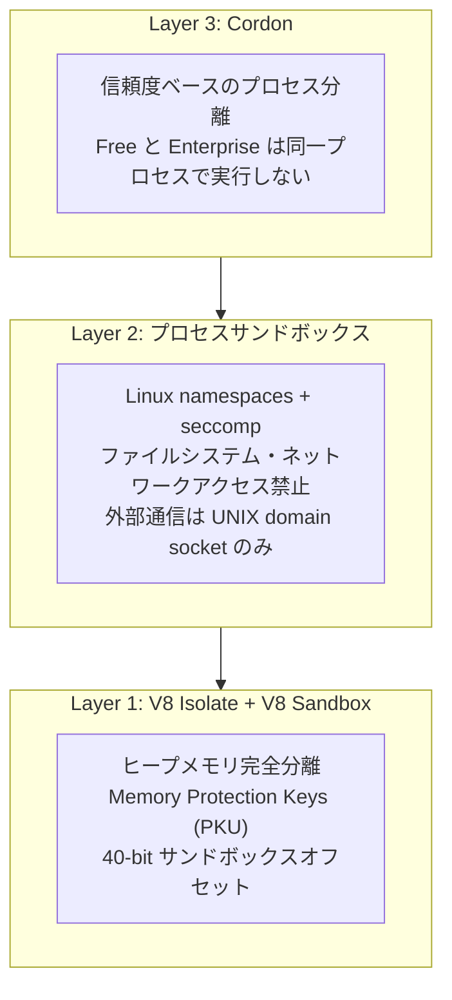

V8 エンジン (Google 製、Chrome/Node.js/Deno の JS エンジン) における完全に独立した VM インスタンス。独自のヒープ、GC、コンパイルパイプラインを持ち、1プロセス内で数千の Isolate が共存できる。Cloudflare Workers が [[edge-computing|Edge Computing]] の実行モデルとして採用し、0.4ms の Cold Start と 32,000 Isolate/host の高密度マルチテナントを実現した。

## Isolate とは何か

Isolate はプロセスでもスレッドでもない。V8 エンジンの独立した VM インスタンス。

各 Isolate が保有するもの:
- 個別の JavaScript ヒープ (通常 128MB 上限)
- 独立した GC 状態
- 独自にコンパイルされたバイトコード・最適化済みマシンコード
- 個別のビルトインオブジェクト (`globalThis`, `Promise` 等)

Isolate 間でメモリは共有不可能 (設計上の分離)。共有されるのは V8 エンジン自体のコンパイル済みコード (text segment) のみ。

### Isolate vs Context

| | Isolate | Context |
|---|---|---|
| 比喩 | ブラウザのウィンドウ | ウィンドウ内の iframe |
| 関係 | 1 Isolate : N Context | N Context : 1 Isolate |
| ヒープ | 独立 | 同一 Isolate のヒープを共有 |
| グローバルオブジェクト | -- | Context ごとに独立 |
| 分離レベル | メモリレベルで完全分離 | 同一ヒープ内で論理分離 |

## V8 コンパイルパイプライン

V8 は4段階の段階的コンパイル (Tiered Compilation) を採用する。

| 段階 | 役割 | コンパイル速度 | コード品質 |
|---|---|---|---|
| Ignition | バイトコード生成 + インタプリタ実行。型フィードバック収集 | -- | 最低 |
| Sparkplug | バイトコード→マシンコードの高速変換。最適化なし | 極めて速い | 低 |
| Maglev | CFG ベースの中程度最適化。Sparkplug の ~10倍遅い | 中 | 中 |
| TurboFan | 投機的最適化。Maglev の ~10倍遅い | 遅い | 最高 |

最新動向: Turboshaft が TurboFan の Sea of Nodes IR を CFG ベースに置換し、コンパイル時間を 50% 削減。さらに Turbolev (Maglev フロントエンド + Turboshaft バックエンド) が TurboFan を将来的に完全置換する方向。

## Edge Computing での活用

### なぜコンテナや VM ではなく Isolate か

| 特性 | V8 Isolate | コンテナ | microVM |
|---|---|---|---|
| Cold Start | 0.4ms (p50) | 数百ms〜数秒 | 3-8ms (snapshot) |
| メモリ/ユニット | ~3-4MB | 50-500MB | 64MB〜 |
| 128GB ホスト密度 | ~32,000 | ~数百 | ~2,000 |
| 分離強度 | ソフトウェア (V8 Sandbox + PKU) | OS (namespaces/cgroups) | HW (KVM) |
| 起動コスト | V8 ヒープ初期化のみ | OS 初期化 + ランタイム | ゲスト OS ブート |

Edge PoP (330+ 箇所) で数十万テナントのコードを同時に処理するには、コンテナ/VM ではメモリとレイテンシの両面でスケールしない。Isolate のメモリ効率 (~20倍) と Cold Start の桁違いの速さが CDN Edge に適合する。

### Cold Start が 0ms に近い理由

1. V8 エンジンは既にプロセス内でロード済み。新 Isolate はヒープの確保と初期化のみ
2. コンパイル済みバイトコードのデシリアライゼーションは ms 以下
3. V8 エンジンのバイナリコードは全 Isolate で共有。テナントごとにエンジンをロードしない

### Isolate のライフサイクル

- Isolate はリクエストごとに破棄されない。リクエスト間で再利用される
- Warm Isolate は JIT 最適化済みコードで後続リクエストを処理 → 性能向上
- メモリ制限 (128MB) を超過した場合: 処理中リクエスト完了後に新 Isolate を生成

### Shard and Conquer (Cold Start 最小化)

Cloudflare が 2025年に導入した高度な最適化:

- Worker スクリプト ID のハッシュで DC 内の「シャードサーバ」にルーティング
- 全リクエストの 4% のみがシャーディング対象だが、Isolate 退去率が 10倍低下
- Warm リクエスト率: 99.9% → 99.99% (three nines → four nines)
- インターネットトラフィックのべき乗分布を利用。低トラフィック Worker (4%) に Cold Start が集中するため、そこをシャーディングすることで全体を改善

## セキュリティモデル: 多層防御

### V8 Sandbox (2024〜)

2021-2023年の Chrome エクスプロイトの 60% が V8 の脆弱性。V8 の脆弱性は古典的メモリ破壊バグではなく、JIT コンパイラの微妙なロジック問題。

技術:
- ヒープ内の全ポインタを 40-bit サンドボックスオフセットに変換
- 外部メモリへのアクセスは間接テーブル (ファイルディスクリプタテーブルに類似) を経由
- `JSArrayBuffer` を破壊しても取得できるのはサンドボックス内オフセットのみ
- Chrome 123 (2024) からデフォルト有効。パフォーマンスオーバーヘッド 1% 以下

### Memory Protection Keys (PKU)

- 各 Isolate にランダムな保護キーを割り当て
- 別 Isolate のメモリにアクセスするとハードウェアトラップが発動
- 32GiB 範囲内で保護キーの重複をゼロに → クロス Isolate アクセスを阻止

### Spectre / Meltdown 対策

- `Date.now()` は最後の I/O 時刻を返す (リアルタイムではない) → 高精度タイミング攻撃を不可能に
- ネイティブコード実行禁止 (JS/Wasm のみ)
- 異常なパフォーマンスパターン検出時に自動的にプロセス分離
- V8 セキュリティパッチ公開から本番デプロイまで 24時間以内

### コンテナ/VM との分離強度比較

| 観点 | V8 Isolate | コンテナ | microVM |
|---|---|---|---|
| 分離レベル | ソフトウェア | OS | ハードウェア |
| 1脆弱性の影響 | 同一プロセス内の全テナント | kernel exploit が必要 | ゲスト OS 内に限定 |
| サイドチャネル耐性 | タイマー無効化で軽減 | OS レベル分離 | HW 分離で強い |
| パッチ速度 | 24時間未満 | 日〜週単位 | 日〜週単位 |
| コンプライアンス | カスタム対応 | 一般的に認定済み | PCI-DSS, HIPAA 対応 |

弱点: JIT コンパイラは複雑で歴史的にバグが多い。サンドボックスエスケープは同一プロセス内の全テナントに波及。強点: パッチ速度が圧倒的に速く、多層防御 (V8 Sandbox + PKU + Cordon) で3段階の突破が必要。

## V8 Isolates vs WebAssembly

| 比較 | V8 Isolates (Cloudflare) | Wasm (Fastly Compute) |
|---|---|---|
| Cold Start | 0.4ms | 50μs 未満 (桁違いに速い) |
| メモリモデル | 共有プロセス内のヒープ分離 | リニアメモリ (完全独立) |
| セキュリティ | V8 Sandbox + PKU | リニアメモリで本質的に強い分離 |
| 言語 | JS/TS ネイティブ + Wasm 経由 | 言語非依存 (Rust, Go, C/C++) |
| JIT | あり (段階的コンパイル) | なし (AOT。予測可能な性能) |
| 開発体験 | JS/TS + npm エコシステム直接利用 | コンパイル言語中心 |

Cloudflare 内での WASM 成長: Workers デプロイの 34% が Wasm コンポーネントを含む (2023: 12%)。V8 Isolate と Wasm は対立ではなく共存する方向。

## 制限事項 (Cloudflare Workers)

| 制限 | Free | Paid |
|---|---|---|
| CPU 時間 | 10ms/リクエスト | 5分/リクエスト |
| メモリ | 128MB/isolate | 128MB/isolate |
| スクリプトサイズ | 3MB (gzip) | 10MB (gzip) |
| サブリクエスト | 50/リクエスト | 10,000/リクエスト |

CPU 時間はウォールクロック時間ではない。ネットワーク待ち (D1 クエリ、R2 リード、外部 API) は CPU 時間にカウントされない。

一般的な制限:
- ファイルシステムアクセス不可。KV, R2 等の API を使用
- ネイティブモジュール (C/C++ バインディング) 使用不可
- Node.js API 非互換 (`fs`, `net`, `child_process` 等は使用不可)
- Web API のサブセットのみ (Fetch, Web Crypto, Web Streams 等)

## 主要プラットフォーム

| プラットフォーム | ランタイム | PoP |
|---|---|---|
| Cloudflare Workers | workerd (V8) | 330+ |
| Deno Deploy | Deno (V8) | 35+ |
| Vercel Edge Functions | Cloudflare 経由 (V8) | Cloudflare 依存 |
| Shopify Oxygen | Cloudflare Workers ベース | Cloudflare 依存 |
| Supabase Edge Functions | Deno (V8) | グローバル |

### workerd (Cloudflare OSS ランタイム)

Cloudflare Workers の本番環境と同じコードベースのオープンソース JS/Wasm ランタイム (Apache 2.0)。

- ナノサービスモデル: マイクロサービスのように独立デプロイ可能だが、呼び出しはローカル関数呼び出しの性能
- ビルトイン API は全て C++ で実装 (Node.js のように JS で実装しない)
- `wrangler dev` が内部で workerd を使用 → 本番とのパリティが高いローカル開発

## 将来の展望

- V8 Sandbox の機能完全化: メモリ破壊を通常のメモリ安全技術で対処可能な脅威に変換
- microVM snapshot が 1ms 以下に到達すれば、Isolate のレイテンシ優位性は消失。ただしメモリ効率 (~20倍) は残る
- WinterCG → ECMA TC55 (WinterTC) に移管。Edge ランタイム間の API 標準化を推進
- Turbolev (Maglev + Turboshaft) が TurboFan を完全置換する方向

## 押さえどころ（カード化候補）

- V8 Isolate の定義 → プロセスでもスレッドでもない。V8 エンジンの独立した VM インスタンスで、独自のヒープ・GC・JIT コードを持つ。1プロセス内で数千が共存。Isolate 間のメモリ共有は設計上不可能
- Isolate と Context の違い → Isolate はメモリレベルで完全分離 (ウィンドウ)。Context は同一 Isolate 内の論理分離 (iframe)。1 Isolate に複数 Context が存在可能
- V8 の4段階コンパイル → Ignition (インタプリタ) → Sparkplug (非最適化) → Maglev (中間最適化) → TurboFan (高度最適化)。ホットスポットが段階的に最適化される。型推測が外れると脱最適化で Ignition に戻る
- Edge で Isolate が選ばれた理由 → コンテナ/VM では 330+ PoP × 数十万テナントでメモリ・レイテンシがスケールしない。Isolate は 3-4MB/unit で 32K/host、Cold Start 0.4ms
- Cold Start が 0ms に近い理由 → V8 エンジンはプロセス内にロード済み。新 Isolate はヒープ確保と初期化のみ。バイトコードデシリアライゼーションは ms 以下。エンジンコードは全 Isolate で共有
- Shard and Conquer → 一貫性ハッシュで低トラフィック Worker (全体の 4%) をシャードサーバに集約。Isolate 退去率 10倍低下。Warm リクエスト率 99.99% (four nines)
- V8 Sandbox の仕組み → ヒープ内ポインタを 40-bit サンドボックスオフセットに変換。外部メモリアクセスは間接テーブル経由。JSArrayBuffer 破壊でもサンドボックス外に到達不能。パフォーマンスオーバーヘッド 1% 以下
- Workers の Spectre 対策 → Date.now() は最後の I/O 時刻を返す (リアルタイムではない)。高精度タイミング攻撃を不可能にする。ネイティブコード実行禁止。パッチ速度 24時間以内
- V8 Isolate vs Wasm の本質的違い → Isolate は共有プロセス内のヒープ分離 (JIT コンパイラの複雑さがリスク)。Wasm はリニアメモリで本質的に強い分離 (Cold Start も桁違いに速い)。ただし Wasm は JS エコシステムとの統合コストがある
- CPU 時間 vs ウォールクロック時間 → Workers の CPU 制限はウォールクロック時間ではない。ネットワーク待ち (D1, R2, 外部 API) は CPU 時間にカウントされない。I/O バウンドなら5分制限内で長時間動作可能
- workerd とは → Cloudflare Workers 本番と同じコードベースの OSS ランタイム。ビルトイン API は全て C++ 実装。wrangler dev が内部使用 → 本番パリティの高いローカル開発
- Isolate 再利用と JIT の関係 → Warm Isolate は JIT 最適化済みコードが蓄積。Isolate 退去で JIT コードも消失するため、再利用戦略が性能に直結

## Links

- [V8 Sandbox (V8 Blog)](https://v8.dev/blog/sandbox)
- [Cloudflare Workers Security Model](https://developers.cloudflare.com/workers/reference/security-model/)
- [Eliminating Cold Starts 2: Shard and Conquer (Cloudflare Blog)](https://blog.cloudflare.com/eliminating-cold-starts-2-shard-and-conquer/)
- [workerd (GitHub)](https://github.com/cloudflare/workerd)
- [Maglev - V8's Fastest Optimizing JIT (V8 Blog)](https://v8.dev/blog/maglev)
- [Land ahoy: leaving the Sea of Nodes (V8 Blog)](https://v8.dev/blog/leaving-the-sea-of-nodes)

## 関連

- [[edge-computing]] — V8 Isolates が CDN Edge の支配的な実行モデル
- [[edge-vs-cloud-vs-onprem]] — 実行モデル比較で V8 Isolates / Wasm / microVM を整理
- [[wasm-simd]] — Edge での WebAssembly 実行に関連
