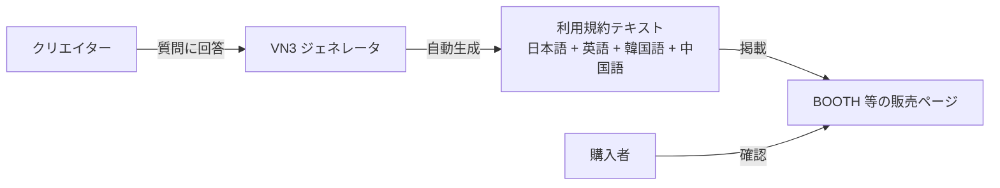
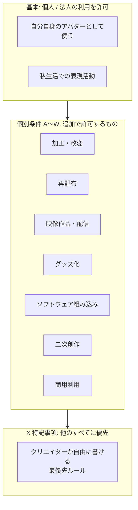

3D モデルや Live2D データの配布用利用規約テンプレート。質問に答えるだけで利用規約が自動生成される。BOOTH の人気アバター上位50のうち約70%が採用（2024年12月時点）。

## 何を解決するものか

BOOTH 等で 3D アバターを売るとき、利用規約を自分で書くのは大変で、書き方もバラバラになる。買う側も毎回違う書式の規約を読むのが面倒。

VN3 ライセンスは **質問に答えるだけで、標準化された利用規約を生成** してくれる。クリエイターは法律の知識がなくても適切な規約を作れ、ユーザーはどの作品でも同じフォーマットで条件を確認できる。

## 仕組み

生成された利用規約はクリエイター自身のもの。さらに自由に改変しても OK。

## 規約の構造

VN3 ライセンスは「デフォルトは禁止、許可したものだけ OK」という設計。

| 層 | 意味 |
|---|---|
| **基本** | 個人 or 法人として私的に使うことを許可 |
| **個別条件 A〜W** | 改変、再配布、配信利用、商用利用など。クリエイターが許可/不許可を選ぶ |
| **X 特記事項** | 他の全条件より優先。「R-18 禁止」「VRChat 以外での利用禁止」等の独自ルール |

## [[creative-commons|CC ライセンス]]との違い

| | CC ライセンス | VN3 ライセンス |
|---|---|---|
| 対象 | 著作物全般（写真、音楽、文章等） | 3D モデル・Live2D 等のバーチャル向けデータ |
| 粒度 | 4 条件の組み合わせ（BY, SA, NC, ND） | A〜W + X の細かい個別条件 |
| 想定シーン | Web での作品共有 | BOOTH でのアバター販売、VRChat での利用 |
| 改変の扱い | ND（改変禁止）か否かの二択 | 調整/改変/外部委託を個別に設定可能 |

CC は汎用的だが、3D アバター特有の事情（「改変はいいけど再配布はダメ」「配信利用は OK だけどグッズ化はダメ」等）を表現しきれない。VN3 はその隙間を埋める。

## 採用例

- BOOTH の人気 3D アバター上位 30 の約 80% が採用
- Live2D モデルにも採用事例あり
- 日本語・英語・韓国語・中国語（繁体・簡体）に対応

## Links

- [VN3 License 公式](https://www.vn3.org/)
- [利用規約ジェネレータ](https://www.vn3.org/generator)
- [本文・解説](https://www.vn3.org/terms)
- [採用事例](https://www.vn3.org/case)

## 関連

- [[creative-commons|Creative Commons]] — 汎用的なライセンス体系。VN3 は 3D アバター特化
- [[copyright-law|著作権法]] — VN3 ライセンスが前提とする法律
- [[vroid-studio-license|VRoid Studio ライセンス]] — VRoid Studio 固有のライセンス（VN3 とは別物）
- [[vrm|VRM]] — VN3 ライセンスが多く使われるフォーマット
