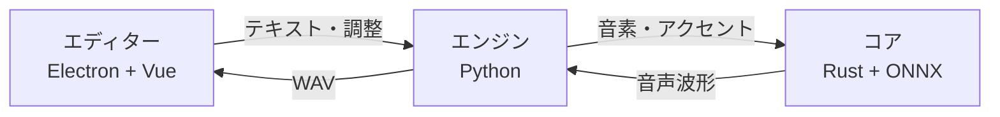
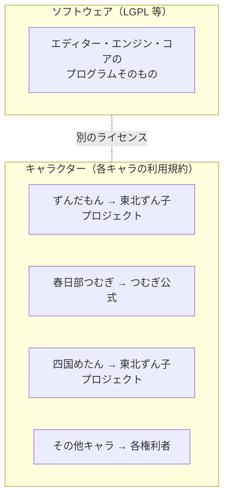
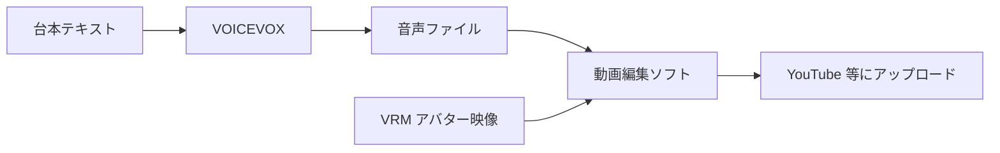

無料で使えるテキスト読み上げ・歌声合成ソフトウェア。ヒホ（ヒロシバ）が 2021年に公開。ずんだもん等のキャラクターボイスで知られる。

## 何をするものか

テキストを入力すると、選んだキャラクターの声で読み上げ音声を生成する。VTuber の動画制作、ゲームの音声、ナレーション、解説動画など幅広く使われている。

## アーキテクチャ

3つのモジュールで構成されている。

| モジュール | 役割 | 技術 |
|---|---|---|
| エディター | GUI。テキスト入力、イントネーション調整 | Electron + Vue |
| エンジン | テキスト解析、音声合成 API サーバー | Python (FastAPI) |
| コア | ディープラーニングによる音声波形生成 | Rust + ONNX Runtime |

エンジンは HTTP API を提供するので、GUI を使わずプログラムから直接呼び出せる（`localhost:50021`）。

## 特徴

- **文字単位のイントネーション調整** — ピッチやアクセントを細かく編集できる
- **感情スタイル** — キャラクターごとに「ノーマル」「あまあま」「ツンツン」等のスタイル
- **オープンソース** — エディター・エンジン・コアすべて GitHub で公開
- **ローカル実行** — クラウド不要。オフラインで動く
- **API 提供** — さくらインターネットが VOICEVOX ベースの TTS API を提供（2026年〜）

## キャラクター

20 キャラ以上が標準搭載。キャラクターごとに複数スタイル（ノーマル、あまあま、ツンツン、セクシー、ささやき等）がある。

代表的なキャラクター: ずんだもん、四国めたん、春日部つむぎ、雨晴はう、波音リツ、玄野武宏、白上虎太郎、青山龍星、冥鳴ひまり、九州そら、もち子さん、剣崎雌雄、WhiteCUL、後鬼、No.7、ちび式じい、櫻歌ミコ、小夜/SAYO、ナースロボ＿タイプＴ 等。

男声・女声・中性と幅広い。ただし **カスタム音声の追加機能はない**（プリセットのみ）。オリジナル声が必要な場合は [[style-bert-vits2|Style-Bert-VITS2]] や COEIROINK を検討。

## 推論速度（AITuber 用途）

| 環境 | レイテンシ | AITuber 適性 |
|---|---|---|
| GPU あり | 100〜300ms | 実用的。ネットワーク往復がないのでクラウド TTS より速い場合が多い |
| CPU のみ | 1〜3s | 実用ギリギリ。長文で顕著に遅延 |

AITuber 用途では GPU 必須。GPU があれば [[aivishub|AivisHub]]（クラウド API、500ms〜1.5s）よりむしろ速く、しかも TTS コスト ¥0。

## ライセンス — ソフトウェアとキャラクターは別

VOICEVOX で最も注意すべき点: **ソフトウェアのライセンスとキャラクターのライセンスは別物。**

### ソフトウェアのライセンス

オープンソース。改変・再配布・組み込みが可能。ロボット、観光案内、クラウドシステム等への応用も OK。

### キャラクターの商用利用

| 条件 | ルール |
|---|---|
| クレジットあり商用利用 | **無料で OK**（「VOICEVOX:キャラクター名」と表記） |
| クレジットなし商用利用 | **有料**（1キャラクターあたり40万円+税の契約が必要） |
| 禁止事項 | 信用・品位を損なう利用、公序良俗に反する利用 |

クレジットの書き方: `VOICEVOX:ずんだもん` のようにソフト名とキャラ名を併記。動画なら概要欄に記載。

### キャラクターごとに規約が違う

キャラクターの権利者はそれぞれ異なるため、詳細な禁止事項（R-18 の可否など）はキャラクターごとに確認が必要。

## VTuber ワークフローでの位置

動画制作で広く使われる。GPU があればリアルタイム生成も 100〜300ms で可能なため、AITuber のライブ配信にも適用可能。ずんだもんは AITuber 採用例が特に多い。

## 類似ソフト

| ソフト | 特徴 |
|---|---|
| **VOICEVOX** | 無料・OSS・キャラ多数 |
| **AivisSpeech** | VOICEVOX フォーク。高品質 |
| **COEIROINK** | 無料。独自キャラ |
| **CeVIO AI** | 有料。高品質。商用向け |
| **A.I.VOICE** | 有料。KOTONOHA シリーズ |

## Links

- [VOICEVOX 公式](https://voicevox.hiroshiba.jp/)
- [ソフトウェア利用規約](https://voicevox.hiroshiba.jp/term/)
- [GitHub](https://github.com/VOICEVOX/voicevox)

## 関連

- [[aituber-cost|AITuber 配信コスト構造]] — VOICEVOX ならTTS コスト ¥0
- [[style-bert-vits2]] — カスタム音声が必要な場合の選択肢
- [[aivishub]] — クラウド TTS（VOICEVOX フォークの AivisSpeech のホスティング版）
- [[streaming-software|配信ソフトウェア]] — 配信パイプラインの音声部分
- [[face-tracking|フェイストラッキング]] — 映像側の入力（VOICEVOX は音声側）
