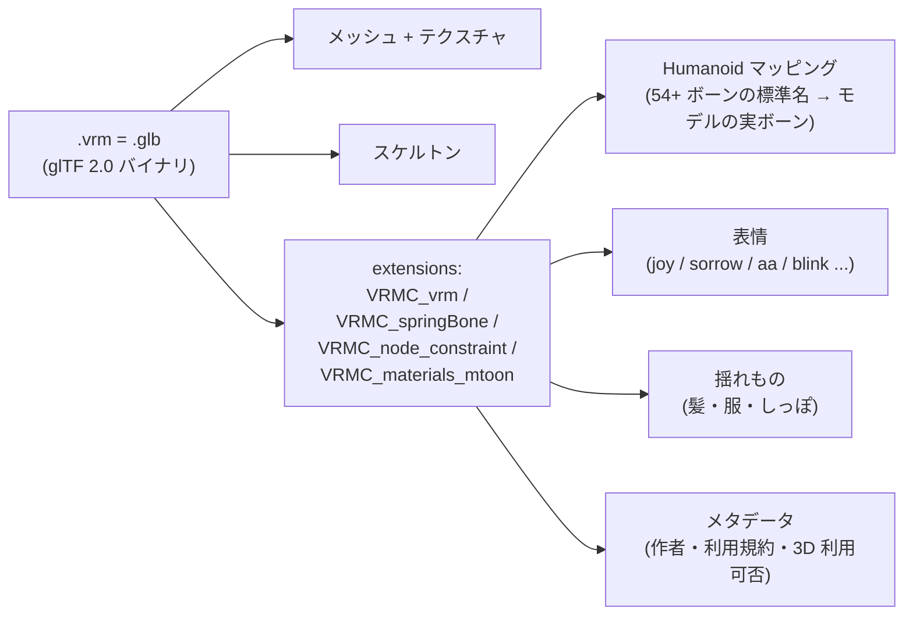

3D ヒューマノイドアバターの規格。**[[gltf|glTF 2.0]] を拡張した日本発のフォーマット**で、ドワンゴが提唱、現在は VRM コンソーシアム（プラットフォーム横断）が仕様を管理。アバターを「アプリ間でそのまま持ち歩ける」ことを核に据えた規格。

## 何を解決した規格か

3D アバターは元々アプリごとに独自フォーマットだった：

- VRChat なら Unity の prefab + AvatarDescriptor
- cluster なら独自インポーター
- ゲームエンジンごとに boilerplate

これだと「同じ自分のアバターを別アプリに持ち込めない」。VRM は **glTF 2.0 + 拡張メタデータ**（ヒューマノイドボーン構造、表情マッピング、揺れもの定義、ライセンス情報）を 1 ファイル `.vrm` に packing して、規格に対応するアプリならそのまま読める形にした。

## バージョン: 0.x と 1.0 の二本立て

VRM には現状 2 つ並走している：

| 系列 | 状況 | 互換性 |
|---|---|---|
| **VRM 0.x** | 2018 から普及。VRChat 系・VRoid 系の素材が膨大 | レガシーだが現実的に主流 |
| **VRM 1.0** | 2023 正式版。仕様が整理され、Material/Constraint が glTF 2.0 拡張に準拠 | 0.x と直接互換ではない（変換が必要）|

新規プロジェクトは VRM 1.0 推奨だが、**既存素材の大半はまだ 0.x**。プラットフォーム側で 0.x → 1.0 自動変換を提供しているケースが多い。

## ファイル構造

`.vrm` は中身が **glTF 2.0 のバイナリ形式 (.glb)** で、VRM 固有の拡張が `extensions` 配下に詰め込まれている。

## VRM 固有の拡張（VRM 1.0 主要なもの）

| 拡張名 | 役割 |
|---|---|
| `VRMC_vrm` | コア。Humanoid + 表情 + メタデータ |
| `VRMC_springBone` | 髪・服・しっぽ等の揺れ物理 |
| `VRMC_node_constraint` | 視線追従などの制約 |
| `VRMC_materials_mtoon` | アニメ調シェーダ MToon（標準同梱）|

## ライセンスメタデータ（VRM の特徴）

VRM は **モデル自体に作者の意思を埋め込める** のが大きな差別化：

- 商用利用可否
- 性的表現の許可
- 他者キャラクター流用の許可
- 改変の可否
- 政治・宗教利用
- 著者名・連絡先

プラットフォーム側はこのメタデータを尊重する義務を負う（強制力はないが、業界の規範）。

## 主要ツール

### 作成

- **VRoid Studio** — 一番手軽。GUI でキャラ作成 → `.vrm` 書き出し
- **Blender + VRM addon** — 既存モデルを VRM 化、または一からモデリング
- **Unity + UniVRM** — Unity の humanoid アバターを VRM に変換

### 利用

- **VRChat** — 直接は VRM 非対応だが、UniVRM 経由で Unity プロジェクト化して使う
- **cluster** — VRM 0.x / 1.0 直読み
- **バーチャルキャスト** — VRM ネイティブ
- **VTube Studio** — VRM 0.x のみ対応（主軸は Live2D）
- **Discord 動画** / **Zoom** — 各種 VRM 対応 VTuber アプリ経由

## VTuber エコシステムでの位置

- 3D 配信（VRChat、cluster、バーチャルキャスト系）→ **VRM が事実上の標準**
- 2D 配信（VTube Studio、ピンマイク系）→ **Live2D が主流**
- 多くの個人 VTuber は両方持っている（場面で使い分け）

## VRM vs Live2D（覚え書き）

| 観点 | VRM | Live2D |
|---|---|---|
| 次元 | 3D | 2D |
| 元素材 | モデリングデータ（fbx, blend）| イラスト（PSD） |
| 角度 | 全方位描画可能 | 正面付近のみ |
| 制作難易度 | 高（モデリング工程）| 中（イラスト + Cubism 操作）|
| 配信向き | VR / メタバース / 3D 表現 | 配信枠の中の 2D 表情 |
| 規格主体 | VRM コンソーシアム | Live2D Inc.（独占） |
| ライセンス | 規格はオープン、モデルは作者次第 | SDK 商用ライセンス契約 |

## 押さえどころ（カード化候補）

- VRM の中身は何のフォーマットか → **glTF 2.0 のバイナリ (.glb)。VRM 固有の拡張を `extensions` に乗せた形**
- VRM 0.x と 1.0 の関係 → **2 系列が並走している。0.x が普及済、1.0 が新規推奨。直接互換ではない**
- VRM 固有の代表的拡張 4 つ → **`VRMC_vrm`(コア)、`VRMC_springBone`(揺れ)、`VRMC_node_constraint`(制約)、`VRMC_materials_mtoon`(MToon シェーダ)**
- VRM が解決した課題 → **3D アバターをアプリ間で持ち歩けるようにした。Humanoid 構造・表情・ライセンスを規格化**
- VRM のライセンス情報 → **モデルファイル自体に商用可否、改変可否、利用範囲などのメタデータを埋め込める**
- VRM vs Live2D → **VRM は 3D（全角度可、モデリング必要）、Live2D は 2D（絵そのまま、横は描けない）**

## Links

- [VRM コンソーシアム公式](https://vrm-c.github.io/)
- [VRM 1.0 仕様](https://github.com/vrm-c/vrm-specification/blob/master/specification/VRMC_vrm-1.0/README.md)
- [VRoid Studio](https://vroid.com/studio)
- [UniVRM (Unity 向け実装)](https://github.com/vrm-c/UniVRM)
