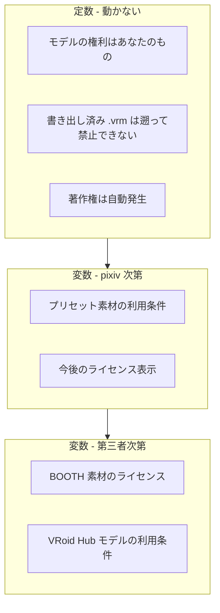
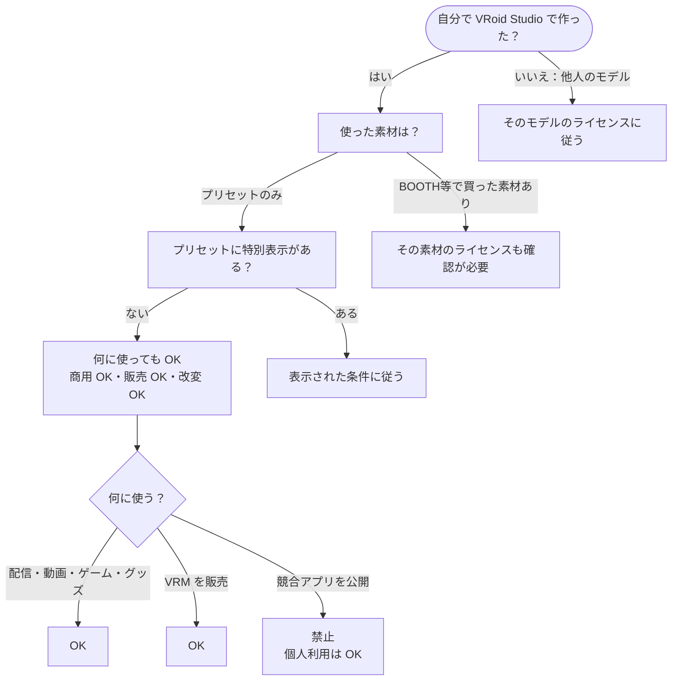
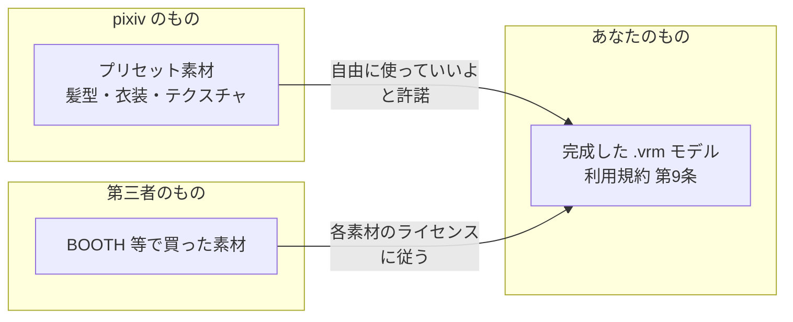
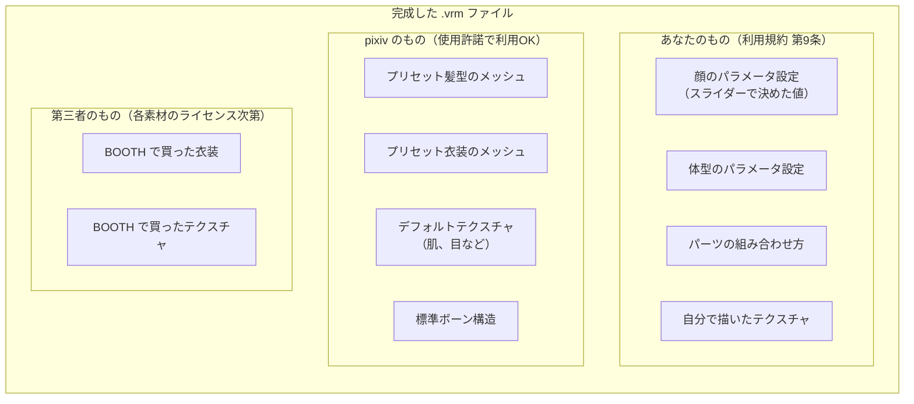
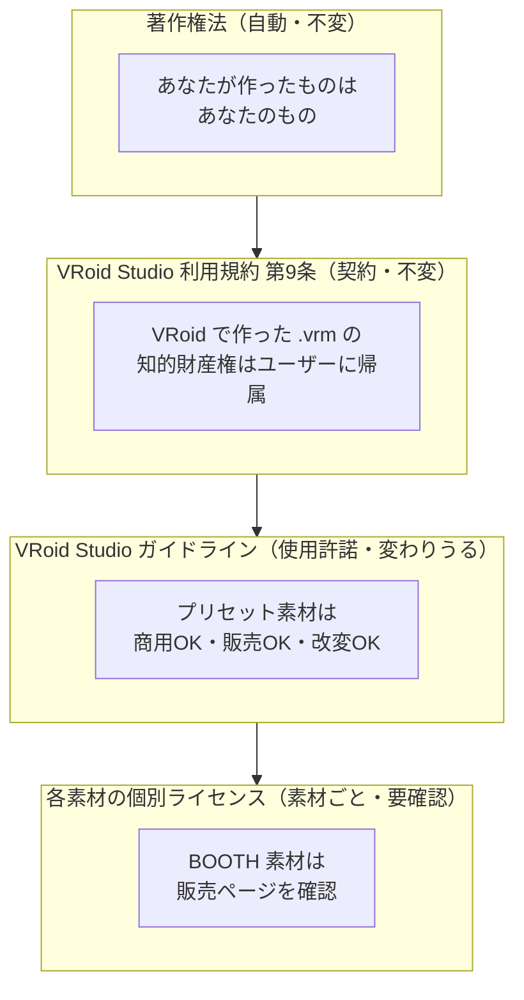
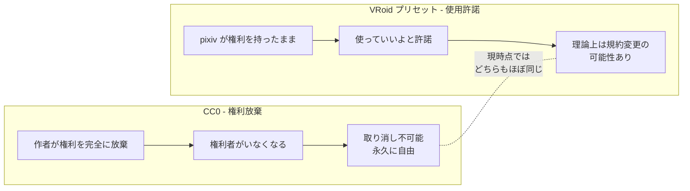
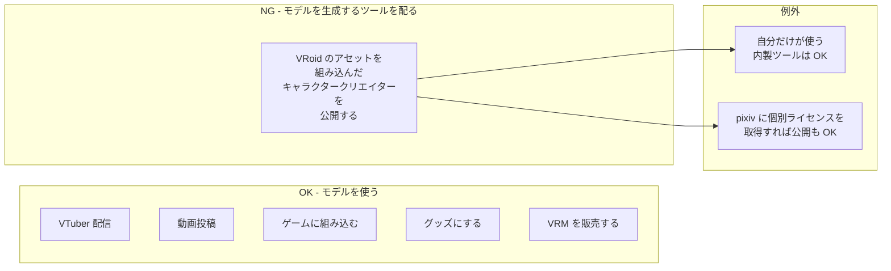

[[vroid-studio|VRoid Studio]] で作ったキャラクターの権利と利用条件。

## 定数と変数 — 何が動かなくて、何が変わりうるか

| 区分 | 内容 | なぜ動かない / 動く |
|---|---|---|
| **定数** | 作ったモデルの権利はあなたのもの | 利用規約 第9条で明記。契約上の権利 |
| **定数** | 既に書き出した .vrm は遡って禁止できない | 民法の[[good-faith-principle\|信義則]]。後出しで約束を変えるのは違法 |
| **定数** | 著作権は自動発生 | [[copyright-law\|著作権法]]。届出不要で世界共通 |
| **変数** | プリセット素材の利用条件 | pixiv のガイドラインで規定。今は商用 OK だが将来変わる可能性はゼロではない |
| **変数** | BOOTH 素材のライセンス | 素材ごとに作者が決める。買う前に確認必須 |

**要するに: 「自分で作った」という事実と「既に書き出した」という事実は誰にも覆せない定数。変わりうるのは「今後の」素材の条件だけ。**

## 自作キャラは自由に使えるか？ — 判定フロー

**結論: 「自分で VRoid Studio のプリセットだけで作ったキャラ」は、何に使っても法的に問題ない。** 注意が必要なのは「外部から持ち込んだ素材」と「競合アプリの公開」だけ。

## 権利の構造

### 作成モデルの知的財産権

VRoid Studio 利用規約（Steam 版）第9条:

> All Intellectual Property Rights and other rights to works that constitute Output Items created using Software shall belong to the Users who created such works.
>
> （和訳）本ソフトウェアを使用して作成された出力物を構成する著作物に関するすべての知的財産権およびその他の権利は、当該著作物を作成したユーザーに帰属するものとします。

つまり **VRoid Studio で作った .vrm モデルはあなたのもの**。個人・法人問わず商用利用可能。

### プリセット素材（髪型、衣装、テクスチャ等）

VRoid Studio ガイドライン（[vroid.com/en/studio/guidelines](https://vroid.com/en/studio/guidelines)）に基づく。

VRoid Studio に最初から入っている髪型や衣装は、pixiv が著作権を持ったまま「自由に使っていいよ」と許諾を出している形。ガイドラインの原文:

> Outside of situations when other special licensing terms are displayed, you can sell data and use it for commercial purposes, regardless of whether you're an individual or corporate body.
>
> （和訳）特別なライセンス条件が表示されている場合を除き、個人・法人を問わず、データを販売したり商用利用したりすることができます。

| 素材の出どころ | 商用利用 | 販売 | 改変 |
|---|---|---|---|
| VRoid Studio のプリセット（特別表示なし） | OK | OK | OK |
| VRoid Studio のプリセット（特別表示あり） | 表示に従う | 表示に従う | 表示に従う |
| BOOTH 等で購入した素材 | **素材ごとに異なる。必ず確認** | 同左 | 同左 |

「特別表示」は素材の説明欄に書かれている。表示がなければ気にしなくていい。

## VRM ファイルの中身 — どこが誰のものか

VRM ファイルは1つのファイルだが、中身は複数の部品で構成されている。それぞれ権利者が違う。

| VRM の中身 | 権利者 | ライセンス | 商用 | 変わる？ |
|---|---|---|---|---|
| パラメータの組み合わせ（顔、体型、構成） | **あなた** | [[copyright-law\|著作権法]]で自動発生 | OK | 定数 |
| 自分で描いたテクスチャ | **あなた** | [[copyright-law\|著作権法]]で自動発生 | OK | 定数 |
| プリセット髪型・衣装のメッシュ | **pixiv** | [VRoid Studio ガイドライン](https://vroid.com/en/studio/guidelines)で使用許諾 | OK（現時点） | 変数 |
| デフォルトテクスチャ（肌、目など） | **pixiv** | 同上 | OK（現時点） | 変数 |
| 標準ボーン構造 | **pixiv** | 同上 | OK（現時点） | 変数 |
| BOOTH で買った衣装・テクスチャ | **その作者** | 各素材の販売ページに記載（素材ごとに違う） | **要確認** | 変数 |
| VRoid Hub から落としたモデル | **そのモデルの作者** | [[vroid-hub\|VRoid Hub]] の利用条件設定 | **要確認** | 変数 |

**「あなたのもの」は誰にも取り消せない。「pixiv のもの」は今は自由に使えるが、pixiv の判断で今後条件が変わる可能性がゼロではない。**

ただし「変数」の部分についても:
- **既に書き出した .vrm** に対して遡って制限をかけることは[[good-faith-principle|信義則]]上できない
- 変わりうるのは「今後新しく作るモデル」に適用される条件だけ

## 関わるライセンス一覧

VRoid Studio で作ったキャラに関わるライセンスは全部で4種類。

| ライセンス | 何を守っている | 種類 | 誰が決めた | どこに書いてある |
|---|---|---|---|---|
| [[copyright-law\|著作権法]] | あなたが作ったもの全般 | 法律（自動発生） | 日本国 | 法律そのもの |
| [VRoid Studio 利用規約](https://store.steampowered.com/eula/1486350_eula_0) 第9条 | 完成した .vrm モデルの権利帰属 | 契約 | pixiv | 利用規約 |
| [VRoid Studio ガイドライン](https://vroid.com/en/studio/guidelines) | プリセット素材の利用条件 | 使用許諾 | pixiv | ガイドライン |
| 各素材の個別ライセンス | BOOTH 等で買った素材 | 素材ごとに異なる | 各素材の作者 | 素材の販売ページ |

上から順に強い。著作権法と利用規約は動かない。ガイドラインは pixiv が変えられる（ただし遡及はできない）。BOOTH 素材は毎回確認。

## CC0 との違い

上のガイドライン（使用許諾）がなぜ CC0 ではないのかという話。フリー素材には「権利放棄」と「使用許諾」の2種類がある。VRoid のプリセットは後者。

| | CC0 | VRoid プリセット |
|---|---|---|
| 権利者 | いない（完全放棄） | pixiv が保持 |
| 取り消し | **不可能** | **理論上は可能** |
| 現時点の自由度 | 何でも OK | 何でも OK（ほぼ同じ） |

**実例: Unsplash のライセンス変更。** 写真共有サイト Unsplash はもともと CC0 で写真を提供していたが、写真を大量ダウンロードして別サイトで再配布する業者が現れたため、独自ライセンス（Unsplash License）に変更した。CC0 時代にダウンロードされた写真は取り消せないが、新規の写真は新ライセンスが適用される。

VRoid のプリセットは CC0 ではなく pixiv の使用許諾なので、同様の変更が起きる可能性はある。ただし **既に書き出した .vrm ファイルの利用を遡って禁止する**（= 「あのとき OK だったけど、今から見たらダメだったことにする」） のは民法の[[good-faith-principle|信義則]]（民法第1条第2項「相手の信頼を裏切る行為はダメ」という原則）に反するため、現実的なリスクは低い。

**結論: 今プリセットだけで作って書き出したキャラは安心して使える。ただし CC0 のように「絶対に永久に自由」とは言い切れない、という構造上の違いがある。**

## 禁止事項

VRoid Studio ガイドラインの原文:

> You cannot create an application that can generate or output 3D models, avatars, or items consisting of deformed or combined meshes and textures that were created in VRoid Studio.
>
> （和訳）VRoid Studio で作成された、変形または組み合わせされたメッシュやテクスチャから構成される 3D モデル・アバター・アイテムを生成・出力できるアプリケーションを作成することはできません。

用語解説:
- **メッシュ** — 3D モデルの形状データ（ポリゴンの集まり）
- **テクスチャ** — 3D モデルの表面に貼る画像（肌の色、服の模様など）
- **変形または組み合わせ** — VRoid Studio 内でスライダー調整やパーツ選択をして作ったもの

また、利用規約 第5条第6項で VRoid Studio 自体の商用利用・二次利用は原則禁止されているが、「出力物の制作（Production of Output Items = VRoid Studio を使ってモデルを作ること）」は明示的に例外として許可されている。

## 参照先

- [VRoid Studio ガイドライン](https://vroid.com/en/studio/guidelines) — プリセット素材の利用条件、アプリ開発制限
- [VRoid Studio 利用規約（Steam 版）](https://store.steampowered.com/eula/1486350_eula_0) — 第5条: 禁止行為、第9条: 知的財産権、第11条: 使用権取消
- [ピクシブ サービス利用規約](https://policies.pixiv.net/) — VRoid Studio 個別規約を含む統合規約

## 関連

- [[vroid-studio|VRoid Studio]] — ツール本体
- [[vroid-hub|VRoid Hub]] — 他人のモデルはここの利用条件に従う
- [[vrm|VRM]] — VRoid が出力するフォーマット
- [[copyright-law|著作権法]] — 「作った人のもの」を守る法律
- [[creative-commons|Creative Commons]] — 「この条件なら使っていいよ」の世界標準（CC0 との違いの前提知識）
- [[good-faith-principle|信義則]] — 「後出しで約束を変えちゃダメ」という民法の原則
