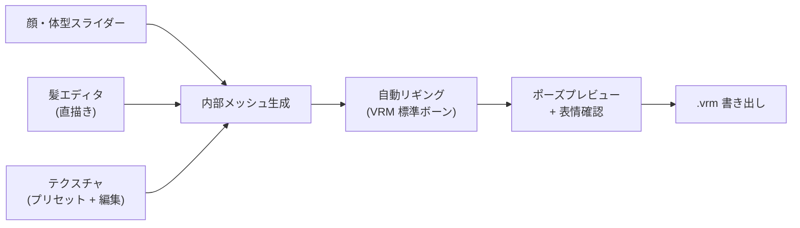

[[vrm|VRM]] アバター作成専用の GUI [[character-creator|キャラクタークリエイター]]。Pixiv が無料で開発・配布、Windows / macOS / iPad に対応。「絵が描けない人でもアニメ調 3D アバターを作れる」ことを目指したツールで、VRM 普及の最大の動力源。

## 何ができるソフトか

通常の 3D キャラ制作は **Blender や Maya でモデリング → リギング → テクスチャ → VRM 出力** という長い道のり。VRoid Studio はこれを **スライダー + 手描きで完結**させる：

- **顔**: 顔型・目・鼻・口・眉のパラメータをスライダーで調整
- **髪**: 「ヘアプリセット」を選び、専用エディタで毛束を直接描いて生やせる（タブレットで手描き感覚）
- **体型**: 身長・体格・胸囲・脚の長さなどをスライダー
- **衣装**: プリセット衣装 + 質感調整。テクスチャ画像を直接編集も可
- **表情**: 喜怒哀楽 + 口形（あいうえお）のプリセット入り

完成したアバターは **VRM** で書き出せる。VTuber アプリ ([[3tene]] / VTube Studio / VSeeFace) でそのまま動く。

## 仕組み

リギングは VRM 標準の Humanoid 構造を **完全自動で**装着するので、ユーザーがボーンを意識する必要がない。

## VRM 0.x と 1.0 のサポート

| VRoid Studio バージョン | 出力 |
|---|---|
| ~v1.0 系 | VRM 0.x のみ |
| **v1.0 以降（現行）** | VRM 0.x / 1.0 両方選択可 |

VRM 0.x は素材の互換性が広く、1.0 は新規プラットフォーム向け。書き出し時に選べる。

## Studio で完結しないこと

VRoid Studio で **できないこと**は他のツールに任せる：

- **指の関節を増やす / 細かい修正** → Blender + UniVRM addon
- **オリジナル衣装をモデリング** → Blender でメッシュ作って読み込ませる
- **アニメーションを付ける** → [[mixamo|Mixamo]] や Unity に持っていく
- **物理演算の細かい調整** → VRM SpringBone を Blender / Unity 側で

VRoid Studio で 8 割 → 残り 2 割は専門ツールでフィニッシュ、というのが典型的なワークフロー。

## 関連

- [[vroid-studio-license|VRoid Studio ライセンス]] — 自作キャラの権利と利用条件
- [[vroid-hub|VRoid Hub]] — モデルの共有プラットフォーム
- [[character-creator|キャラクタークリエイター]] — このジャンルの抽象概念
- [[vrm|VRM]] — VRoid Studio が出力するフォーマット
- [[blender|Blender]] — VRoid で作った後の細かい修正に使う
- [[mixamo|Mixamo]] — アニメーション付与
- [[3tene]] — VRM アバターを動かす VTuber アプリ
- [[face-tracking|フェイストラッキング]] — VTuber アプリでアバターを駆動する技術
- [[streaming-software|配信ソフトウェア]] — 最終的な配信の出口

## Links

- [VRoid Studio 公式](https://vroid.com/studio)
- [VRoid Documentation](https://vroid.pixiv.help/)
