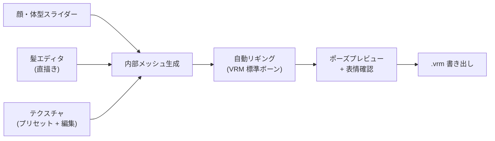

[[vrm|VRM]] アバター作成専用の **GUI キャラクタークリエイター**。Pixiv が無料で開発・配布、Windows / macOS / iPad に対応。「絵が描けない人でもアニメ調 3D アバターを作れる」ことを目指したツールで、VRM 普及の最大の動力源。

## 何ができるソフトか

通常の 3D キャラ制作は **Blender や Maya でモデリング → リギング → テクスチャ → VRM 出力** という長い道のり。VRoid Studio はこれを **スライダー + 手描きで完結**させる：

- **顔**: 顔型・目・鼻・口・眉のパラメータをスライダーで調整
- **髪**: 「ヘアプリセット」を選び、専用エディタで毛束を直接描いて生やせる（タブレットで手描き感覚）
- **体型**: 身長・体格・胸囲・脚の長さなどをスライダー
- **衣装**: プリセット衣装 + 質感調整。テクスチャ画像を直接編集も可
- **表情**: 喜怒哀楽 + 口形（あいうえお）のプリセット入り

完成したアバターは **VRM** で書き出せる。VTuber アプリ ([[3tene]] / VTube Studio / VSeeFace) でそのまま動く。

## 仕組み

リギングは VRM 標準の Humanoid 構造を **完全自動で**装着するので、ユーザーがボーンを意識する必要がない。

## VRM 0.x と 1.0 のサポート

| VRoid Studio バージョン | 出力 |
|---|---|
| ~v1.0 系 | VRM 0.x のみ |
| **v1.0 以降（現行）** | VRM 0.x / 1.0 両方選択可 |

VRM 0.x は素材の互換性が広く、1.0 は新規プラットフォーム向け。書き出し時に選べる。

## VRoid Hub との関係

VRoid Studio は **作るツール**、VRoid Hub は **共有プラットフォーム** で別物（どちらも Pixiv 運営）：

- **[VRoid Hub](https://hub.vroid.com/)** — 自作モデルを公開・他人モデルをダウンロード・利用条件メタデータを管理
- 作家が「商用利用 OK / 改変 OK」等を細かく設定でき、VRM の **ライセンスメタデータ機能** がそのまま生きる仕組み
- 一部モデルは Pixiv FANBOX / BOOTH 連携で有料配布

## Studio で完結しないこと

VRoid Studio で **できないこと**は他のツールに任せる：

- **指の関節を増やす / 細かい修正** → Blender + UniVRM addon
- **オリジナル衣装をモデリング** → Blender でメッシュ作って読み込ませる
- **アニメーションを付ける** → [[mixamo|Mixamo]] や Unity に持っていく
- **物理演算の細かい調整** → VRM SpringBone を Blender / Unity 側で

VRoid Studio で 8 割 → 残り 2 割は専門ツールでフィニッシュ、というのが典型的なワークフロー。

## ライセンス

### ソフトウェア本体

無料。Windows / macOS / iPad 対応。Steam でも配布。

### 作成したモデルの権利

ユーザーが VRoid Studio で作成した出力物（.vrm モデル）の知的財産権は **ユーザーに帰属**する。個人・法人問わず商用利用可能。

### プリセット素材（髪型、衣装、テクスチャ等）

pixiv が提供するプリセット素材は **CC0 ではない**。pixiv が著作権を保持し、幅広い用途で使えるようライセンスしている。

- **特別なライセンス表示がないプリセット** → 個人・法人問わず、改変しても、そのままモデルに装着して販売しても OK
- **特別なライセンス表示があるプリセット** → その条件に従う
- **サードパーティ素材**（BOOTH 等で購入したテクスチャ等）→ その素材のライセンスに従う

### 禁止事項

VRoid Studio で作成されたメッシュ・テクスチャを使って **3D モデルを生成・出力できるアプリケーションを開発すること** は禁止。ただし自分だけが使う場合はこの制限は適用されない。

### 参照先

- [VRoid Studio ガイドライン](https://vroid.com/en/studio/guidelines)
- [VRoid Studio 利用規約](https://vroid.com/agreement/studio)（第9条: 出力物の権利、第11条: 使用権の取消）

## 競合・類似

| ツール | プラットフォーム | 特徴 |
|---|---|---|
| **VRoid Studio** | Win/Mac/iPad、無料 | アニメ調・VRM 出力・Pixiv 製 |
| **Vket Cloud Avatar Maker** | Web、無料 | VRM 出力、シンプル |
| **Reallusion Character Creator 4** | Win、有料 | 写実調、ハイエンド向け |
| **MakeHuman** | OSS、無料 | 写実、医学的・教育向け |
| **MetaHuman Creator** | Web、無料（要 Unreal） | 超写実、Unreal 専用 |

VRoid のニッチは **「日本のアニメ調キャラを最短で作れる」**。

## 押さえどころ（カード化候補）

- VRoid Studio の開発元と料金 → **Pixiv が開発・配布、完全無料。Windows / macOS / iPad 対応**
- VRoid Studio が出力するフォーマット → **VRM (0.x / 1.0 を書き出し時に選択可能)。VTuber アプリでそのまま使える**
- VRoid Studio の主要編集機能 → **顔/体型スライダー、髪エディタ (毛束を直描き)、衣装プリセット + テクスチャ編集、表情プリセット、リギングは全自動**
- VRoid Studio と VRoid Hub の違い → **VRoid Studio は作るツール、VRoid Hub は共有プラットフォーム。どちらも Pixiv 運営だが別サービス**
- VRoid だけで完結しないこと → **指の関節追加・オリジナル衣装モデリング・アニメ付け・物理細調整は Blender や Unity・Mixamo に渡す**
- VRoid Studio のニッチ → **アニメ調 3D アバターを最短で作れる。写実系ハイエンドは Character Creator や MetaHuman の領域**

## 関連

- [[vrm|VRM]] — VRoid Studio が出力するフォーマット
- [[blender|Blender]] — VRoid で作った後の細かい修正に使う
- [[mixamo|Mixamo]] — アニメーション付与
- [[3tene]] — VRM アバターを動かす VTuber アプリ
- [[face-tracking|フェイストラッキング]] — VTuber アプリでアバターを駆動する技術
- [[streaming-software|配信ソフトウェア]] — 最終的な配信の出口

## Links

- [VRoid Studio 公式](https://vroid.com/studio)
- [VRoid Hub](https://hub.vroid.com/)
- [VRoid Documentation](https://vroid.pixiv.help/)
