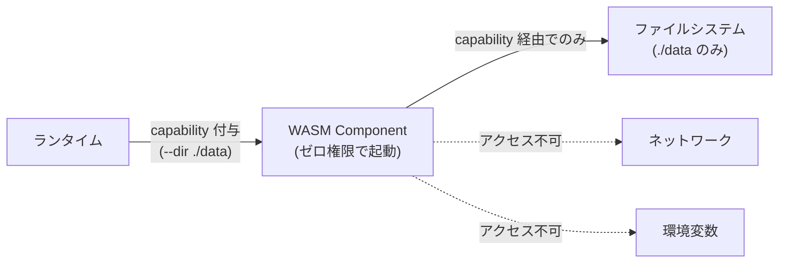

WebAssembly System Interface。WASM モジュールがブラウザ外でファイルシステム、ネットワーク、時刻取得等のシステムリソースにアクセスするための標準化 API 群。Capability-based security (deny-by-default) が設計の核心。Bytecode Alliance が主導し、[[wasm-at-the-edge|Edge Computing]] の基盤技術として機能する。

## なぜ WASI が必要か

Core WASM はサンドボックス内の純粋な計算しかできない。ファイル、ネットワーク、乱数、時刻へのアクセス手段が一切ない。WASI がこのギャップを埋める。

## 設計哲学: Capability-Based Security

プログラムはデフォルトで一切のシステムリソースにアクセスできない。ランタイムが明示的に渡した capability (権限トークン) のみを通じてアクセスする。



### WASI vs POSIX

| 項目 | POSIX | WASI |
|---|---|---|
| 権限モデル | Ambient authority (暗黙の全権) | Capability-based (明示的付与) |
| ファイルアクセス | `open("/etc/passwd")` で任意ファイル | `openat(dir_handle, "file")` でハンドル範囲内のみ |
| グローバル名前空間 | ファイルシステム、ネットワーク等の全名前空間 | なし。一切存在しない |
| サンドボックス哲学 | 全権プロセスを事後的に制限 (chroot, seccomp) | ゼロ権限から必要なものだけを付与 (secure by design) |

POSIX のサンドボックスは「天井から壁を下ろす」。WASI は「地面から必要な穴だけ開ける」。

## Preview 1 → Preview 2 → Preview 3

### Preview 1 (legacy)

45個のフラットな C ABI 関数群。`fd_read`, `fd_write`, `path_open` 等。Rust ターゲット: `wasm32-wasip1`。

| 制限 | 詳細 |
|---|---|
| ネットワーキング | TCP/UDP クライアント接続不可 |
| スレッド | なし |
| 非同期 I/O | `poll_oneoff` のみ |
| データ交換 | C ABI + linear memory 上のポインタ |

レガシーだがツールチェーンの成熟度から依然として広く使われている。

### Preview 2 (WASI 0.2, 2024年1月〜)

Component Model ベースへの根本的移行。最新: v0.2.11 (2026年4月)。

| インターフェース | 説明 |
|---|---|
| wasi:cli | コマンドライン (args, env, stdio) |
| wasi:http | HTTP incoming/outgoing handler |
| wasi:io | ストリーム、ポーリング |
| wasi:filesystem | ファイル/ディレクトリ操作 |
| wasi:sockets | TCP/UDP ソケット (P1 にはなかった) |
| wasi:random | 暗号的安全乱数 |
| wasi:clocks | wall-clock, monotonic-clock |

Rust ターゲット: `wasm32-wasip2` (Rust 1.82+ で Tier 2)。

### Preview 3 (WASI 0.3, 策定中)

最大の変更: async I/O のネイティブサポート。

- `stream<T>` / `future<T>` が Canonical ABI レベルで実装
- 言語のイディオマティックな async/await をそのまま使用可能
- スレッドサポートが段階的に追加予定 (協調的 → プリエンプティブ)
- Wasmtime 43+ で RC 利用可能
- WASI 1.0 (production-stable): 2026年後半〜2027年前半が目標

## Component Model

Core Module から Component への進化。WASI の価値の大部分がここにある。

### Core Module vs Component

| 項目 | Core Module | Component |
|---|---|---|
| インターフェース | 数値型の関数のみ | WIT で定義された型付きインターフェース |
| データ交換 | linear memory 上の生ポインタ | string, record, variant, list を直接授受 |
| 言語間結合 | 共有メモリ + 手動 FFI | WIT を共通契約として自動バインディング生成 |
| メモリ隔離 | 単一 linear memory を共有 | コンポーネントごとに独立メモリ |

### WIT (WebAssembly Interface Types)

Component Model の IDL。コンポーネントの import/export を型安全に定義する。

```wit
package my-company:my-api@1.0.0;

interface greeter {
    record person {
        name: string,
        age: u32,
    }
    greet: func(who: person) -> string;
}

world my-service {
    import wasi:http/types@0.2.0;
    export greeter;
}
```

型システム:
- プリミティブ: `bool`, `u8`-`u64`, `s8`-`s64`, `f32`, `f64`, `char`, `string`
- 複合: `list<T>`, `option<T>`, `result<T, E>`, `tuple<T1, T2>`
- ユーザー定義: `record`, `variant`, `enum`, `flags`, `resource`

`resource` は偽造不可能なハンドル + メソッドを持つ型。WASI の capability モデルの基盤。

### Canonical ABI

WIT の高水準型を Core WASM の linear memory 上の表現に変換するルール。コンポーネント間のデータマーシャリングを自動化する。WASI 0.3 では `stream<T>`, `future<T>` が追加。

### コンポーネントの配布

- OCI レジストリ (ghcr.io, DockerHub) で OCI Artifacts として配布
- `wkg` CLI (wasm-pkg-tools) で publish/fetch
- Bytecode Alliance が WASI WIT ファイルを GitHub Packages に公開

## Rust / Almide での実践

### ビルド

```bash
# ターゲット追加
rustup target add wasm32-wasip2

# 直接ビルド (WASI インターフェースのみ使用する場合)
cargo build --target wasm32-wasip2 --release

# cargo-component (カスタム WIT / 多言語結合が必要な場合)
cargo install cargo-component
cargo component new --lib my-handler
cargo component build --release
```

### HTTP ハンドラの実装

```rust
// wit/world.wit:
// world my-handler {
//     export wasi:http/incoming-handler@0.2.0;
// }

wit_bindgen::generate!({
    world: "my-handler",
    path: "wit",
});

struct MyHandler;

impl Guest for MyHandler {
    fn handle(request: IncomingRequest, response_out: ResponseOutparam) {
        // リクエスト処理
    }
}

export!(MyHandler);
```

### Edge デプロイ

```bash
# Fermyon Spin (Akamai)
spin build && spin deploy

# Fastly Compute
fastly compute build && fastly compute deploy

# Wasmtime で直接実行
wasmtime serve target/wasm32-wasip1/release/handler.wasm
```

Almide のパス: `*.almd` → Almide コンパイラ → `*.rs` → cargo-component → `*.wasm` (Component) → Edge デプロイ。Almide が直接 `wasm32-wasip2` 互換の WASM を出力できれば Rust 経由のパスをスキップ可能。

## ランタイムサポート状況

| ランタイム | P1 | P2 | P3 | Component Model | 特徴 |
|---|---|---|---|---|---|
| Wasmtime | Full | Full | RC | Full | リファレンス実装。Fastly の基盤 |
| Wasmer | Full | Partial | -- | 開発中 | WASIX (独自拡張) に注力。ロックインリスク |
| WasmEdge | Full | 開発中 | -- | Partial | Edge AI 特化 (WASI-NN) |
| WAMR | Full | Partial | -- | Partial | 超軽量。組み込み/IoT |

WASIX (Wasmer 独自): `fork()`, `exec()`, pthreads, BSD ソケットを追加。公式 WASI 標準ではないため、Wasmer でしか動作しない。

## 提案段階のインターフェース

| インターフェース | 段階 | 内容 |
|---|---|---|
| wasi:nn | Phase 2 | ML 推論 (ONNX, TF Lite, GGML) |
| wasi:gfx | Phase 2 | GPU アクセス (WebGPU バインディング) |
| wasi:blob-store | Phase 1 | オブジェクトストレージ |
| wasi:crypto | Phase 1 | 暗号操作 |
| wasi:keyvalue | Phase 1 | KV ストア |
| wasi:messaging | Phase 1 | メッセージング/Pub-Sub |
| wasi:sql | Phase 1 | SQL データベース |
| wasi:threads | Phase 1 | スレッドサポート |

## 押さえどころ（カード化候補）

- WASI の存在理由 → Core WASM はサンドボックス内の純粋計算のみ可能。ファイル、ネットワーク、乱数等のシステムリソースへのアクセス手段がない。WASI がこのギャップを埋める標準 API 群
- Capability-based security の本質 → プログラムはゼロ権限で起動。ランタイムが明示的に capability を付与した範囲のみアクセス可能。ambient authority (暗黙の全権) を排除し、supply chain attack の攻撃面を構造的に最小化
- WASI vs POSIX の哲学的違い → POSIX: 全権プロセスを事後的に制限 (chroot, seccomp)。WASI: ゼロ権限から必要なものだけ付与。POSIX は「天井から壁を下ろす」、WASI は「地面から穴を開ける」
- P1 → P2 の根本的変化 → P1: 45個のフラット C ABI 関数。P2: Component Model ベース + WIT による型安全インターフェース。ネットワーキング (wasi:sockets)、高水準データ交換 (string, record) が追加
- Component Model の価値 → 異なる言語で書かれたコンポーネントを WIT を共通契約として型安全に結合。コンポーネントごとに独立メモリ。OCI レジストリで配布。「LEGO ブロック」アプローチ
- WIT の role → Component Model の IDL。package/interface/world でコンポーネントの import/export を定義。Canonical ABI でデータマーシャリングを自動化
- resource 型と capability → WIT の resource は偽造不可能なハンドル + メソッド。インスタンスが明示的に渡さない限り取得不可能。WASI の capability モデルの基盤
- P3 の最大の変更 → async I/O の Canonical ABI レベルでのネイティブサポート。stream<T> と future<T>。言語の async/await をそのまま使用可能。スレッドも段階的に追加
- wasm32-wasip1 vs wasm32-wasip2 → wasip1: Core Module 出力、ネットワーキングなし、C ABI。wasip2: Component 出力、wasi:sockets/wasi:http あり、WIT ベース。wasip2 は Rust 1.82+ で Tier 2
- WASIX のロックインリスク → Wasmer 独自拡張で fork/exec/pthreads/BSD ソケットを追加。公式 WASI 標準ではなく、Wasmer でしか動作しない。利便性と引き換えのベンダーロックイン
- cargo-component vs wasm32-wasip2 の選択 → WASI インターフェースのみなら wasm32-wasip2 + wasi crate で十分。カスタム WIT や多言語結合が必要なら cargo-component
- WASI 1.0 への道筋 → P3 (async) → ポイントリリースでスレッド・ゼロコピー追加 → WASI 1.0 (2026年後半〜2027年前半)。2ヶ月ごとのリリース列車モデル
- Almide → WASI → Edge のパス → *.almd → Almide コンパイラ → *.rs → cargo-component → *.wasm (Component) → Edge デプロイ。Almide が直接 wasip2 互換 WASM を出力できれば最短パス
- スレッド不在が最大の欠落 → 計算負荷の高いサーバーワークロードのカテゴリ全体を排除。P3 のポイントリリースで協調的スレッド → プリエンプティブスレッドの順で追加予定

## Links

- [WASI (GitHub)](https://github.com/WebAssembly/WASI)
- [WASI Interfaces (wasi.dev)](https://wasi.dev/interfaces)
- [WASI Roadmap](https://wasi.dev/roadmap)
- [WASI Design Principles](https://github.com/WebAssembly/WASI/blob/main/docs/DesignPrinciples.md)
- [Component Model Book](https://component-model.bytecodealliance.org/)
- [cargo-component (GitHub)](https://github.com/bytecodealliance/cargo-component)
- [wit-bindgen (GitHub)](https://github.com/bytecodealliance/wit-bindgen)
- [Bytecode Alliance](https://bytecodealliance.org/)

## 関連

- [[wasm-at-the-edge]] — WASI が Edge WASM ランタイムの標準 I/O 層
- [[edge-platforms]] — Fastly Compute (Wasmtime), Fermyon Spin が WASI P2 対応
- [[dead-code-elimination]] — WASM バイナリサイズ最適化。WASI Component のサイズが Edge Cold Start に直結
