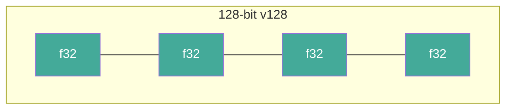

WebAssembly に 128-bit 幅のベクトル演算 (SIMD: Single Instruction Multiple Data) を追加する拡張仕様。単一の命令で複数のデータ要素を同時に処理し、スカラ WASM と比べて 2-6x の高速化を実現する。WebAssembly 2.0 仕様の一部として 2024年12月に W3C Standard となった。

## なぜ 128-bit か

x86 (SSE2 以降)、ARM (NEON)、RISC-V など現行の主要アーキテクチャが全て 128-bit SIMD をサポートしている。128-bit は「どのハードウェアでも確実に高速実行できる」最大公約数。



1命令で 4つの f32 を同時に加算・乗算できる。

## v128 型とレーン解釈

`v128` は唯一の新しい値型。命令によってレーンの解釈が変わる:

| 解釈 | レーン数 | レーン幅 | 主な用途 |
|---|---|---|---|
| i8x16 | 16 | 8-bit 整数 | 画像ピクセル、バイト操作 |
| i16x8 | 8 | 16-bit 整数 | 音声サンプル、中間計算 |
| i32x4 | 4 | 32-bit 整数 | 汎用整数演算 |
| i64x2 | 2 | 64-bit 整数 | 暗号、ハッシュ |
| f32x4 | 4 | 32-bit 浮動小数点 | 3D/物理、ML推論 |
| f64x2 | 2 | 64-bit 浮動小数点 | 科学計算、高精度演算 |

合計 236 命令を追加。オペコードプレフィックスは `0xfd`。

## 命令カテゴリ

### メモリ操作

| 命令 | 説明 |
|---|---|
| `v128.load` / `v128.store` | 128-bit ロード/ストア |
| `v128.load8x8_s/u` 等 | 拡張ロード (半幅レーンを全幅に拡張しながらロード) |
| `v128.load*_splat` | スカラ値をロードして全レーンに複製 |
| `v128.load*_zero` | 部分ロード (残りゼロ埋め) |
| `v128.load*_lane` / `v128.store*_lane` | 特定レーンのみロード/ストア |

### 構築・シャッフル

| 命令 | 説明 |
|---|---|
| `v128.const` | 16バイト即値からベクトル生成 |
| `*.splat` | スカラ値を全レーンに複製 |
| `i8x16.shuffle` | 2つのベクトルから即値インデックス (0-31) でレーン選択 |
| `i8x16.swizzle` | ベクトルのレーンを別ベクトルのインデックスで選択 (範囲外は0) |
| `*.extract_lane` | 指定レーンからスカラ値を抽出 |
| `*.replace_lane` | 指定レーンの値を置換 |

### 整数算術

| 命令 | 対応型 |
|---|---|
| `add`, `sub` | 全整数型 |
| `mul` | i16x8, i32x4, i64x2 (i8x16.mul は存在しない) |
| `add_sat_s/u`, `sub_sat_s/u` | i8x16, i16x8 (飽和演算) |
| `min_s/u`, `max_s/u` | i8x16, i16x8, i32x4 |
| `neg`, `abs` | 全整数型 |
| `shl`, `shr_s`, `shr_u` | 全整数型 (シフト量はスカラ) |
| `avgr_u` | i8x16, i16x8 (丸め平均) |
| `i32x4.dot_i16x8_s` | ペアワイズ乗算 → 32-bit に加算 |
| `i8x16.popcnt` | バイトごとのポップカウント |

### 拡張整数演算

| 命令 | 説明 |
|---|---|
| `extmul_low/high` | 半幅レーンを全幅に拡張して乗算 |
| `extadd_pairwise` | 隣接レーンペアを加算して幅拡張 |
| `narrow_*_s/u` | 全幅レーンを半幅に飽和圧縮 |
| `extend_low/high_*_s/u` | 半幅レーンを全幅に拡張 |

### 浮動小数点算術

| 命令 | 対応型 |
|---|---|
| `add`, `sub`, `mul`, `div`, `sqrt` | f32x4, f64x2 |
| `abs`, `neg` | f32x4, f64x2 |
| `min`, `max` (NaN伝播) | f32x4, f64x2 |
| `pmin`, `pmax` (NaN非伝播) | f32x4, f64x2 |
| `ceil`, `floor`, `trunc`, `nearest` | f32x4, f64x2 |

### ビット演算・比較

| 命令 | 説明 |
|---|---|
| `v128.and/or/xor/not/andnot` | ビット論理演算 |
| `v128.bitselect` | マスクに基づくビットレベル選択 |
| `v128.any_true` | いずれかのビットが非ゼロか |
| `*.all_true` | 全レーンが非ゼロか |
| `*.bitmask` | 各レーンの最上位ビットをスカラビットマスクに抽出 |
| `*.eq/ne/lt/gt/le/ge` | レーンごとの比較 (結果はマスクベクトル) |

### 型変換

| 命令 | 説明 |
|---|---|
| `i32x4.trunc_sat_f32x4_s/u` | f32 → i32 飽和切り捨て |
| `f32x4.convert_i32x4_s/u` | i32 → f32 変換 |
| `f32x4.demote_f64x2_zero` | f64 → f32 精度低下 |
| `f64x2.promote_low_f32x4` | f32 → f64 精度昇格 |

## ネイティブ SIMD とのマッピング

WASM SIMD は SSE2/SSSE3/SSE4.1 と NEON の共通部分集合を基に設計されている。

| WASM SIMD | x86 | ARM |
|---|---|---|
| `i8x16.add` | `PADDB` (1命令) | `VADDQ.I8` (1命令) |
| `i32x4.mul` | `PMULLD` (SSE4.1) | `VMULQ.I32` |
| `i8x16.shuffle` | `PSHUFB` + 追加命令 | `TBL` |
| `i8x16.bitmask` | `PMOVMSKB` (1命令) | 5-6命令チェーン (24サイクル) |
| `f32x4.min` (NaN伝播) | 7-10命令 | `VMINQ.F32` (1命令) |

アーキテクチャ非対称性: 一部命令は特定ハードウェアで非効率。`i8x16.bitmask` は x86 では1命令だが ARM64 では24サイクル。これが [[hashbrown]] が WASM SIMD を採用しなかった理由でもある (PR #269 が Close)。

## パフォーマンス

| 比較 | 高速化倍率 |
|---|---|
| WASM SIMD vs WASM スカラ | 2-4x (一般)、最大 6x (画像処理) |
| WASM SIMD vs JavaScript | 6-10x |
| WASM SIMD vs ネイティブ SIMD | 0.5-0.85x (15-50% のギャップ) |

実例:
- MediaPipe 手追跡: 14-15 FPS → 38-40 FPS (2.7x)
- TensorFlow.js ML推論: 2-4x 高速化
- Canny エッジ検出: ネイティブの 1.16-1.22x 程度の遅延 (ほぼネイティブ)

## ブラウザ対応状況

| ブラウザ | バージョン | 時期 |
|---|---|---|
| Chrome | 91+ | 2021-05 |
| Firefox | 89+ | 2021-06 |
| Safari | 16.4+ | 2023-03 |
| Edge | 91+ | 2021-05 |

グローバルカバレッジ: 約 94.2% (2026年時点)。

## 言語サポート

### Rust

```rust
use std::arch::wasm32::*;

#[target_feature(enable = "simd128")]
pub unsafe fn add_vectors(a: &[f32; 4], b: &[f32; 4]) -> [f32; 4] {
    let va = v128_load(a.as_ptr() as *const v128);
    let vb = v128_load(b.as_ptr() as *const v128);
    let result = f32x4_add(va, vb);
    let mut out = [0.0f32; 4];
    v128_store(out.as_mut_ptr() as *mut v128, result);
    out
}
```

有効化方法:
- 関数単位: `#[target_feature(enable = "simd128")]`
- 全体: `-Ctarget-feature=+simd128`

モジュール: `std::arch::wasm32` / `core::arch::wasm32`

### C/C++ (Emscripten)

```c
#include <wasm_simd128.h>

void brighten(uint8_t* pixels, int count, uint8_t amount) {
    v128_t vadd = wasm_u8x16_splat(amount);
    for (int i = 0; i < count; i += 16) {
        v128_t px = wasm_v128_load(&pixels[i]);
        v128_t result = wasm_u8x16_add_sat(px, vadd);
        wasm_v128_store(&pixels[i], result);
    }
}
// emcc -msimd128 -O2 brighten.c -o brighten.wasm
```

Emscripten は SSE/NEON 互換ヘッダも提供。既存の `<xmmintrin.h>` コードをそのままコンパイル可能。

## 制限事項

| 制限 | 説明 |
|---|---|
| 128-bit のみ | 256-bit (AVX), 512-bit (AVX-512) は未対応 |
| Gather/Scatter なし | 離散メモリアクセスの並列化は不可 |
| i8x16.mul なし | 8-bit 整数乗算は未定義 |
| 水平加算なし | shuffle + add で手動実装が必要 |
| FMA なし | Fixed-width SIMD には FMA なし ([[relaxed-simd]] で追加) |
| ランタイム検出不可 | CPUID 相当がない。SIMD版/非SIMD版の2ビルドが必要 |
| 可変幅 SIMD 非対応 | ARM SVE, RISC-V RVV は活用できない |

## ユースケース

| 分野 | 代表例 |
|---|---|
| 画像処理 | Figma, Photopea, OpenCV.js, WebP encoder |
| 音声/動画 | FFmpeg.wasm, libopus, AV1 デコーダ |
| ML推論 | TensorFlow.js, ONNX Runtime Web, Whisper.cpp |
| 暗号 | 1Password, noble-hashes (SHA-256, ChaCha20) |
| 物理シミュレーション | ブラウザゲームエンジン |

## 将来の拡張

| 提案 | 段階 | 内容 |
|---|---|---|
| [[relaxed-simd]] | Phase 4 (完了) | 非決定性を許容して FMA, dot product 等を追加 |
| Flexible Vectors | Phase 1 | 128-bit 超の可変幅 SIMD。SVE/RVV 対応 |
| Half-Precision Float | アクティブ | f16x8 型。AI推論/グラフィックス向け |

## 策定経緯

| 時期 | 出来事 |
|---|---|
| 2017頃 | proposal 開始。SIMD.js (TC39) の知見を継承 |
| 2021-05 | Chrome 91 で安定版リリース |
| 2021-06 | Firefox 89 でデフォルト有効化 |
| 2021-07 | Phase 4 到達 (Finished Proposal) |
| 2023-03 | Safari 16.4 で全主要ブラウザ対応完了 |
| 2024-12 | WebAssembly 2.0 として W3C Standard |

チャンピオン: Deepti Gandluri (Google / V8)

## 押さえどころ（カード化候補）

- WASM SIMD の位置づけ → WebAssembly に 128-bit ベクトル演算を追加する拡張。v128 型 1つで i8x16〜f64x2 のレーン解釈を命令で切り替え。236命令追加。W3C Standard (2024)
- なぜ 128-bit か → x86 (SSE2)、ARM (NEON)、RISC-V が全て 128-bit をサポート。どのハードウェアでも確実に高速実行できる最大公約数
- WASM SIMD vs スカラの高速化 → 一般的に 2-4x、画像処理で最大 6x。ネイティブ SIMD との差は 15-50%
- bitmask のアーキテクチャ非対称性 → i8x16.bitmask は x86 では PMOVMSKB 1命令だが ARM64 では 24サイクルの依存チェーン。hashbrown が WASM SIMD を採用しなかった原因
- WASM SIMD にない命令 → Gather/Scatter、i8x16.mul、水平加算、FMA (Fixed-width)。FMA は Relaxed SIMD で追加
- ランタイム検出の不在 → CPUID 相当がない。SIMD対応はコンパイル時に全体で決定。非対応環境向けに別ビルドが必要
- Rust での WASM SIMD → std::arch::wasm32 モジュール。#[target_feature(enable = "simd128")] で関数単位に有効化。v128 型を直接操作
- C/C++ での WASM SIMD → wasm_simd128.h ヘッダ + emcc -msimd128。SSE/NEON 互換ヘッダも提供され既存コードを移植可能
- v128 のレーン解釈 → 同じ v128 型を命令で i8x16/i16x8/i32x4/i64x2/f32x4/f64x2 として解釈。型ではなく命令がデータ幅を決める
- WASM SIMD の将来 → Relaxed SIMD (FMA 等, Phase 4 完了)、Flexible Vectors (128-bit 超, Phase 1)、Half-Precision Float (f16x8)

## Links

- [WebAssembly/simd (GitHub)](https://github.com/WebAssembly/simd)
- [SIMD Proposal Spec](https://github.com/WebAssembly/simd/blob/main/proposals/simd/SIMD.md)
- [V8 SIMD Feature Page](https://v8.dev/features/simd)
- [Emscripten SIMD Documentation](https://emscripten.org/docs/porting/simd.html)
- [Rust core::arch::wasm32](https://doc.rust-lang.org/beta/core/arch/wasm32/index.html)
- [Can I Use: wasm-simd](https://caniuse.com/wasm-simd)

## 関連

- [[relaxed-simd]] — 非決定性を許容して FMA 等の高速命令を追加する拡張提案
- [[swiss-table]] — SIMD を活用したハッシュテーブル探索 (ネイティブ環境)
- [[hashbrown]] — WASM では bitmask の非対称性により SIMD 不使用 (ポータブル fallback)
