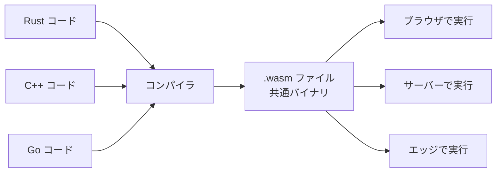

ブラウザでも、サーバーでも、組み込み機器でも同じように動く「世界共通の高速バイナリ規格」。多くの言語からこの形式に出力でき、ほぼネイティブに近い速度で動く。

## 何ができる？／なぜ重要？

世界中どこに行っても挿せる「ユニバーサルなコンセント」を想像してください。WASM はソフトウェア版のそれで、Rust や C++ で書いたプログラムを WASM という共通の形にまとめておけば、ブラウザでも、サーバーでも、スマートフォンでも、ほぼそのまま動かせます。船で例えれば「コンテナ船」です。中身が何であれ、決まったサイズの箱（コンテナ）に詰めれば、どの港にもそのまま運べます。

これが嬉しいのは、「ブラウザ向けに書き直す」「Mac 向けに作り直す」といった面倒な作業が大幅に減ることです。なければ、同じ機能を OS ごと、環境ごとに別々に作る必要があり、開発コストが膨れ上がります。

## 仕組み

複数の言語を一度 WASM という共通の形式に変換しておけば、その後はあらゆる場所（ブラウザ、サーバー、エッジ）で同じバイナリが動きます。

## 用語

- **バイナリ**: 機械が直接読める 0 と 1 の形式。人間には読めない。
- **ランタイム**: WASM を実際に動かす実行環境（例: ブラウザ、Wasmtime）。
- **WASI**: WASM がファイルやネットワークを扱うための標準仕様。
- **bindgen**: Rust など他言語と JavaScript を繋ぐ自動生成ツール。
- **サンドボックス**: WASM が外の世界に勝手にアクセスできない隔離環境。安全性が高い。
- **モジュール**: WASM の単位。関数や変数をまとめた箱。
- **ホスト**: WASM を呼び出す側のプログラム（ブラウザの JS など）。
- **JIT**: 実行直前に機械語へ変換する仕組み。WASM を高速に動かす。

## vault 内での使われ方

- [[almide]] — WASM をターゲットにコンパイルできる言語
- [[almide-wasm-bindgen]] — Almide と JS を WASM 経由で繋ぐ
- [[almide-bindgen]] — 言語間バインディング生成
- [[almide-js]] — Almide の JavaScript ランタイム
- [[almide-nn]] — WASM で動くニューラルネット
- [[almide-lander]] — Almide のランディングページ（WASM デモ）
- [[almide-lumen]] — Almide のグラフィック実装
- [[bonsai-almide]] — ブラウザ上で Almide を動かす
- [[lean4-rust-backend]] — Lean4 を Rust 経由で WASM 化
- [[playground]] — ブラウザで WASM プログラムを試す環境
- [[obsid]] — WASM を活用したツール
- [[sandboxes-o6lvl4]] — WASM サンドボックスの集合
- [[porta]] — WASM ポータビリティ関連
- [[animula]] — WASM 関連プロジェクト
- [[whenm]] — WASM 利用ツール

## 関連概念

- [[compiler]] — WASM へ変換する翻訳工程
- [[llvm]] — 多くの言語が LLVM 経由で WASM を出力する

## Links

- [WebAssembly 公式](https://webassembly.org/)
- [Wikipedia: WebAssembly](https://ja.wikipedia.org/wiki/WebAssembly)
