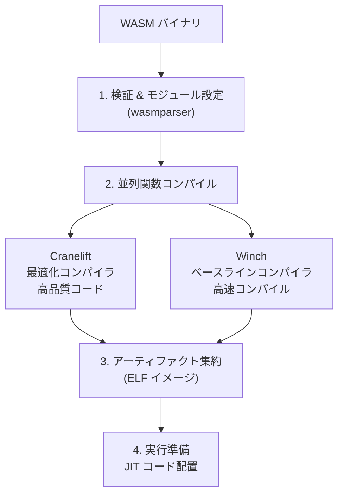
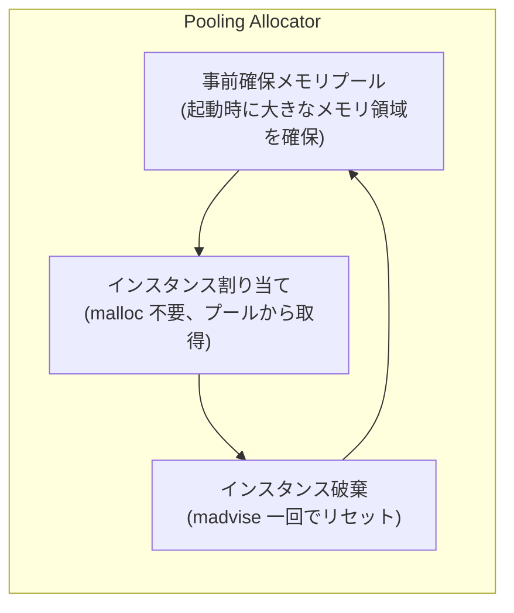

Bytecode Alliance が開発する WebAssembly のリファレンスランタイム。[[wasi|WASI]] および Component Model の世界初の完全実装。Cranelift コンパイラバックエンドによるセキュリティ重視の設計と、Pooling Allocator + CoW によるマイクロ秒レベルのインスタンス化が特徴。Fastly Compute と Fermyon Spin (Akamai) の基盤。

## 基本情報

| 項目 | 値 |
|---|---|
| 最新バージョン | v45.0.0 (2026-05-21) |
| 言語 | [[rust|Rust]] |
| ライセンス | Apache 2.0 with LLVM Exception |
| リリースサイクル | 月次 (毎月 20日前後) |
| LTS | 12バージョンごと、2年間のセキュリティ修正 |
| Tier 1 プラットフォーム | x86_64 (Linux, macOS, Windows) |

主要利用者: Fastly Compute (10,000+ ユーザー)、Fermyon Spin/Akamai (75M req/sec)、Shopify Functions、wasmCloud、NGINX Unit。

## コンパイルパイプライン



### Cranelift (最適化コンパイラ)

~200K 行の Rust (LLVM の 2000万行と対照的)。セキュリティとコンパイル速度を最優先。

| 特徴 | 詳細 |
|---|---|
| IR | CLIF (SSA 形式)。未定義動作を設計上排除 |
| Mid-end 最適化 | Acyclic E-graph (aegraph): 業界初の e-graph ベース本番コンパイラ。GVN + LICM + DCE を統合 |
| ISA ローワリング | ISLE DSL で宣言的にリライトルールを記述 |
| レジスタアロケータ | regalloc2: バックトラッキング型。SSA ネイティブ。シンボリックチェッカーで形式検証 |
| 関数インライニング | v36+ (off-by-default、baking 中) |

ISA サポート:

| ISA | Cranelift | Winch |
|---|---|---|
| x86_64 | Tier 1 | Tier 1 |
| aarch64 | Tier 2 | Tier 1 (v35+) |
| s390x | Tier 2 | -- |
| riscv64 | Tier 2 | -- |

### Cranelift vs LLVM

| 観点 | Cranelift | LLVM |
|---|---|---|
| コードサイズ | ~200K 行 Rust | ~20M+ 行 C++ |
| コンパイル速度 | 20-40% 高速 | ベースライン |
| コード品質 | ネイティブの ~86% | ネイティブの ~100% |
| IR の未定義動作 | なし | `undef`, `poison` あり |
| セキュリティ | 悪意ある入力への耐性設計 | 汎用コンパイラ |
| サンドボックスエスケープ CVE | 2016年以降 2件 | -- |

### Winch (ベースラインコンパイラ)

シングルパスで WASM オペコードごとに定型の機械語列を出力。Cranelift のコンパイル時間がボトルネックになる cold start シナリオで使用。最適化は最小限だがコンパイル速度は極めて高速。

## Pooling Allocator + CoW

Wasmtime のインスタンス化が マイクロ秒レベルで完了する理由。



- **CoW メモリイメージ**: memfd ベース。モジュール読み込み時に CoW イメージを構築。メモリコピーは初回書き込みまで遅延
- **Memory Protection Keys (MPK)**: ガードリージョンのカラーストライピングで同一仮想空間に最大 15倍のリニアメモリを収容

## AOT コンパイル

```bash
wasmtime compile input.wasm    # -> input.cwasm
wasmtime input.cwasm           # コンパイル不要で即実行
```

```rust
let module = Module::new(&engine, wasm_bytes)?;
let serialized = module.serialize()?;
// 後でデシリアライズ (コンパイルスキップ)
let module = unsafe { Module::deserialize(&engine, &serialized)? };
```

`.cwasm` は Engine 設定と Wasmtime バージョンに厳密に紐づく。信頼できるソースのもののみ使用すべき。

## メモリ安全性: ガードページ

```
[2GB ガード] [4GB リニアメモリ領域 (初期 64KB)] [2GB ガード]
```

- 後方ガード (2GB): 33-bit 実効アドレスに対するバウンズチェックを完全除去
- 前方ガード (2GB): Cranelift の符号拡張バグに対する defense-in-depth
- 明示的チェック時のオーバーヘッド: 1.2-1.8x (ガードページで回避)

## セキュリティ

| 機構 | 説明 |
|---|---|
| サンドボックス | コールスタック不可視、メモリ境界ポインタ、型検査付き制御フロー |
| Rust 実装 | コンパイル時エラー検出。public API 経由でのセグフォルト防止保証 |
| Fuel | 命令単位の CPU 制限。`store.set_fuel(10_000)` で燃料設定 |
| Epoch Interruption | 固定サイクルごとに変数検査。Fuel より高速だが非決定論的 |
| Capability-based | ファイル/ディレクトリは明示的に付与された capability のみアクセス可能 |
| Proof-Carrying Code | メモリ操作がサンドボックス内に留まることを検証 (~1% オーバーヘッド) |
| Spectre 緩和 | `call_indirect` のバウンズチェック、`br_table` の決定論的投機ルーティング |

## WASI / Component Model

| 仕様 | サポート |
|---|---|
| WASI Preview 1 | 完全対応 (P2 インフラ上に再実装済み) |
| WASI Preview 2 | 完全対応 (世界初の完全実装) |
| WASI Preview 3 | RC サポート (v37+、native async) |
| Component Model | リファレンス実装 |

`wasmtime serve`: `wasi:http/proxy` world を実装したコンポーネントを HTTP サーバーとして実行。

## パフォーマンス

| 指標 | 値 |
|---|---|
| コード品質 | V8 TurboFan の ~98%、LLVM の ~86% |
| コンパイル速度 | LLVM の 20-40% 高速 |
| インスタンス化 | マイクロ秒レンジ (Pooling Allocator + CoW) |
| Cold Start | Fermyon Spin で sub-0.5ms |
| ホスト-ゲスト呼び出し | 最小 10 ナノ秒 |
| 最小ビルドサイズ | 2.1MB (x86_64、組み込み向け) |
| メモリフットプリント | ~15MB |

## API と言語バインディング

| 言語 | 安定性 | 備考 |
|---|---|---|
| Rust | Tier 1 | ネイティブ API。crates.io `wasmtime` |
| C | Tier 1 | `libwasmtime.a`。他言語バインディングの基盤 |
| Python | -- | PyPI `wasmtime` |
| Go | -- | `wasmtime-go` |
| .NET | -- | NuGet `Wasmtime` |

`#![no_std]` サポート (Tier 2) で組み込み用途にも対応。Pulley インタプリタで Cranelift 未対応プラットフォームでも動作。

## 他ランタイムとの比較

| 観点 | Wasmtime | Wasmer | WasmEdge |
|---|---|---|---|
| WASI P2 | 完全 (初) | 追随中 | 追随中 |
| Component Model | リファレンス実装 | 追随中 | 追随中 |
| Cold Start | 3ms | 2ms | 1.5ms |
| メモリ | 15MB | 12MB | 8MB |
| 独自機能 | Pooling Allocator, MPK, LTS | WASIX (POSIX 互換) | WASI-NN (TF Lite, llama.cpp) |
| ガバナンス | Bytecode Alliance (非営利) | Wasmer Inc. (営利) | CNCF Sandbox |
| 方針 | 標準準拠最重視 | プラグマティック | 拡張重視 |

選択指針: FaaS/セキュリティ重視なら Wasmtime、レガシー POSIX 移行なら Wasmer、Edge AI/IoT なら WasmEdge。

## 押さえどころ（カード化候補）

- Wasmtime の位置づけ → Bytecode Alliance のリファレンスランタイム。WASI / Component Model の世界初の完全実装。標準準拠を最重視し、独自拡張を行わない方針
- Cranelift vs LLVM → Cranelift: ~200K 行 Rust、20-40% 高速コンパイル、ネイティブの ~86% のコード品質。LLVM: ~20M+ 行 C++、~100% のコード品質。Cranelift は IR に未定義動作がなくセキュリティ設計
- Acyclic E-graph (aegraph) → 業界初の e-graph ベース本番コンパイラ最適化。GVN + LICM + DCE + リマテリアライゼーションを単一フレームワークで統合。ISLE DSL でリライトルールを宣言的に記述
- Winch の存在理由 → Cranelift は高品質コードを生成するがコンパイルに時間がかかる。Winch はシングルパスでコンパイル速度最優先。Edge の cold start 最小化に使用
- Pooling Allocator + CoW → 起動時に大きなメモリプールを事前確保。インスタンスはプールから取得 (malloc 不要)。CoW でメモリコピーを初回書き込みまで遅延。結果: マイクロ秒レベルのインスタンス化
- MPK によるメモリ密度 → Memory Protection Keys でガードリージョンをカラーストライピング。同一仮想空間に最大 15倍のリニアメモリを収容可能
- ガードページによるバウンズチェック除去 → 2GB 前方 + 2GB 後方ガード。33-bit 実効アドレスに対する明示的バウンズチェックを完全除去。チェックありだと 1.2-1.8x のオーバーヘッド
- Fuel vs Epoch Interruption → Fuel: 命令単位の精密な CPU 制限 (決定論的だがオーバーヘッド高)。Epoch: 固定サイクルごとの検査 (高速だが非決定論的)。信頼できないコードの実行制限に使用
- AOT コンパイルの意味 → wasmtime compile で .cwasm を事前生成。実行時はデシリアライズのみでコンパイルスキップ。Edge デプロイでは AOT が cold start 最小化の鍵
- Proof-Carrying Code → メモリ操作がサンドボックス内に留まることを検証。オーバーヘッド ~1%。Cranelift の IR に未定義動作がないことと組み合わせてセキュリティを保証
- regalloc2 → IonMonkey インスパイアのバックトラッキング型レジスタアロケータ。SSA ネイティブ。シンボリックチェッカーによる形式検証 + libFuzzer でファジング。コンパイル速度 ~20% 向上
- Wasmtime の LTS 方針 → 12バージョンごと、2年間のセキュリティ修正保証。月次リリースとの組み合わせで、最先端追従とエンタープライズ安定性を両立
- Wasmtime vs Wasmer vs WasmEdge の選択 → Wasmtime: 標準準拠/セキュリティ/LTS。Wasmer: WASIX で POSIX 互換 (ただしロックイン)。WasmEdge: 最小メモリ/Edge AI/WASI-NN
- wasmtime serve → wasi:http/proxy world を実装したコンポーネントを HTTP サーバーとして実行。ProxyPre による事前インスタンス化でリクエスト処理を高速化

## Links

- [Wasmtime (GitHub)](https://github.com/bytecodealliance/wasmtime)
- [Wasmtime Docs](https://docs.wasmtime.dev/)
- [Cranelift](https://cranelift.dev/)
- [Wasmtime Security](https://docs.wasmtime.dev/security.html)
- [Bytecode Alliance](https://bytecodealliance.org/)

## 関連

- [[wasi]] — Wasmtime が世界初の完全実装を提供
- [[wasm-at-the-edge]] — Fastly Compute, Fermyon Spin の基盤ランタイム
- [[edge-platforms]] — ランタイム比較の文脈
- [[dead-code-elimination]] — WASM バイナリサイズと Wasmtime の cold start の関係
