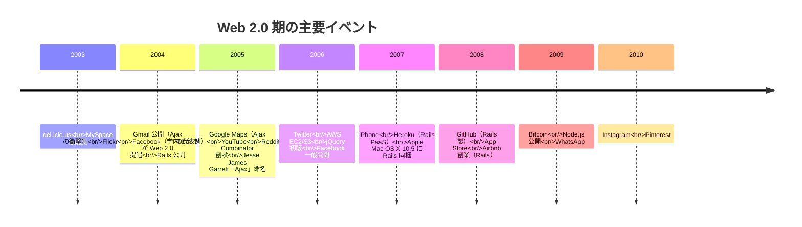

2004 年に Tim O'Reilly が提唱し、2005 年のエッセイ "What Is Web 2.0" で定義された **Web の構造的転換を指す概念**。**「ページとして読むもの」から「アプリケーション・プラットフォーム」へ** の移行を指す。同時期に登場した Rails が広まる時代背景そのものでもある。

## 何を区切ったか

「Web 1.0 / 2.0」という世代区分自体が当時のマーケティング用語であり、技術的に厳密な境界はない。だが O'Reilly が同名カンファレンスと記事で **Web の体験・経済モデルが質的に変わったこと** を指摘し、当時の業界関係者がその区分を採用したことで概念として定着した。

| 観点 | Web 1.0（〜2003 頃） | Web 2.0（2004〜） |
|---|---|---|
| Web の本質 | 文書を配信する場所 | アプリケーションを動かすプラットフォーム |
| 主役 | 出版社・大手ポータル（Yahoo!, AOL） | ユーザー自身（UGC）と、それを集約するプラットフォーム |
| コンテンツの作成 | プロが作る | 誰でも作る（ブログ、Wiki、写真共有、SNS） |
| ページ | 静的、リロード前提 | リアルタイム更新、Ajax |
| データ | サイト内に閉じる | API で外部から組み合わせ可能（mashup） |
| ビジネス | 広告・課金・物販 | ロングテール、ネットワーク効果、データそのものが資産 |
| ソフト配布 | パッケージ販売 | サービス提供（SaaS） |

## O'Reilly の "What Is Web 2.0"（2005）

Tim O'Reilly が 2004 年のカンファレンスで用語を打ち出し、2005 年 9 月のエッセイで詳説した 7 つの原則：

1. **The Web as Platform** — Web 自体が OS のようにアプリを動かす土台になる
2. **Harnessing Collective Intelligence** — 集合知の活用（Wikipedia, Amazon レビュー、del.icio.us のタグ）
3. **Data is the Next Intel Inside** — データがプロダクトの差別化要因（Google の検索インデックス、Amazon の購入履歴）
4. **End of the Software Release Cycle** — perpetual beta、継続的デプロイ、バージョン番号の意味の希薄化
5. **Lightweight Programming Models** — REST、RSS、JSON、軽量 API。SOAP / WS-* の重さに対する反動
6. **Software Above the Level of a Single Device** — モバイル・デスクトップ・サーバを横断するソフト
7. **Rich User Experiences** — Ajax 等によるデスクトップアプリ並みの体感

これらは事後的に Rails の設計とほぼ完全に重なる（**Rails は 5 と 7 の技術的実装、4 はデプロイ習慣、1–3 は Rails で作られた多くのスタートアップが目指したもの**）。Rails が Web 2.0 を作ったのではないが、両者は同じ時代精神の二つの現れ。

## キラーアプリと出来事のタイムライン

## Ajax — Web 2.0 の技術的中心

`XMLHttpRequest` 自体は 1999 年に Microsoft が IE 5 で実装、2002 年頃に Mozilla 等にも広がっていたが、**「Ajax」という言葉が 2005 年 2 月に Jesse James Garrett のエッセイで命名され、概念として独立した**。

「Asynchronous JavaScript and XML」の頭字語だが、現実には XML より JSON のほうが多用された。重要なのは **「ページ全体をリロードせず、JavaScript からサーバへ部分更新リクエストを投げる」** というインタラクションモデルの命名。

代表的なデモンストレーションが Google Maps（2005）と Gmail（2004）で、これらが「ブラウザでもデスクトップアプリ並みの体感が作れる」ことを証明し、業界全体を Ajax 路線に押し出した。

クライアント側ライブラリの普及：

- **Prototype.js**（2005）— Sam Stephenson 作、Rails 同梱で広まる
- **script.aculo.us**（2005）— Prototype 上のアニメーション、Rails 同梱
- **MochiKit**（2005）、**Dojo**（2005）、**Mootools**（2007）
- **jQuery**（2006）— John Resig 作、後に事実上の標準に

## 当時の言語・フレームワーク普及状況

Rails が登場した 2004 年から普及がピークに達する 2010 年頃までの、Web 開発における主要言語・フレームワークの状況。

### Java EE / Struts / Spring

| 時期 | 状況 |
|---|---|
| 2001 | Struts 1.0、J2EE 1.3 |
| 2003 | Spring Framework 1.0（Rod Johnson） |
| 2006 | Spring 2.0、JSF 1.2 |
| 2009 | Spring 3.0 |
| 2014 | Spring Boot 1.0（Rails 的 CoC を取り込んだ Java 陣営の応答） |

- **採用領域**: 銀行・大企業・政府系・大規模 EC サイト
- **強み**: 性能・スレッド・型安全・ツール整備（Eclipse, IntelliJ）
- **弱み**: XML 設定の嵐、Hello World までの距離が長い、デプロイサイクルが重い
- **Rails への影響**: 「Java の重さに辟易したエンタープライズ Java 出身者」が Rails の主要な初期採用者層になった

### PHP

| 時期 | 状況 |
|---|---|
| 2000 | PHP 4.0、Zend Engine |
| 2003 | PHP 4.3、CakePHP 開発開始 |
| 2004 | PHP 5.0（OO 大幅強化）、Symfony 開発開始 |
| 2005 | CakePHP 1.0、Symfony 1.0（**いずれも Rails の影響を公言**） |
| 2009 | PHP 5.3（namespace、closure） |
| 2011 | Laravel 1.0 |
| 2015 | PHP 7.0（性能 2 倍） |

- **採用領域**: 個人サイト・中小規模 EC・WordPress（2003〜）・MediaWiki・Drupal・Facebook（2004 創業時、後に HHVM/Hack に移行）
- **強み**: シェアードホスティングとの相性、`<?php` インラインの単純さ、習得コストの低さ
- **弱み**: 言語仕様の一貫性のなさ、規模化での破綻しやすさ
- **Rails への影響**: PHP 陣営の主要フレームワーク（CakePHP, Symfony, Laravel）はすべて Rails のパターン（CoC, MVC, scaffold, ORM）を継承

### Python

| 時期 | 状況 |
|---|---|
| 2000 | Python 2.0、Zope 2.0 |
| 2003 | TurboGears 開発開始 |
| 2005 | Django 0.91（**Rails と並走で 2003 年から非公開開発、2005 年公開**） |
| 2006 | Pylons |
| 2008 | Django 1.0、Python 3.0 |
| 2010 | Flask 0.1（軽量派の対抗馬） |

- **採用領域**: Google（一部）、Instagram、Pinterest、Mozilla、新聞社（Django は元々ローカル新聞の CMS）
- **強み**: 言語の一貫性、学術・データ分析との地続き、Django の admin 機能
- **弱み**: WSGI の出遅れ、GIL、Web 採用は Rails より遅れて広まった
- **Rails との対比**: 思想は近いが、文化が違う。Python は「明示的に書く」を重視（Zen of Python）し、Rails の魔法を意図的に避けた。両者は競合というより並走

### Perl

| 時期 | 状況 |
|---|---|
| 2000〜 | CGI.pm、mod_perl で運用される既存サイトが大量 |
| 2005 | Catalyst（Rails の影響） |
| 2008 | Mojolicious、Dancer |

- **採用領域**: 既存大規模サイト（Slashdot、IMDB、当時の Wikipedia の前身、各種運用スクリプト）
- **状況**: 新規採用は Rails 登場以降、急速に減少。Perl 6 の長期遅延（2000 発表、2015 リリース、後に Raku 改名）も Perl 離れを加速
- **Rails への影響**: Perl の「There's More Than One Way To Do It」哲学に対する **「There's One Best Way To Do It」（規約）の対比** として、Rails は明確な対立軸を持った

### .NET / ASP.NET

| 時期 | 状況 |
|---|---|
| 2002 | .NET Framework 1.0、ASP.NET 1.0 |
| 2005 | ASP.NET 2.0 |
| 2009 | ASP.NET MVC 1.0（**Rails の MVC を Microsoft が採用**） |
| 2016 | ASP.NET Core 1.0（クロスプラットフォーム） |

- **採用領域**: Microsoft 製品エコシステム、企業内システム
- **強み**: Visual Studio との統合、企業契約での安心感
- **弱み**: Windows サーバ前提、ライセンス費用、OSS 文化との断絶（2014 年以降に大幅改善）
- **Rails への影響**: ASP.NET MVC は **Microsoft が公式に Rails のパターンを取り入れた事実上初のメジャー OS** ベンダ事例

### JavaScript（サーバサイド）

| 時期 | 状況 |
|---|---|
| 2009 | Node.js（Ryan Dahl） |
| 2010 | Express.js |
| 2014 | Hapi、Koa |

- **状況**: Node.js 登場まで、JavaScript は **クライアントサイドの言語** に限られていた
- Web 2.0 期のフロント側では JavaScript 人気が急上昇したが、サーバ側で Rails の競合になるのは 2010 年代に入ってから

### TIOBE インデックスでの Ruby の動き

TIOBE 言語人気ランキング（2026 年現在も継続中）における Ruby のおおまかな推移：

- 2003: 30 位前後
- 2006: 11 位
- 2008: **9 位（ピーク）**
- 2012: 10 位前後
- 2018: 12 位前後
- 2024: 18 位前後

Ruby 自体の言語人気は **2006–2010 年が頂点** で、その後は緩やかに低下。だが「Web プロダクトを少人数で立ち上げる」用途では今も第一候補として残っている。Ruby の人気は事実上 Rails の人気と同義。

## ホスティング・インフラの転換

Rails の爆発的普及には **インフラ側の進化が決定的** だった。

| 時期 | 出来事 | Rails への影響 |
|---|---|---|
| 〜2005 | シェアードホスティング全盛（cPanel、PHP 前提） | Rails は当初デプロイが難しい言語の代表だった |
| 2006 | AWS EC2 / S3 公開 | 仮想サーバが時間単位で借りられる時代へ |
| 2007 | **Heroku 公開**（Rails 専用 PaaS、後に多言語対応） | `git push heroku master` だけでデプロイ完了。Rails の最大の弱点（デプロイ難）を解消 |
| 2008 | GitHub 公開（Rails 製） | OSS 開発インフラの中心が Rails の上に乗った |
| 2010 | Heroku が Salesforce に買収（$212M） | PaaS モデルの正当性確立 |
| 2011 | Rails Asset Pipeline 標準化 | フロント資産管理の負荷低減 |

特に **Heroku の登場（2007）は Rails 普及の加速器** だった。それまで「Rails はデプロイが面倒で、共有レンタルサーバには載せられない」という参入障壁があったが、`git push` でデプロイ完了になった瞬間、参入コストが PHP より低くなった。

## 経済・文化的背景

Rails の普及は技術要因だけで起きたわけではない。

### Y Combinator と少人数スタートアップ文化

- 2005 年 3 月に Paul Graham・Jessica Livingston が立ち上げた初期ステージ投資
- **「2 人組で 3 ヶ月で MVP を作れ」** モデルが、ちょうど Rails の生産性プロファイルと完璧に噛み合った
- YC 出身の Rails 採用企業: Reddit（初期は Lisp で書き直し）、Airbnb、Heroku、Stripe（後に独自スタックへ移行）、Dropbox（一部）
- 「ベンチャーキャピタルの大型投資ではなく、エンジェル + 自己資金で素早く立ち上げる」スタイルの定着

### Mac の開発者標準化

- 2006 年の Intel 移行と MacBook Pro 登場で、開発者マシンとして Mac が現実的な選択肢に
- Unix ベースの BSD 系 OS なので Linux サーバとの親和性が高い
- 2007 年 OS X 10.5 Leopard に Ruby と Rails がプリインストール（Apple による事実上の権威付け）
- RailsConf 等の登壇者がほぼ全員 Mac を使っている、という光景が「Rails 開発者は Mac」という文化を作った

### dot-com バブル後の再起動期

- 2001 年崩壊、2003–2004 年に Web 業界の心理が回復
- 「もう一度 Web で何か作ろう」という空気が業界全体に戻ってきた時期に Rails が出現
- Web 1.0 期に Java/Perl で苦労した世代が「次は楽したい」というモチベーションを Rails に投影

### Lean Startup / Long Tail / その他のミーム

- **Long Tail**（Chris Anderson、2004 年 Wired 記事、2006 年書籍）— ニッチでも届けば商売になる、という Web 2.0 経済論
- **The Tipping Point** / **Wisdom of Crowds** — 集合知・ネットワーク効果のポップ化
- **Lean Startup**（Eric Ries、実践は 2008 年頃から、書籍 2011 年）— 最小機能で素早く出す → Rails の生産性と直結
- **Getting Real**（37signals、2006）— Lean Startup の前駆。Rails 文化と直結

## Web 2.0 の終焉と「3.0」

Web 2.0 という呼称自体は 2010 年代に入って使われなくなった。理由：

- 用語が陳腐化（過剰なバズワード化）
- スマートフォンの登場（2007〜）で Web の前提自体が変わった
- ソーシャルメディア集中化が進み、UGC 集約プラットフォームが寡占化
- 後に「Web 3.0」「Web3」（ブロックチェーン文脈、2014〜2022 頃のサイクル）が出現、用語空間を奪った

しかし **「Web をプラットフォームとして使う」「軽量 API で組み合わせる」「リッチなクライアント体験」** という Web 2.0 の中核思想は今も Web の標準前提。SaaS、API ファースト、Jamstack、SPA、PWA などはすべて Web 2.0 の延長線上にある。

## 関連

- 並走関係（依存ではない）
  - Web 2.0 と Rails — 同じ時代精神の二つの現れ。互いに必要条件ではないが、同時に進行することで相乗的に普及した
  - Web 2.0 と Django、CakePHP、Symfony — 各言語陣営から同時期に出た「Rails 的 FW」群
- 後継・関連潮流
  - Web3 / ブロックチェーン文脈（2014〜）
  - Jamstack（2016〜）
  - LLM 駆動 Web（2023〜）

## 押さえどころ（カード化候補）

- 「Web 2.0」を提唱した人物と年 → **Tim O'Reilly。2004 年のカンファレンス、2005 年のエッセイ "What Is Web 2.0"**
- Web 2.0 の 7 原則のうち技術的中心 → **Lightweight Programming Models（REST/JSON/軽量 API）と Rich User Experiences（Ajax）**
- 「Ajax」という用語が独立した時期 → **2005 年 2 月、Jesse James Garrett のエッセイで命名**
- Ajax の技術的衝撃を作ったキラーアプリ → **Gmail（2004）と Google Maps（2005）**
- Rails の参入障壁を解消した PaaS → **Heroku（2007）。`git push heroku master` でデプロイ完了**
- Rails 普及と並走したスタートアップ装置 → **Y Combinator（2005 創設）。少人数 3 ヶ月 MVP モデルが Rails の生産性と噛み合った**
- 当時の Rails 競合 FW で同時期に立ち上がったもの → **Django（Python、2005）、CakePHP / Symfony（PHP、2005）、Catalyst（Perl、2005）**
- Microsoft が公式に Rails パターンを採用した事例 → **ASP.NET MVC 1.0（2009）。後に Spring Boot（2014）が Java 陣営でも CoC を採用**

## Links

- [What Is Web 2.0 — Tim O'Reilly (2005)](https://www.oreilly.com/pub/a/web2/archive/what-is-web-20.html)
- [Ajax: A New Approach to Web Applications — Jesse James Garrett (2005)](https://web.archive.org/web/20080702075113/http://www.adaptivepath.com/ideas/essays/archives/000385.php)
- [The Long Tail — Chris Anderson (Wired, 2004)](https://www.wired.com/2004/10/tail/)
- [Heroku 創業エピソード（James Lindenbaum）](https://blog.heroku.com/the-history-of-heroku)
- [Y Combinator History](https://www.ycombinator.com/about)
- [TIOBE Index（言語人気ランキング）](https://www.tiobe.com/tiobe-index/)
