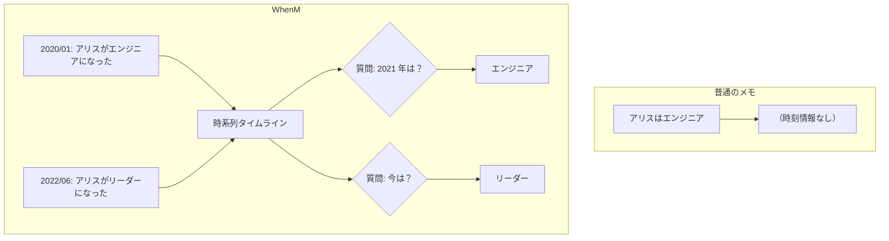

時系列メモリシステム。「何が」ではなく「いつ」を理解する。Event Calculus と Trealla Prolog (WASM) を [[unillm]] と組み合わせ、schemaless に時間・状態変化・因果を扱う。

## 何ができる？

AI のための「日付つきメモ帳」です。普通のメモは「アリスはエンジニア」としか書けませんが、このメモ帳は「アリスは 2020 年 1 月にエンジニアになった、2022 年 6 月にチームリーダーに昇進した」と時系列で覚えてくれます。だから「2021 年のアリスは何者？」と聞いても、ちゃんと「エンジニア」と答えられます。人事履歴・カルテ・事故調査・ゲームのセーブデータなど「いつ何が変わったか」が大事な場面で力を発揮します。後から事実が変わっても矛盾せず、過去のある時点での真実を取り出せるのが強みです。

## 用語

- **時系列メモリ**: 時間情報つきの記憶。日記とアルバムを合わせたもの
- **RAG**: 検索しながら答える普通の AI 記憶方式。「今の事実」しか持てない
- **Event Calculus（イベント計算）**: 「いつ何が起きて、何が真になったか」を論理で扱う仕組み
- **Prolog**: 「事実とルール」を書いて推論させるプログラミング言語。論理パズルを解くのが得意
- **Trealla Prolog**: 軽量で速い Prolog の実装
- **WASM**: ブラウザ上で動く高速プログラム形式。スマホでもサーバでも同じものが動く
- **schemaless**: 事前に「データの型紙」を決めなくていい仕組み。何でも放り込める箱
- **fluent**: 「真であり続ける性質」（例: 役職、状態）。時間とともに変わる
- **exclusive（排他的）**: 同時に 1 つしか持てない属性（例: 役職は 1 つだけ）
- **timeline**: 時刻順に並んだ出来事の一覧
- **状態遷移**: ある状態から別の状態へ変わること（エンジニア → リーダー）
- **因果**: 「これが起きたから、あれが起きた」の関係

## 仕組み



入力された自然言語を AI が「いつ・誰が・何をした」に分解し、Prolog の論理事実として保存します。質問された時刻に応じて、その時点で真だった答えを返します。

## Core Idea

通常の RAG は「X とは何か?」しか答えられない。WhenM は「時刻 Y における X は何か?」を答える。事実は時間と共に変わる、という前提でデータをモデル化する。

| 観点 | RAG | WhenM |
|---|---|---|
| 時間理解 | なし | ネイティブ temporal reasoning |
| 状態変化 | 追跡不能 | 全遷移を追跡 |
| 矛盾 | 全バージョン返却 | timeline で解決 |
| Schema | 事前定義 | 完全 schemaless |
| Query | "What is X?" | "What was X at time Y?" |

## 使用例

```ts
import { WhenM } from '@aid-on/whenm';

const memory = await WhenM.groq(process.env.GROQ_API_KEY);

await memory.remember("Alice joined as engineer", "2020-01-15");
await memory.remember("Alice became team lead", "2022-06-01");

await memory.ask("What was Alice's role in 2021?");
// → "engineer"

await memory.ask("What is Alice's current role?");
// → "team lead"
```

## Architecture

3 つの技術を組み合わせる:

1. **Event Calculus** — 時間推論の形式論理
2. **Trealla Prolog** — WASM 上で動く高性能推論エンジン
3. **LLM Integration** — schemaless な自然言語理解 (via [[unillm]])

### データフロー

```
Input → Language Normalization → Semantic Decomposition → Temporal Logic → Response
```

### イベント記録の内部表現

```ts
await memory.remember("Taro became manager", "2024-03-01");
```

→ Stage 2: Semantic Analysis (LLM)

```json
{
  "subject": "taro",
  "verb": "became",
  "object": "manager",
  "temporalType": "STATE_UPDATE",
  "affectedFluent": {
    "domain": "role",
    "value": "manager",
    "isExclusive": true
  }
}
```

→ Stage 3: Prolog Facts

```prolog
event_fact("evt_1234", "taro", "became", "manager").
happens("evt_1234", 1709251200000).
initiates("evt_1234", role("taro", "manager")).
is_exclusive_domain(role).
```

## True Schemaless

ハードコードでなく、LLM が動的に domain と exclusivity を決める。

```
"Pikachu learned Thunderbolt" → {domain: "skill", value: "thunderbolt", isExclusive: false}
"Robot battery at 80%"        → {domain: "battery", value: "80", isExclusive: true}
"Alien transformed to energy" → {domain: "form", value: "energy", isExclusive: true}
```

## Persistence (Experimental)

Plugin 方式。デフォルトは in-memory。Cloudflare D1, custom backend を選択可能。

```ts
const memory = await WhenM.cloudflare({
  accountId, apiKey, email,
  persistenceType: 'd1',
  persistenceOptions: { database: env.DB, tableName: 'whenm_events' }
});

await memory.persist();
await memory.restore({ timeRange: { from: '2024-01-01', to: '2024-12-31' } });
```

Prolog 形式の export/import も可能。

## 性能

- Insert: 25,000+ events/秒
- Query: 1-30ms
- Cloudflare Workers で稼働可能

## 用途

- 人事・キャリア追跡
- 医療履歴・治療経緯
- AI Agent の長期記憶
- インシデント RCA
- 監査ログ
- ゲーム状態管理
- IoT 予兆保全

## 関連

- [[unillm]] — マルチプロバイダ LLM 抽象
- [[memory-rag]] — 時間軸を持たない静的 RAG との対比
- [[nagare]] — エッジ稼働の前提

## Links

- [GitHub](https://github.com/Aid-On/whenm)
- [npm](https://www.npmjs.com/package/@aid-on/whenm)
