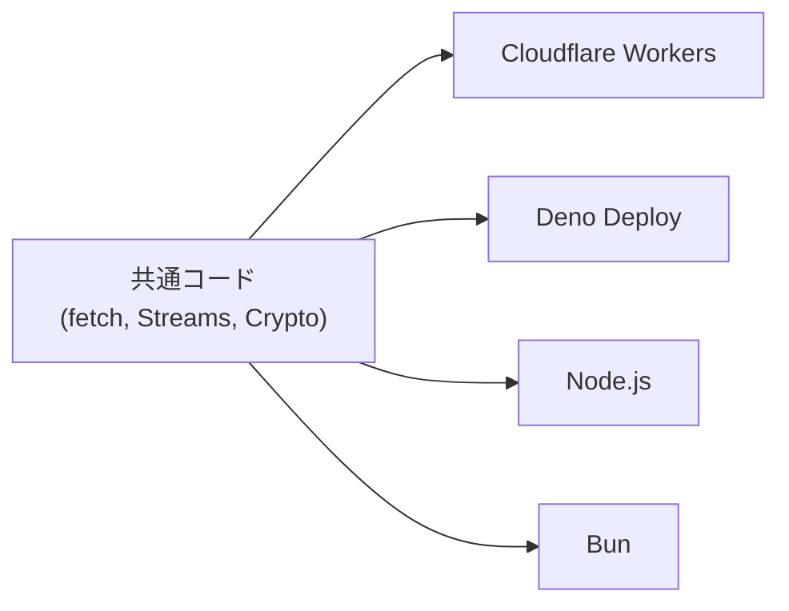

Ecma International TC55。サーバーサイド / Edge の JavaScript ランタイム間で Web Platform API の互換性を標準化する技術委員会。旧名 WinterCG (W3C Community Group, 2022年設立)。2024年12月に Ecma に移管され、正式な国際標準を発行できるようになった。2025年12月に ECMA-429 (Minimum Common Web Platform API) が採択。

## 経緯

| 時期 | 出来事 |
|---|---|
| 2022年5月 | WinterCG を W3C Community Group として設立 (Deno + Cloudflare 主導) |
| 2024年12月 | Ecma TC55 (WinterTC) として移管。W3C CG では標準を発行できないため |
| 2025年1月10日 | WinterCG 正式閉鎖。全作業を WinterTC に移管 |
| 2025年12月10日 | ECMA-429 (Minimum Common Web API, 1st Edition) 採択 |

移管の本質: Community Group (議論の場) → Technical Committee (標準化組織) への昇格。TC39 (ECMAScript) と同じモデル。

## ミッション

> サーバー、Edge、ブラウザを問わず、JS 開発者が頼れる包括的で統一された API サーフェスを推進する。

### 何を標準化するか

- Web Platform API のサーバーランタイム向けサブセット (Minimum Common API)
- サーバー固有の新規 API (Sockets API, CLI API)
- ランタイム識別子 (Runtime Keys)

### 何を標準化しないか

- 既存 W3C/WHATWG 仕様のフォーク
- ブラウザ側の API
- 新しい API の「発明」(既存 Web 標準の採用が原則)

## ECMA-429: Minimum Common Web Platform API

2025年12月に Ecma Standard として採択。ブラウザとサーバー双方に共通する最小限の API セット。

### 主要 API

| カテゴリ | API |
|---|---|
| Fetch / ネットワーク | `fetch()`, `Headers`, `Request`, `Response` |
| URL | `URL`, `URLSearchParams`, `URLPattern` |
| Streams | `ReadableStream`, `WritableStream`, `TransformStream` + 関連コントローラ |
| Encoding | `TextEncoder`, `TextDecoder`, `TextEncoderStream`, `TextDecoderStream` |
| Crypto | `crypto`, `Crypto`, `CryptoKey`, `SubtleCrypto` |
| DOM / Events | `AbortController`, `AbortSignal`, `Event`, `EventTarget`, `CustomEvent` |
| Compression | `CompressionStream`, `DecompressionStream` |
| Form / File | `FormData`, `Blob`, `File` |
| WebAssembly | `WebAssembly.Module`, `Instance`, `Memory`, `compile()`, `instantiate()` 等 |
| グローバル | `setTimeout`, `setInterval`, `queueMicrotask`, `atob`, `btoa`, `structuredClone`, `console` |
| Performance | `Performance`, `performance` |

適合要件: 全 API を `globalThis` 上に W3C/WHATWG 定義通りに提供すること。

## 参加メンバー

| 組織 | 役割 |
|---|---|
| Deno | 共同議長 (Luca Casonato)。Web 標準互換性を競争優位とする |
| Igalia | 共同議長 (Andreu Botella)。ブラウザエンジン実装の専門企業 |
| Cloudflare | Workers の Web API 互換性を推進 |
| Bloomberg | Daniel Ehrenberg が Ecma President として移行を主導 |
| Node.js | エコシステム代表。最大の JS ランタイム |

InfoWorld の表現: 「Cloudflare, Vercel, Deno, Node.js コアチーム間の一種の平和条約」。

## Edge Computing への影響

### ポータビリティの実現

WinterTC 準拠のランタイムでは同一 JS コードが修正なしで動作する:



実証例: Hono フレームワークが Node, Deno, Bun, Cloudflare Workers, Fastly で同一コードで動作。

### ベンダーロックイン: 軽減される部分 / されない部分

| | 軽減される | 軽減されない |
|---|---|---|
| Compute (計算) | `fetch()`, Streams, Crypto 等の共通 API でビジネスロジックが移植可能 | -- |
| Data (データ) | -- | Cloudflare D1/R2/KV, Vercel KV, Deno KV 等は各社固有 |

「Write Once, Compute Anywhere」が正確な表現。完全な WORA にはデータ層の標準化が別途必要。

## 技術的詳細

### ブラウザ API との差異

サーバーには存在しない概念への対処:

| ブラウザ概念 | サーバーでの扱い |
|---|---|
| 同一オリジンポリシー / CORS | 「現在のページ」がないため意味をなさない |
| Cookie jar | サーバー側にはブラウザの cookie 管理機構がない |
| Referrer | リクエストの referrer が存在しない |
| 相対 URL | ベース URL がないため `fetch("./api")` の挙動がランタイム間で異なる |

WinterTC はこれらを WHATWG Fetch 仕様への upstream 変更提案として対処する (フォークしない)。

### Runtime Keys

各ランタイムを一意に識別する標準キー。`package.json` の `exports` フィールド等で使用:

```json
{
  "exports": {
    "workerd": "./src/cloudflare.js",
    "deno": "./src/deno.js",
    "node": "./src/node.js",
    "default": "./src/index.js"
  }
}
```

Ecma Technical Report として策定中。

## WinterTC と WASI の関係

| 観点 | WinterTC | [[wasi\|WASI]] |
|---|---|---|
| 対象 | JavaScript ランタイム | WebAssembly ランタイム |
| 言語 | ECMAScript | 言語非依存 (Rust, C, Go → WASM) |
| API スタイル | Web Platform API (fetch, Streams) | POSIX ライクなシステムインターフェース |
| 標準化組織 | Ecma (TC55) | W3C / Bytecode Alliance |

競合ではなく補完的。JS ランタイムが WinterTC 準拠 API を提供しつつ、WASI 準拠 WASM モジュールをホスティングする構成が現実的。

## 進行中の作業

| 提案 | 状態 | 内容 |
|---|---|---|
| Minimum Common API 2nd Ed | 継続開発 | 2026年末の年次スナップショット |
| Sockets API | Proposal | TCP 接続。非ブラウザ環境向け |
| CLI API | Proposal | argv, 環境変数, ファイルアクセス |
| Runtime Keys | Draft TR | ランタイム識別子の標準化 |
| Test Suite | 開発中 | 適合性テストスイート |

## 課題

| 課題 | 詳細 |
|---|---|
| データ層の不在 | Compute のポータビリティは改善されるがストレージは標準化スコープ外 |
| テストスイート未整備 | 適合性は非強制。微妙な挙動差異の検出・是正が困難 |
| Bun の不参加 | WinterTC に正式参加しておらず準拠姿勢が不透明 |
| サーバー固有 API の遅れ | Sockets API, CLI API はまだ Proposal 段階 |
| 相対 URL 等の差異 | fetch() の挙動差異が WHATWG への upstream 依存で解決が遅い |

## 押さえどころ（カード化候補）

- WinterTC の正体 → Ecma TC55。サーバー/Edge の JS ランタイム間で Web Platform API の互換性を標準化。旧 WinterCG (W3C CG) から 2024年12月に移管。正式な国際標準を発行できるようになった
- WinterCG → WinterTC の移管理由 → W3C Community Group では標準を発行できない。作業が成熟し正式な標準化プロセスが必要に。TC39 (ECMAScript) と同じ Ecma モデルに
- ECMA-429 の意義 → 2025年12月採択。ブラウザとサーバー双方に共通する最小限の Web API セット。fetch, Streams, Crypto, URL, TextEncoder 等。「この API があればどのランタイムでも動く」の基準
- 「Write Once, Compute Anywhere」 → WinterTC で Compute 層のポータビリティは実現しつつある。ただしデータ層 (D1, R2, KV 等) は各社固有で標準化スコープ外。完全な WORA にはデータ抽象化が別途必要
- WinterTC が標準化しないもの → 既存 W3C/WHATWG 仕様のフォーク、ブラウザ API、新しい API の発明。原則は「既存の Web 標準をサーバーランタイムに採用させる」
- サーバーに存在しないブラウザ概念 → CORS (「現在のページ」がない)、Cookie jar、Referrer、相対 URL。WinterTC は WHATWG への upstream 変更提案で対処 (フォークしない)
- Runtime Keys の用途 → package.json の exports フィールド等でランタイムを識別。workerd, deno, node 等の標準キーを定義。条件付きモジュール解決の基盤
- WinterTC vs WASI → WinterTC: JS ランタイム間の Web API 互換性。WASI: WASM ランタイム間のシステムアクセス標準化。競合ではなく補完的。JS ランタイムが WinterTC API + WASI WASM ホスティング
- Bun の不参加リスク → Bun は WinterTC に正式参加しておらず準拠姿勢が不透明。「全ランタイム共通」の看板に傷がつく可能性
- 「平和条約」としての WinterTC → Cloudflare, Vercel, Deno, Node.js 間の API 標準化合意。競争が API ロックインから DX (開発者体験) での差別化に移行する効果

## Links

- [WinterTC (wintertc.org)](https://wintertc.org/)
- [WinterTC FAQ](https://wintertc.org/faq)
- [ECMA-429 Specification](https://ecma-international.org/publications-and-standards/standards/ecma-429/)
- [Minimum Common Web API Spec](https://min-common-api.proposal.wintertc.org/)
- [Goodbye WinterCG, welcome WinterTC (Deno Blog)](https://deno.com/blog/wintertc)
- [WinterTC GitHub](https://github.com/WinterTC55)

## 関連

- [[edge-platforms]] — Cloudflare, Deno, Fastly の WinterTC 準拠度比較
- [[wasi]] — WASM ランタイム側の標準化。WinterTC と補完関係
- [[v8-isolates]] — WinterTC 準拠の主要 Edge ランタイムが V8 ベース
