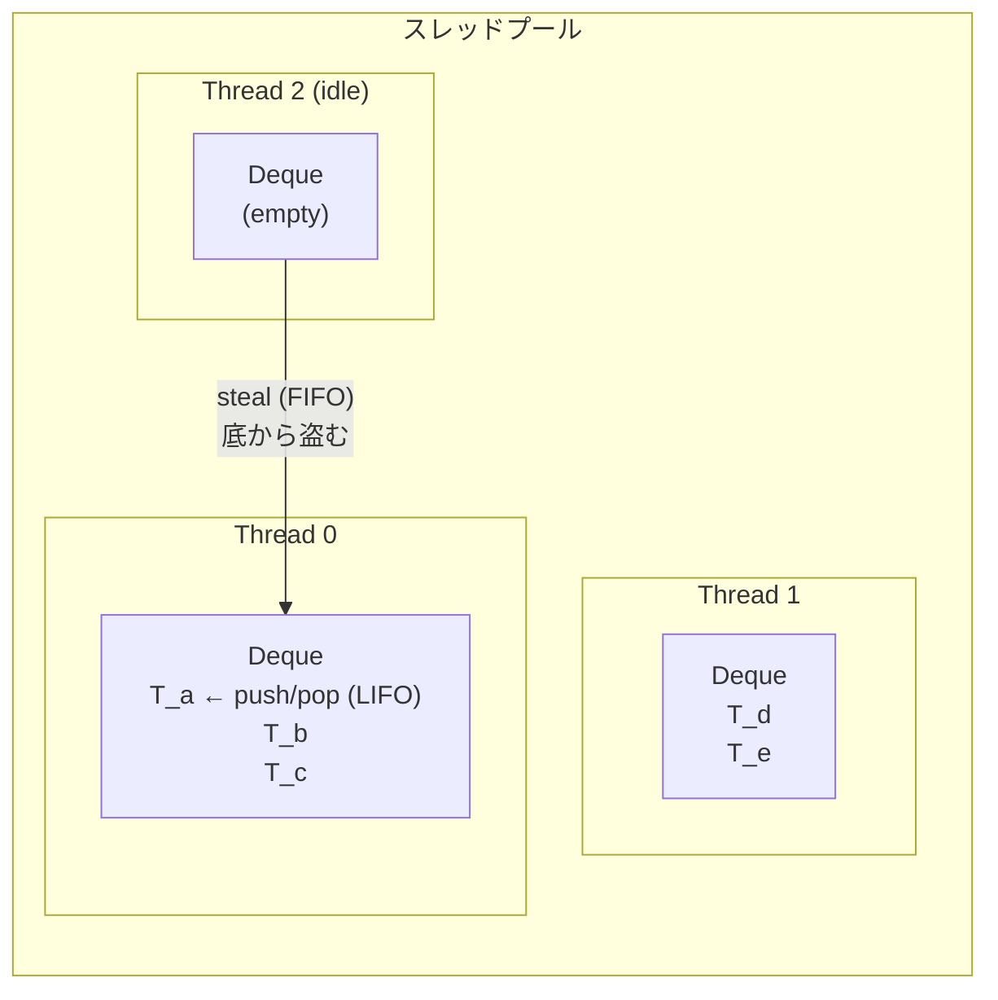
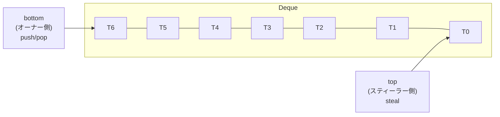
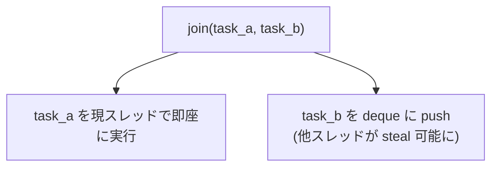
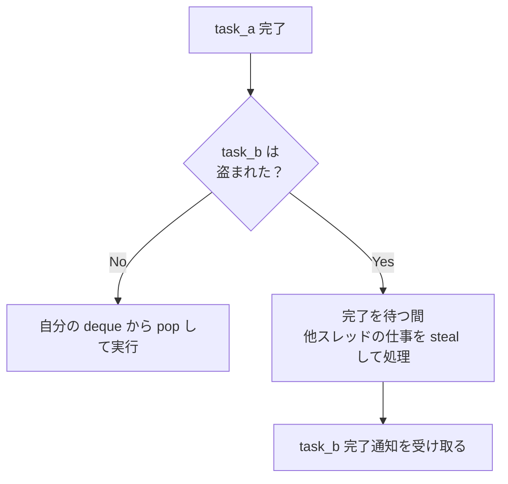

並列タスクスケジューリングアルゴリズム。暇なスレッドが忙しいスレッドからタスクを「盗む」ことで負荷を動的に分散する。1999年の Cilk プロジェクト (MIT) で理論的基盤が確立された。[[rayon]] が Rust 実装として代表的。

## 基本構造



各ワーカースレッドがローカルの deque (両端キュー) を持つ。

## Deque (両端キュー) の二つの操作面

| 操作 | 方向 | 実行者 | 特性 |
|---|---|---|---|
| push / pop | LIFO (上端) | オーナースレッド | ロック不要。キャッシュ局所性が高い |
| steal | FIFO (底端) | 他のスレッド | CAS ベースのロックフリー操作 |

この非対称性が work-stealing の性能の鍵:

- LIFO pop: 直近に分割した小さなサブタスクを優先。キャッシュに載っているデータを処理
- FIFO steal: 古い (= 大きい) タスクを盗む。1回の steal で大量の仕事を獲得できる

### Chase-Lev Deque

work-stealing で最も広く使われるロックフリー deque 実装。rayon は crossbeam-deque (Chase-Lev の Rust 実装) に依存している。



- `push` / `pop` は `bottom` をアトミック操作
- `steal` は `top` を CAS で更新
- 競合するのは deque に要素が1つだけの場合のみ → ほぼ競合しない

## 動作フロー

### 1. タスク生成



### 2. タスク消費

```rust
loop {
    if let Some(task) = my_deque.pop() {
        // 自分の deque にタスクがある → 実行
        task.execute();
    } else {
        // 暇 → ランダムに他スレッドを選んで steal を試みる
        let victim = random_thread();
        if let Some(stolen) = victim.deque.steal() {
            stolen.execute();
        } else {
            // steal 失敗 → 再試行 or スリープ
            yield_or_sleep();
        }
    }
}
```

### 3. join の完了待ち

`task_a` が完了した後、`task_b` の状態に応じて分岐:



この「待ちながらも steal する」動作が、スレッドを遊ばせない設計の核心。

## 分割統治との相性

work-stealing は再帰的な分割統治 (divide-and-conquer) と最も相性が良い:

```rust
fn parallel_sum(data: &[i32]) -> i32 {
    if data.len() <= THRESHOLD {
        // 十分小さければ逐次実行
        data.iter().sum()
    } else {
        let mid = data.len() / 2;
        let (left, right) = data.split_at(mid);
        // join: left を即実行、right を deque に push
        let (l, r) = rayon::join(
            || parallel_sum(left),
            || parallel_sum(right),
        );
        l + r
    }
}
```

分割のたびにタスクが deque に push され、暇なスレッドが steal する。データサイズに応じて自然に並列度が調整される。

## 理論的保証

Cilk プロジェクト (Blumofe & Leiserson, 1999) の証明による:

| 指標 | 保証 |
|---|---|
| 期待実行時間 | `T₁/P + O(T∞)` (T₁: 逐次時間, P: プロセッサ数, T∞: クリティカルパス) |
| steal 回数の期待値 | `O(P × T∞)` — スレッド数とクリティカルパスに比例 |
| 空間使用量 | `O(P × S₁)` (S₁: 逐次実行時のスタック使用量) |
| 線形スピードアップ | T∞ ≪ T₁/P なら ほぼ P 倍の高速化 |

直感的な解釈: 十分な並列性がある問題なら、work-stealing はほぼ最適に近い負荷分散を達成する。steal のオーバーヘッドはクリティカルパスに比例するだけで、全体の仕事量には比例しない。

## 他のスケジューリング手法との比較

| 手法 | 負荷分散 | オーバーヘッド | キャッシュ局所性 |
|---|---|---|---|
| Work-Stealing | 動的。暇なスレッドが盗む | steal は稀。通常はローカル pop | 高い (LIFO) |
| Work-Sharing | 動的。タスク生成時に他スレッドに配布 | タスク生成ごとに通信 | 低い |
| 静的パーティショニング | 事前分割 | ゼロ | 最高 |
| タスクキュー (共有) | 動的。全スレッドが1つのキューから取得 | キューがボトルネック | 低い |

work-stealing は「通常はローカルで完結し、不均衡時だけ steal する」ため、バランスの良いワークロードでも不均衡なワークロードでも効率が良い。

## 実装上の注意点

### steal 失敗時のバックオフ

全スレッドが暇な状態 (仕事がない) で steal を繰り返すと CPU を無駄に消費する。実装ではスピンループ → yield → futex/condvar wait と段階的にバックオフする。

### キャッシュの考慮

- LIFO 実行でキャッシュ局所性は良好
- ただし OS のスレッドマイグレーション (別コアへの移動) が発生すると L1/L2 が無効化される
- CPU pinning (`sched_setaffinity`) で改善可能だが、rayon 自身は CPU pinning を行わない

### デッドロックリスク

work-stealing プール内でブロッキング I/O やロック待ちを行うと、全スレッドがブロックされてデッドロックに陥る可能性がある。CPU バウンドな計算専用にすべき。

## 押さえどころ（カード化候補）

- work-stealing の一言定義 → 暇なスレッドが忙しいスレッドのタスクキューから仕事を盗む動的負荷分散アルゴリズム。通常はローカル LIFO 実行でキャッシュ効率が高く、不均衡時だけ steal が発生
- deque の非対称性が鍵な理由 → オーナーは LIFO で小タスクを処理 (キャッシュ局所性)、スティーラーは FIFO で大タスクを盗む (1回の steal で多くの仕事を獲得)
- join の待機中の動作 → task_b の完了を待つ間、idle にならず他スレッドの仕事を steal して処理する。スレッドを遊ばせない設計
- work-stealing の理論的保証 → 期待実行時間 T₁/P + O(T∞)。steal 回数は O(P×T∞) で全体の仕事量に比例しない。十分な並列性があればほぼ線形スピードアップ
- work-stealing vs work-sharing → work-sharing はタスク生成時に配布 (毎回通信コスト)。work-stealing はローカルで完結し不均衡時のみ steal (通信は稀)
- Chase-Lev deque → work-stealing の標準的なロックフリー deque 実装。push/pop はオーナーのみ、steal は CAS ベース。競合は deque に1要素の場合だけでほぼ発生しない
- work-stealing のアンチパターン → プール内でブロッキング I/O やロック待ちを行うとデッドロックリスク。CPU バウンドな計算専用にすべき
- 分割統治との相性 → 再帰分割のたびにタスクが deque に push され、暇なスレッドが steal。データサイズに応じて自然に並列度が調整される。最も自然な適用パターン

## Links

- [Blumofe & Leiserson (1999) - Scheduling Multithreaded Computations by Work Stealing](https://dl.acm.org/doi/10.1145/324133.324234)
- [crossbeam-deque (Rust)](https://docs.rs/crossbeam-deque)

## 関連

- [[rayon]] — work-stealing を用いた Rust のデータ並列ライブラリ
